# //uses-rel-preload/samples/pages+cached

[→ Parent](../..)


## Raw


```yaml
p90min: 0
p90max: 1477
p90range: 1477
p90mean: 740.4835164835165
p90median: 1406
p90stdev: 716.5561772972161
p90skewness: -0.0651756577879077
p90eccentricity: 1.0000000000000007
p90discretization: 2.6
outlandishness: 3.183414504643411
confidence: 1084.6012980328464
p90confidence: 294.4473396870917

```

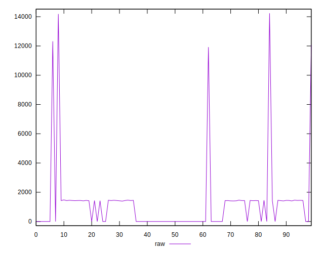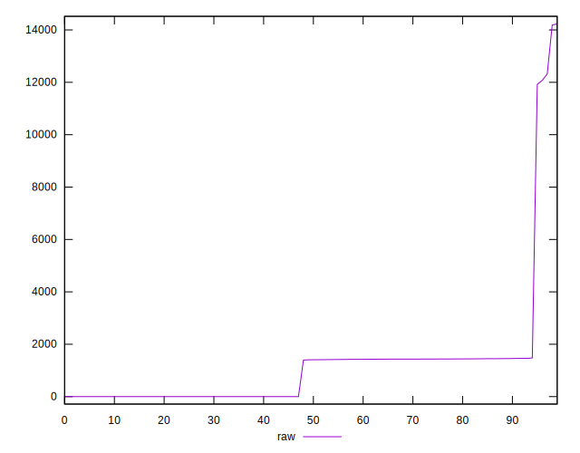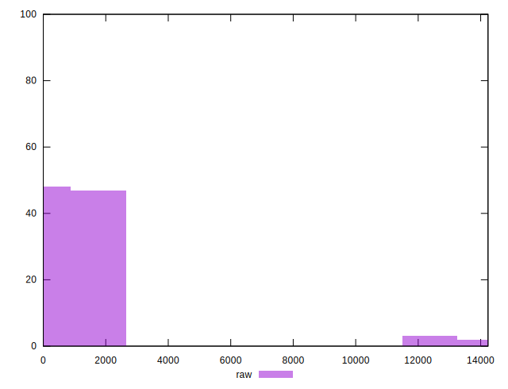
## Score


```yaml
p90min: 0.41
p90max: 1
p90range: 0.5900000000000001
p90mean: 0.7003296703296709
p90median: 0.42
p90stdev: 0.28995054731609354
p90skewness: 0.06593110265136627
p90eccentricity: 1.0000000000000002
p90discretization: 30.333333333333332
outlandishness: 0.9353132761168876
confidence: 0.1264683888761129
p90confidence: 0.1191465093777675

```

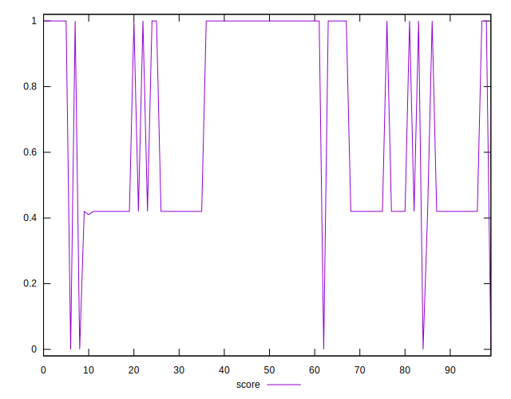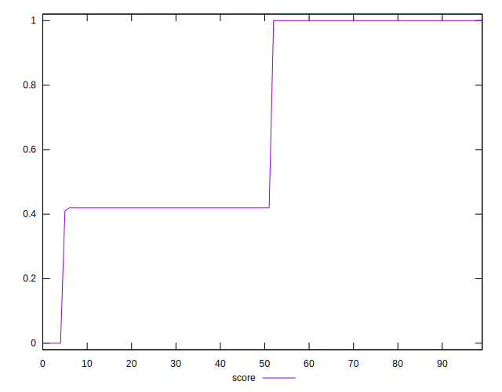
## Raw Estimate

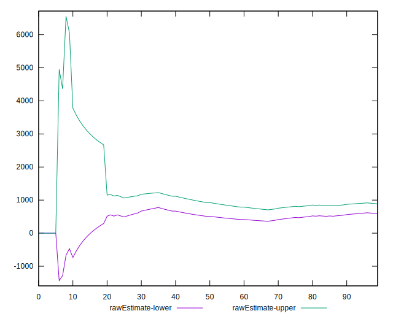
## Score Estimate

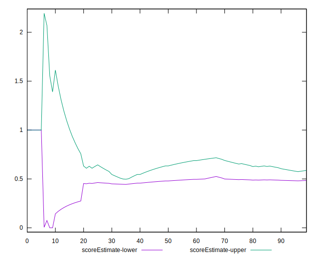
## P Score


```yaml
p90min: 0.41447058823529415
p90max: 1
p90range: 0.5855294117647059
p90mean: 0.7002146089204913
p90median: 0.4228235294117647
p90stdev: 0.2900632613209886
p90skewness: 0.06590285782893053
p90eccentricity: 1.0000000000000009
p90discretization: 2.6
outlandishness: 0.9353314298789437
confidence: 0.12650159654458126
p90confidence: 0.11919282582850554

```

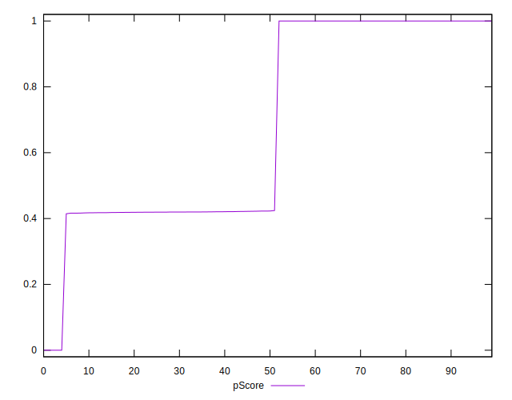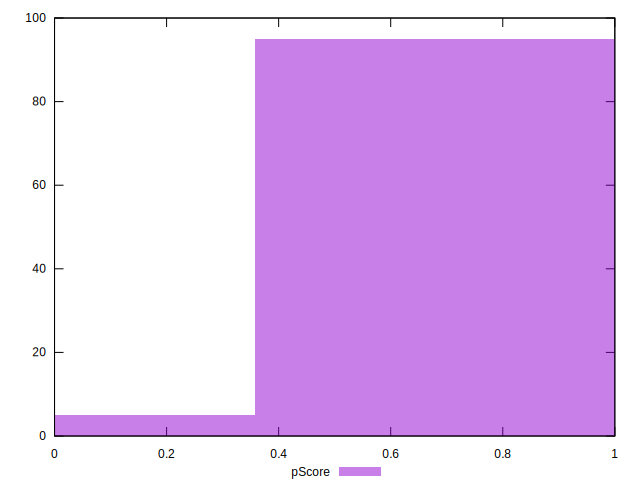
## Score Difference


```yaml
p90min: 0
p90max: 0
p90range: 0
p90mean: 0
p90median: 0
p90stdev: 0
p90skewness: .nan
p90eccentricity: .nan
p90discretization: 91
outlandishness: .inf
confidence: 2.165089820536967e-18
p90confidence: 0

```

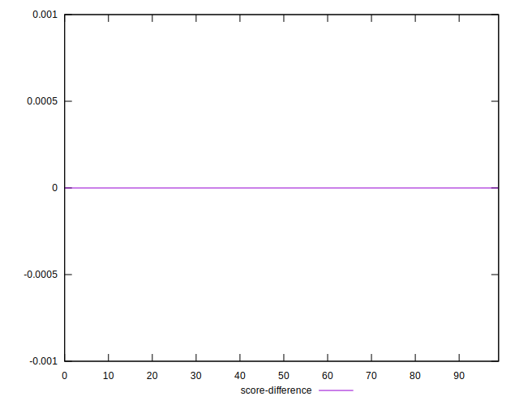
## P Score Difference


```yaml
p90min: -0.0025882352941176134
p90max: 0.0022352941176470575
p90range: 0.004823529411764671
p90mean: -0.00014738202973496532
p90median: 0
p90stdev: 0.0008146335311871824
p90skewness: -0.497715757941071
p90eccentricity: 1
p90discretization: 3.3703703703703702
outlandishness: 0.5047229993843949
confidence: 0.0005084947574931769
p90confidence: 0.0003347492962557692

```

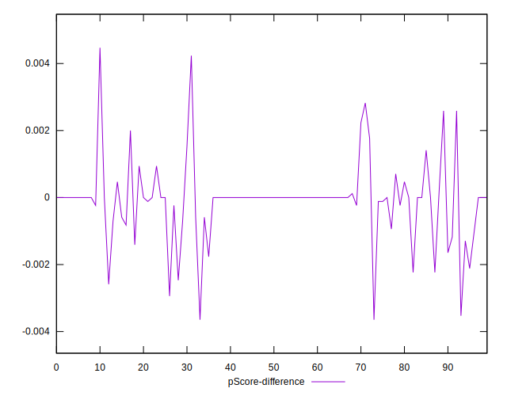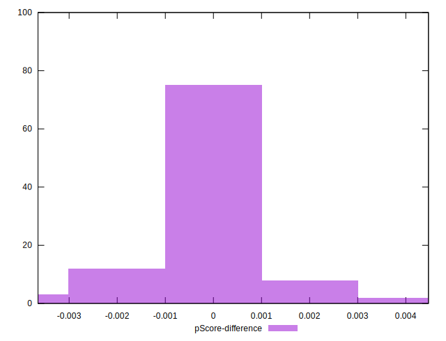