# //uses-rel-preload/samples/pages

[→ Parent](../..)


## Raw


```yaml
p90min: 0
p90max: 1689
p90range: 1689
p90mean: 1009.5274725274726
p90median: 1473
p90stdev: 709.6138299855764
p90skewness: -0.7092912408607281
p90eccentricity: 1.0000000000000002
p90discretization: 1.82
outlandishness: 1.3486769243201735
confidence: 704.6085100541354
p90confidence: 291.59458960013194

```

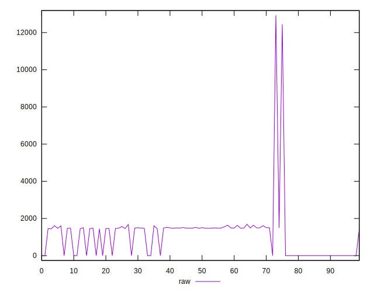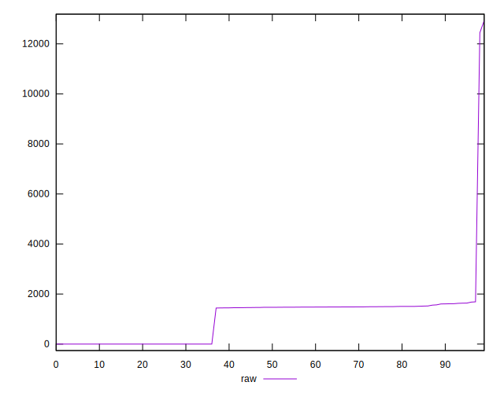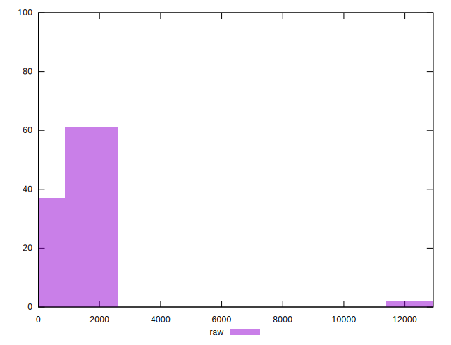
## Score


```yaml
p90min: 0.39
p90max: 1
p90range: 0.61
p90mean: 0.6048351648351649
p90median: 0.41
p90stdev: 0.27718507578143825
p90skewness: 0.7232483209829902
p90eccentricity: 1.000000000000002
p90discretization: 18.2
outlandishness: 1.0521302626102784
confidence: 0.11623220342050788
p90confidence: 0.113900920473059

```

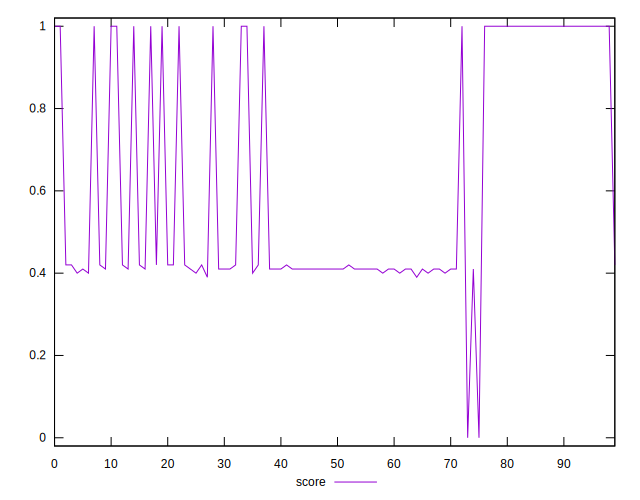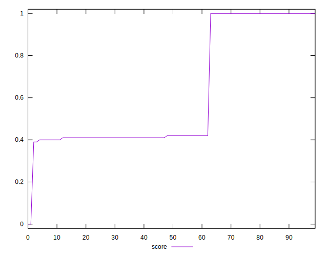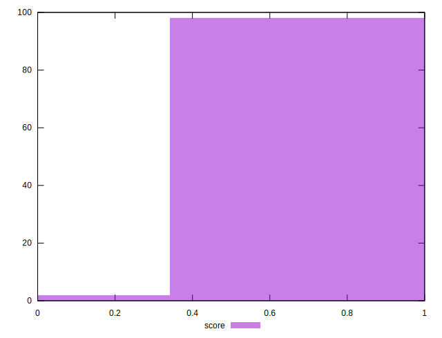
## Raw Estimate

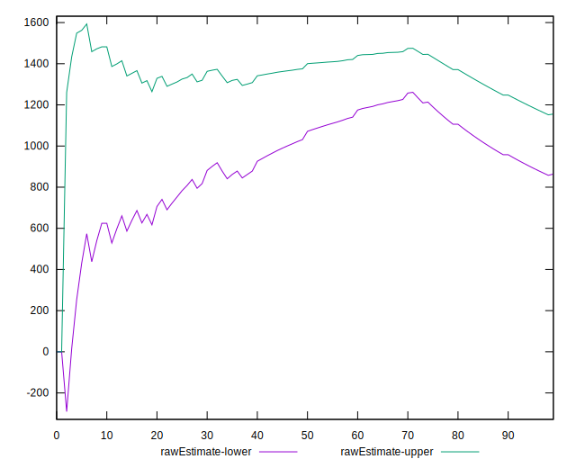
## Score Estimate

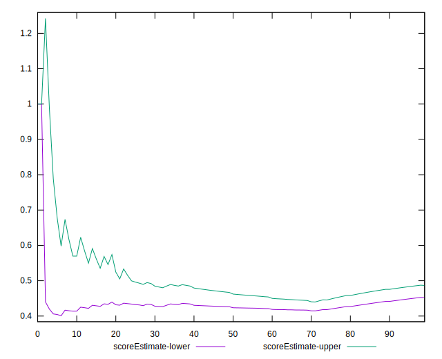
## P Score


```yaml
p90min: 0.3895294117647059
p90max: 1
p90range: 0.6104705882352941
p90mean: 0.6052139625080802
p90median: 0.41494117647058826
p90stdev: 0.27691656550593935
p90skewness: 0.7233029550007077
p90eccentricity: 1.0000000000000009
p90discretization: 1.82
outlandishness: 1.0519816660394075
confidence: 0.11613558465549834
p90confidence: 0.11379058420242982

```

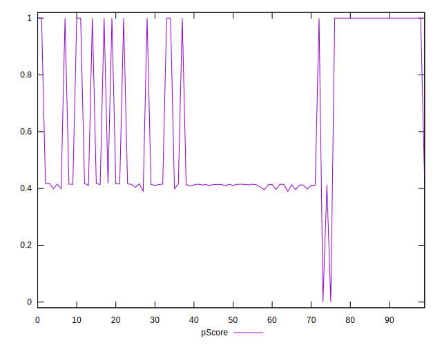
## Score Difference


```yaml
p90min: 0
p90max: 5.551115123125783e-17
p90range: 5.551115123125783e-17
p90mean: 1.6470341574109465e-17
p90median: 0
p90stdev: 2.5357749710552487e-17
p90skewness: 0.8900816650006709
p90eccentricity: 1.0000000000000002
p90discretization: 45.5
outlandishness: 1.4721777777777778
confidence: 1.0444786286747678e-17
p90confidence: 1.0420009176232813e-17

```

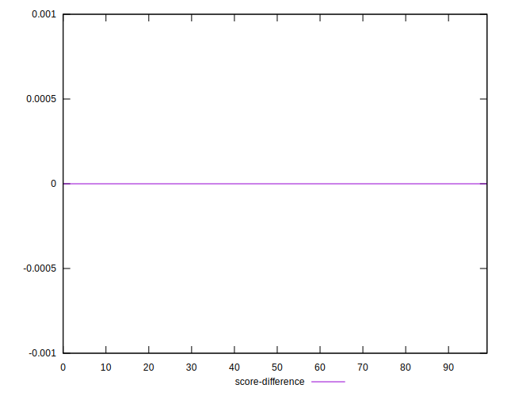
## P Score Difference


```yaml
p90min: -0.004117647058823559
p90max: 0.004705882352941171
p90range: 0.00882352941176473
p90mean: 0.000533936651583716
p90median: 0
p90stdev: 0.0021543404125088116
p90skewness: 0.10331062788491492
p90eccentricity: 1.0000000000000002
p90discretization: 2.1666666666666665
outlandishness: 0.4167906061476627
confidence: 0.0009953594105887363
p90confidence: 0.0008852617887355077

```

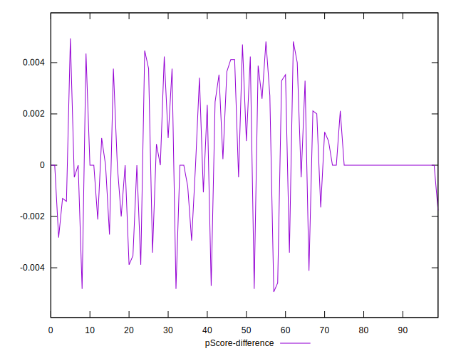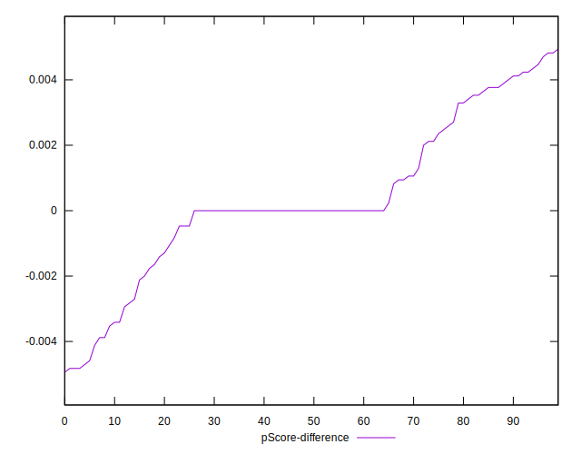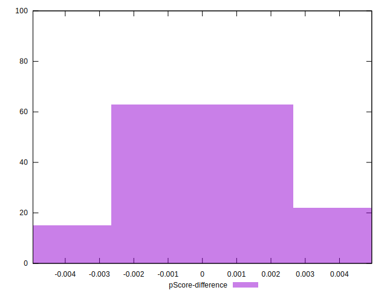