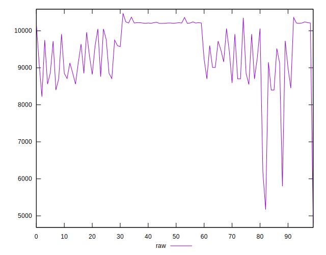
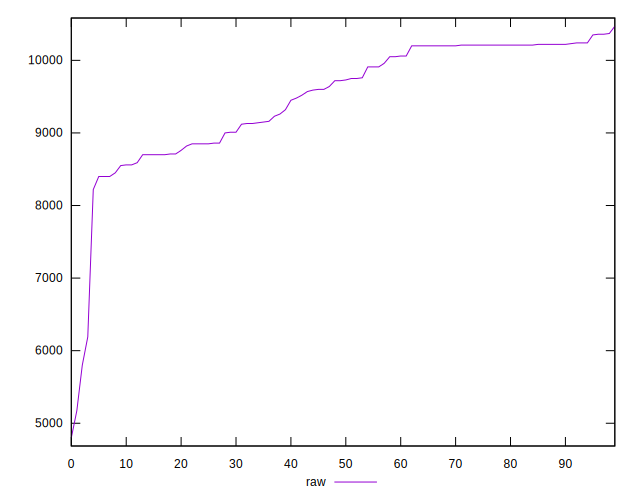
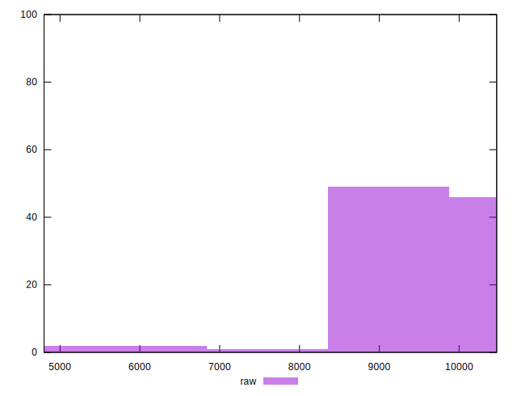
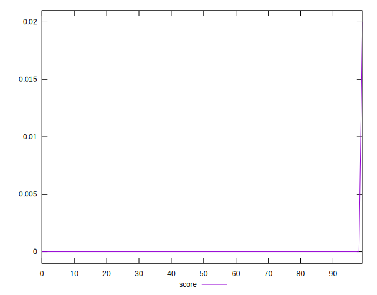
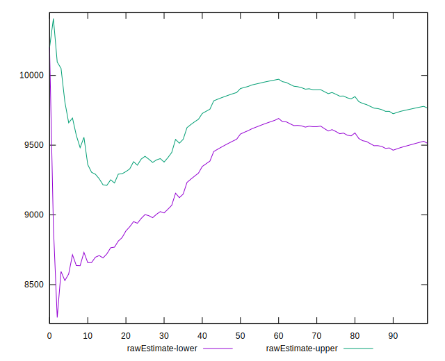
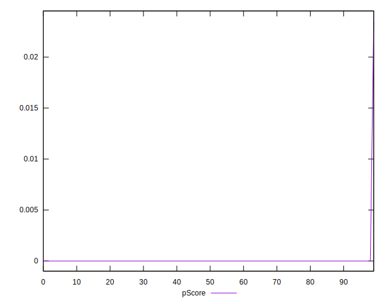
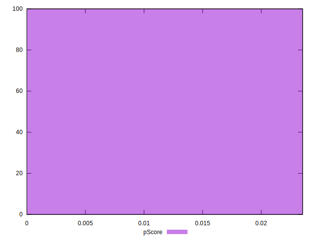
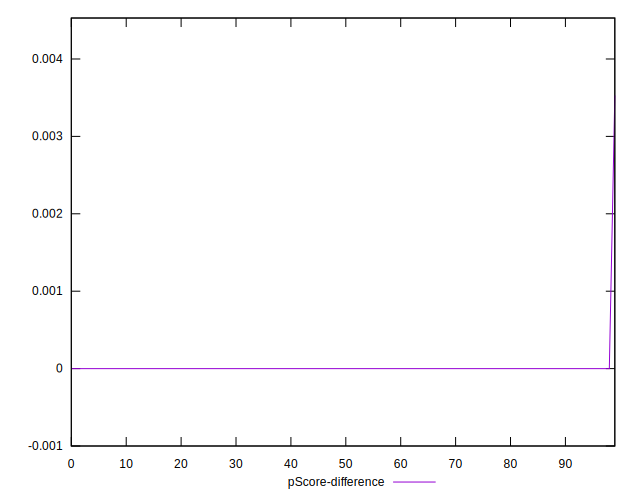
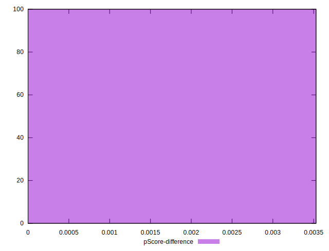

# //uses-text-compression/samples/pages+cached+noexternal

[→ Parent](../..)


## Raw


```yaml
p90min: 8450
p90max: 10370
p90range: 1920
p90mean: 9639.89010989011
p90median: 9760
p90stdev: 615.9447215554945
p90skewness: -0.47863112162085014
p90eccentricity: 1.0000000000000004
p90discretization: 2.116279069767442
outlandishness: 0.9570902747642059
confidence: 406.4656007206322
p90confidence: 253.10406971914927

```


## Score


```yaml
p90min: 0
p90max: 0
p90range: 0
p90mean: 0
p90median: 0
p90stdev: 0
p90skewness: .nan
p90eccentricity: .nan
p90discretization: 91
outlandishness: .inf
confidence: 0.0007800558167195134
p90confidence: 0

```


## Raw Estimate


## Score Estimate


## P Score


```yaml
p90min: 0
p90max: 0
p90range: 0
p90mean: 0
p90median: 0
p90stdev: 0
p90skewness: .nan
p90eccentricity: .nan
p90discretization: 91
outlandishness: .inf
confidence: 0.0009177127255523686
p90confidence: 0

```


## Score Difference


```yaml
p90min: 0
p90max: 0
p90range: 0
p90mean: 0
p90median: 0
p90stdev: 0
p90skewness: .nan
p90eccentricity: .nan
p90discretization: 91
outlandishness: .nan
confidence: 0
p90confidence: 0

```


## P Score Difference


```yaml
p90min: 0
p90max: 0
p90range: 0
p90mean: 0
p90median: 0
p90stdev: 0
p90skewness: .nan
p90eccentricity: .nan
p90discretization: 91
outlandishness: .inf
confidence: 0.00013765690883285484
p90confidence: 0

```

