# //uses-text-compression/samples/pages

[→ Parent](../..)


## Raw


```yaml
p90min: 1350
p90max: 9410
p90range: 8060
p90mean: 4159.89010989011
p90median: 2890
p90stdev: 2478.765863833127
p90skewness: 1.2606404555474133
p90eccentricity: 0.9999999999999996
p90discretization: 2.6
outlandishness: 1.26131441825319
confidence: 1125.8293399490358
p90confidence: 1018.5747292917458

```

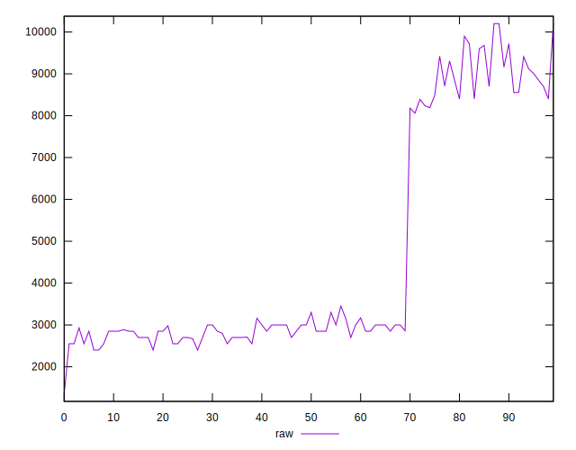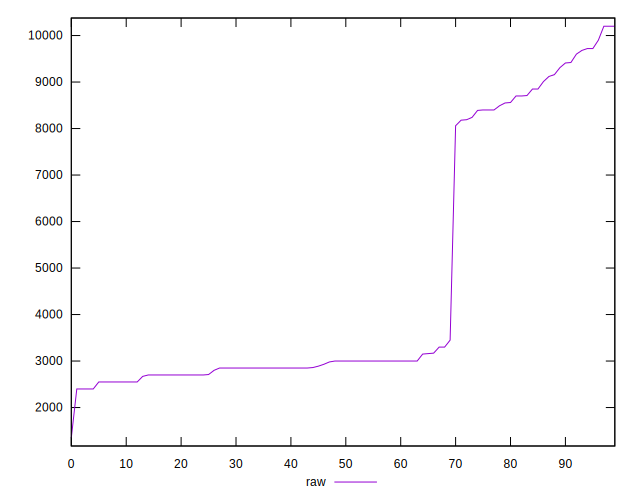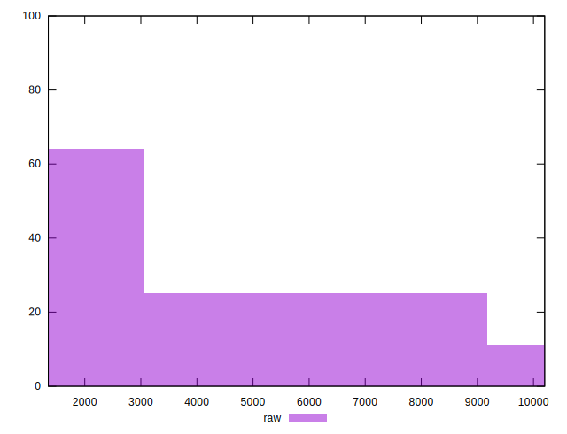
## Score


```yaml
p90min: 0
p90max: 0.31
p90range: 0.31
p90mean: 0.19384615384615372
p90median: 0.24
p90stdev: 0.11167819969629217
p90skewness: -1.0702345126123503
p90eccentricity: 0.9999999999999999
p90discretization: 9.1
outlandishness: 0.8689642872889898
confidence: 0.04759204225961727
p90confidence: 0.04589081755690105

```

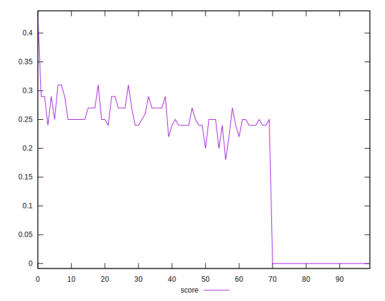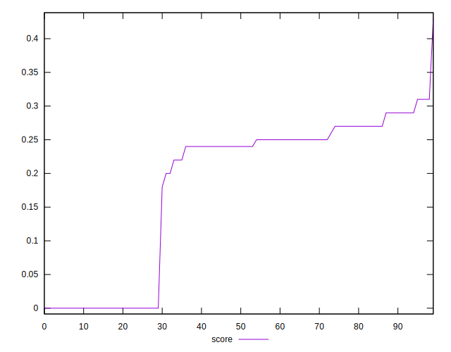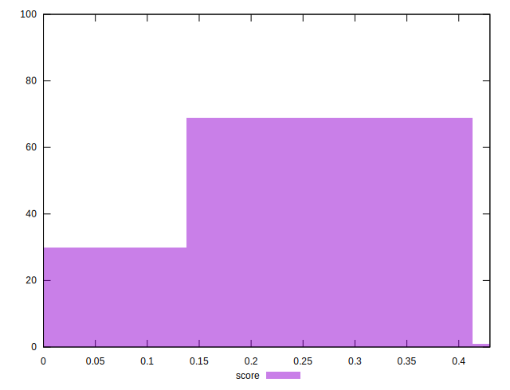
## Raw Estimate

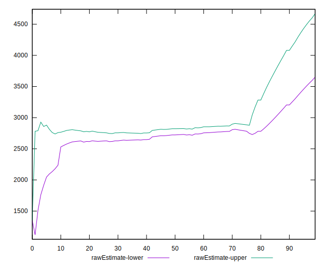
## Score Estimate

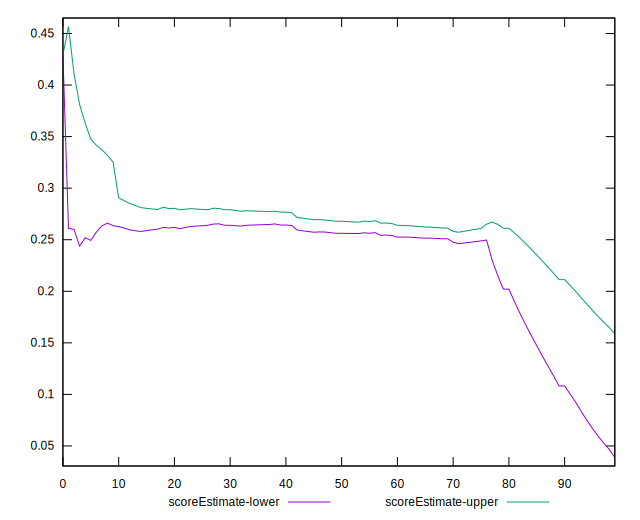
## P Score


```yaml
p90min: 0
p90max: 0.3058823529411765
p90range: 0.3058823529411765
p90mean: 0.1932514544279249
p90median: 0.24352941176470588
p90stdev: 0.11136462057238514
p90skewness: -1.0696940033007465
p90eccentricity: 1
p90discretization: 5.055555555555555
outlandishness: 0.8690348069225837
confidence: 0.047461453586739366
p90confidence: 0.04576196159034712

```

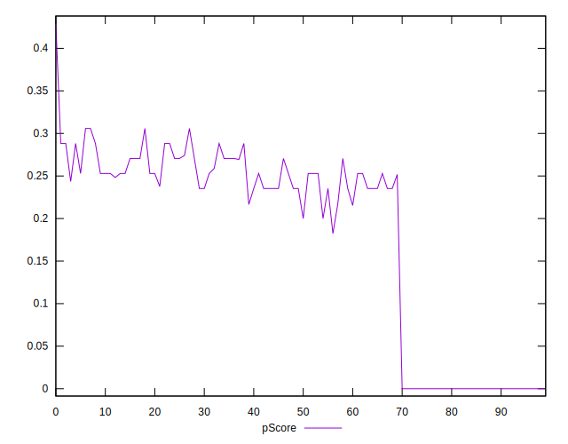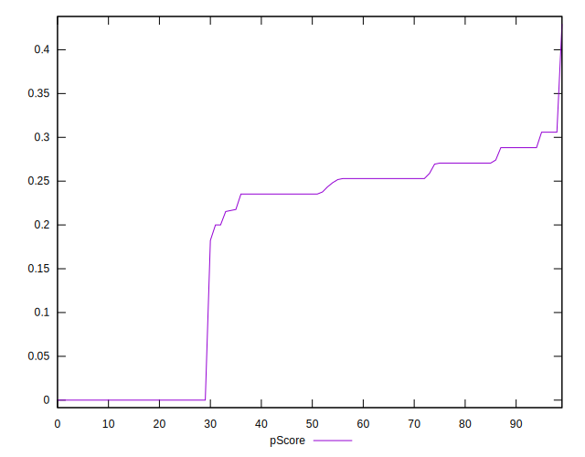
## Score Difference


```yaml
p90min: 0
p90max: 0
p90range: 0
p90mean: 0
p90median: 0
p90stdev: 0
p90skewness: .nan
p90eccentricity: .nan
p90discretization: 91
outlandishness: .nan
confidence: 0
p90confidence: 0

```


## P Score Difference


```yaml
p90min: -0.004705882352941171
p90max: 0.003529411764705892
p90range: 0.008235294117647063
p90mean: -0.00023270846800259055
p90median: 0
p90stdev: 0.0023152756463372787
p90skewness: -0.4424852364326996
p90eccentricity: 1.0000000000000007
p90discretization: 6.066666666666666
outlandishness: 5.52641736111097
confidence: 0.001004698166775442
p90confidence: 0.0009513933119350585

```

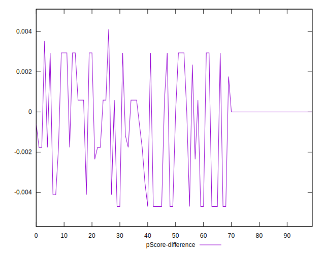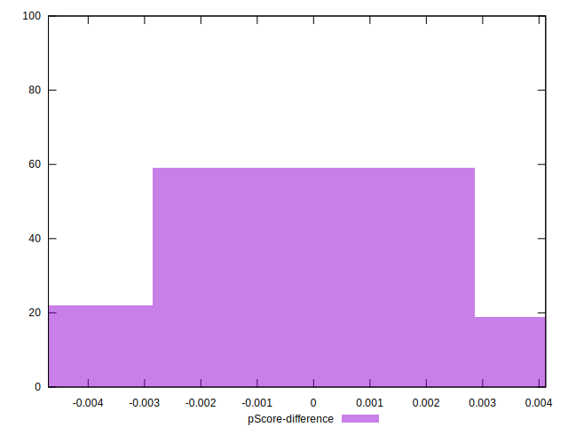