# //uses-webp-images/samples/pages+cached+noexternal+nomedia+nocss+nojs

[→ Parent](../..)


## Raw


```yaml
p90min: 880
p90max: 1510
p90range: 630
p90mean: 1254.2857142857142
p90median: 1290
p90stdev: 172.9710822375344
p90skewness: -0.40353123037011746
p90eccentricity: 0.9999999999999996
p90discretization: 2.5277777777777777
outlandishness: 1.0107348057554704
confidence: 99.62865359732177
p90confidence: 71.07729529280687

```

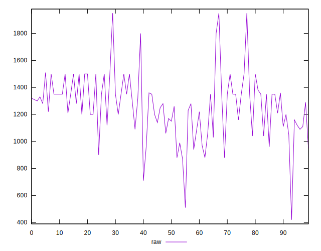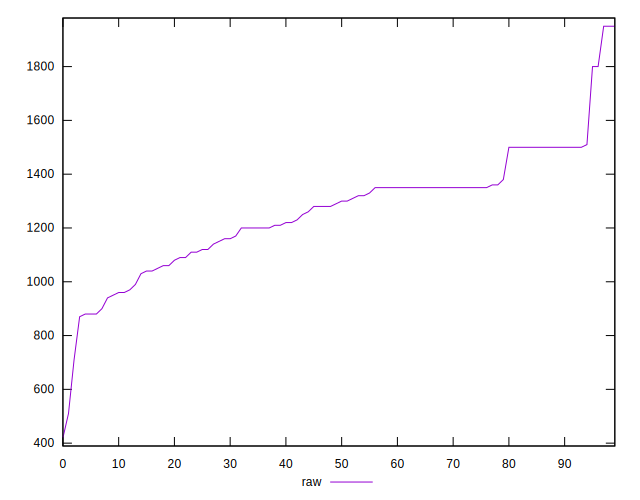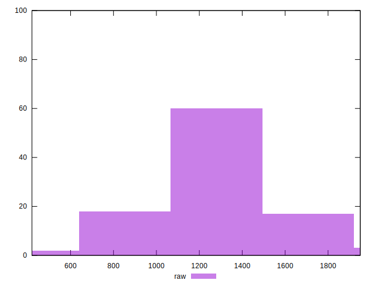
## Score


```yaml
p90min: 0.41
p90max: 0.48
p90range: 0.07
p90mean: 0.44076923076923075
p90median: 0.44
p90stdev: 0.02066109415050897
p90skewness: 0.27076067163306083
p90eccentricity: 1
p90discretization: 13
outlandishness: 1.008780095879438
confidence: 0.01602723322990285
p90confidence: 0.008490058979867654

```

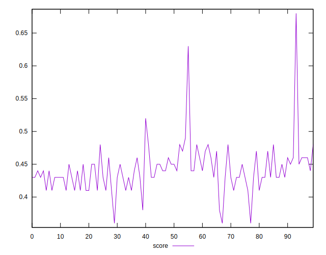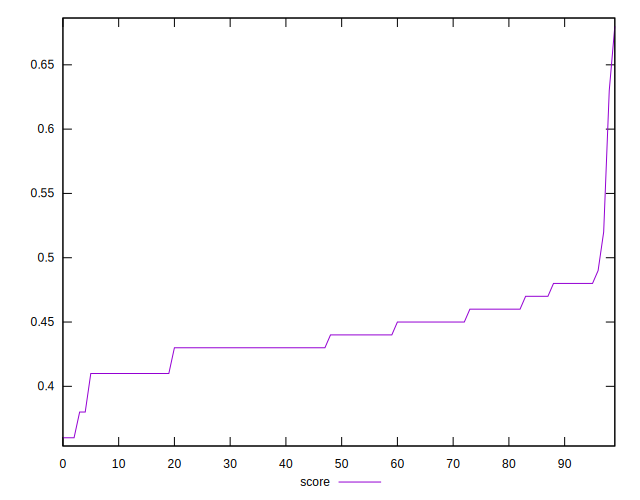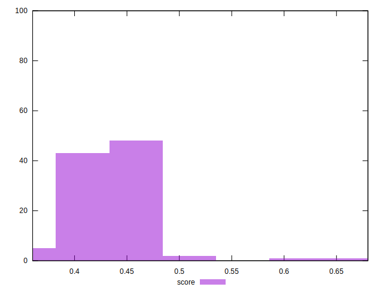
## Raw Estimate


## Score Estimate

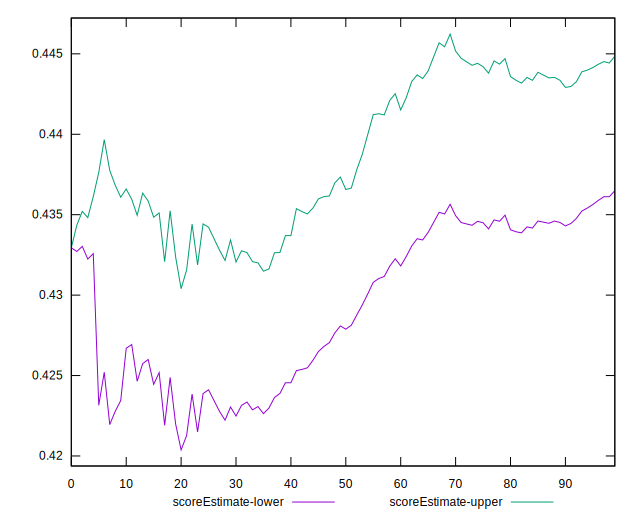
## P Score


```yaml
p90min: 0.41058823529411764
p90max: 0.48470588235294115
p90range: 0.07411764705882351
p90mean: 0.4406722689075633
p90median: 0.4364705882352941
p90stdev: 0.020349539086768748
p90skewness: 0.4035312303701044
p90eccentricity: 0.9999999999999986
p90discretization: 2.5277777777777777
outlandishness: 1.0085566616806605
confidence: 0.016179755494928227
p90confidence: 0.00836203474033026

```

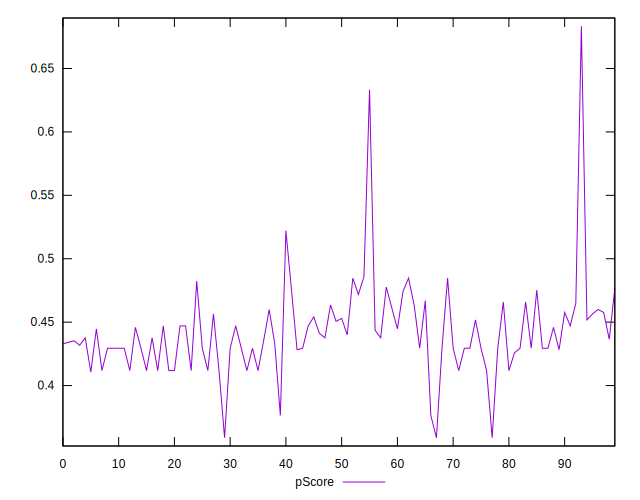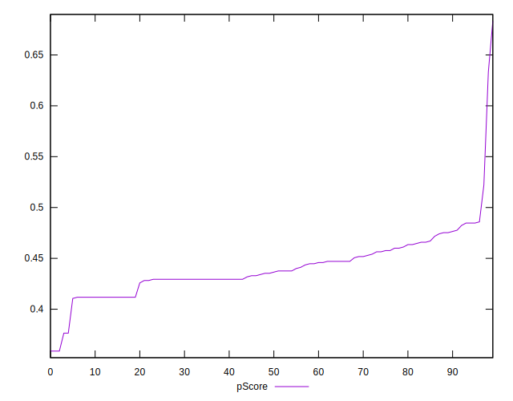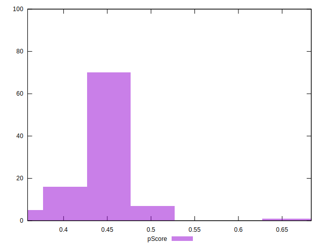
## Score Difference


```yaml
p90min: 0
p90max: 5.551115123125783e-17
p90range: 5.551115123125783e-17
p90mean: 6.710139159822375e-18
p90median: 0
p90stdev: 1.8095899594645835e-17
p90skewness: 2.3259895254981897
p90eccentricity: 1.0000000000000018
p90discretization: 45.5
outlandishness: 2.7375206611570246
confidence: 8.703988572289729e-18
p90confidence: 7.435968963363071e-18

```

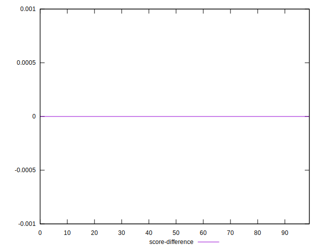
## P Score Difference


```yaml
p90min: -0.004705882352941171
p90max: 0.004117647058823559
p90range: 0.00882352941176473
p90mean: -0.00031602384543560354
p90median: -0.0005882352941176117
p90stdev: 0.002374039805803366
p90skewness: 0.02555827736684812
p90eccentricity: 0.9999999999999996
p90discretization: 3.9565217391304346
outlandishness: 0.21462161983470252
confidence: 0.0010511948068793807
p90confidence: 0.0009755406865191456

```

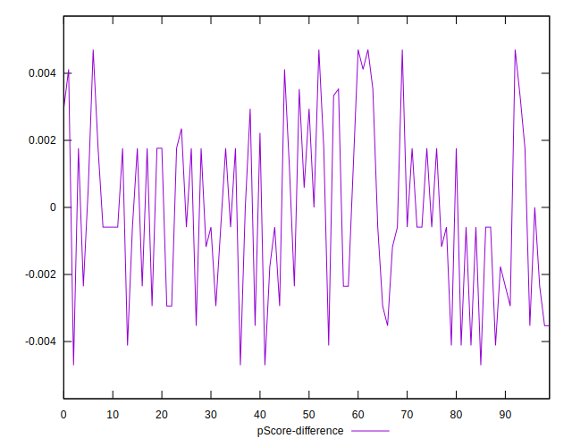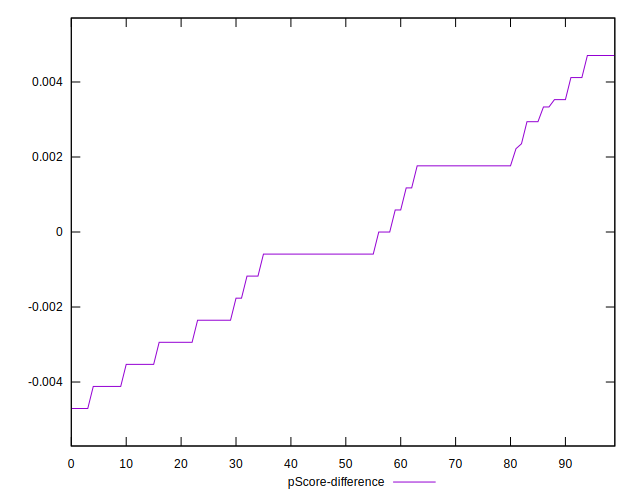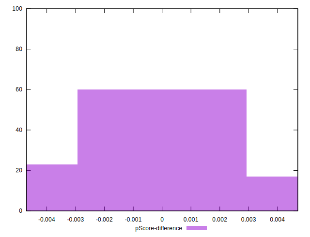