# //uses-webp-images/samples/pages+cached+noexternal+nomedia+nocss

[→ Parent](../..)


## Raw


```yaml
p90min: 950
p90max: 1510
p90range: 560
p90mean: 1251.4285714285713
p90median: 1210
p90stdev: 147.57803991445394
p90skewness: 0.21269598610924587
p90eccentricity: 0.9999999999999996
p90discretization: 2.6
outlandishness: 0.9668321950386775
confidence: 84.02075511073326
p90confidence: 60.64278367252473

```

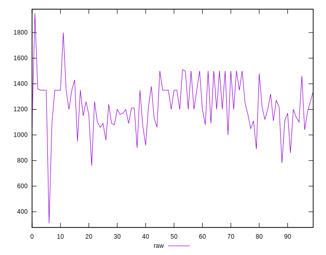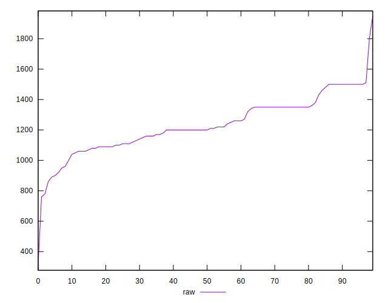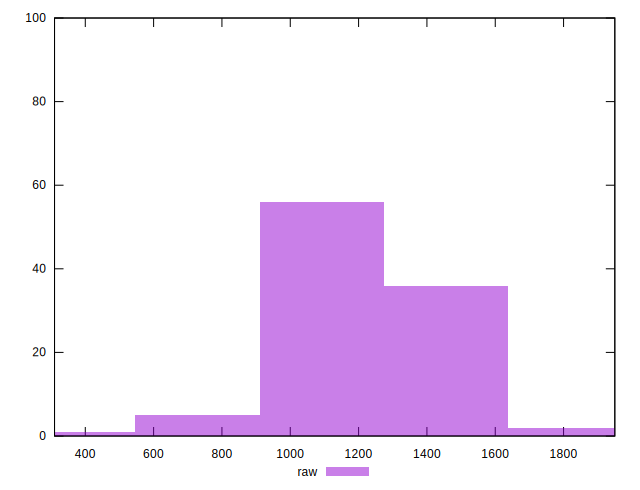
## Score


```yaml
p90min: 0.41
p90max: 0.48
p90range: 0.07
p90mean: 0.4435164835164836
p90median: 0.45
p90stdev: 0.01829992051706912
p90skewness: -0.14963395068743765
p90eccentricity: 1.0000000000000002
p90discretization: 11.375
outlandishness: 1.0094175096087632
confidence: 0.014712216084849405
p90confidence: 0.00751980526224838

```

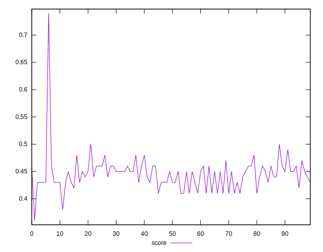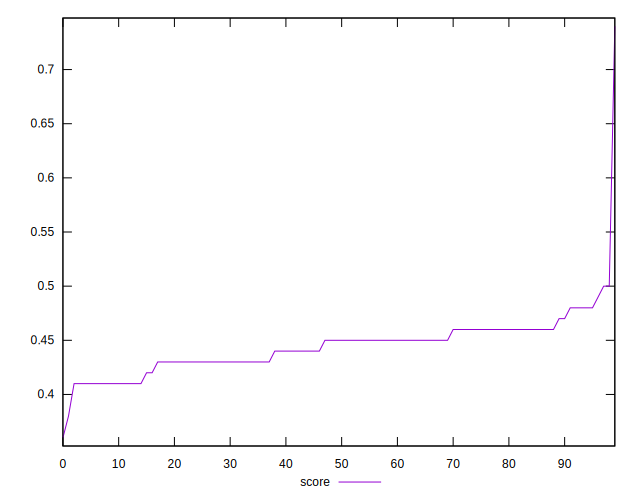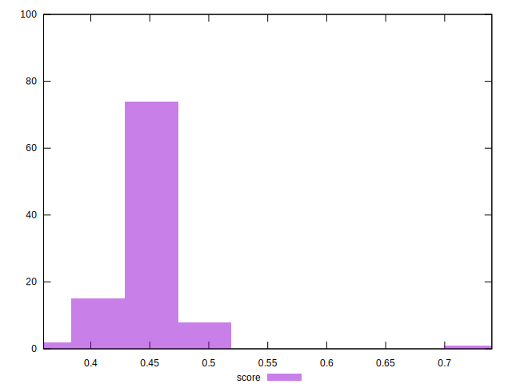
## Raw Estimate

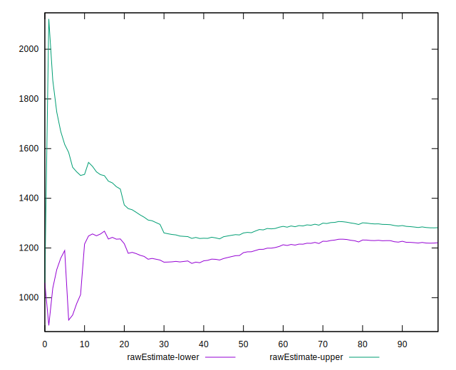
## Score Estimate

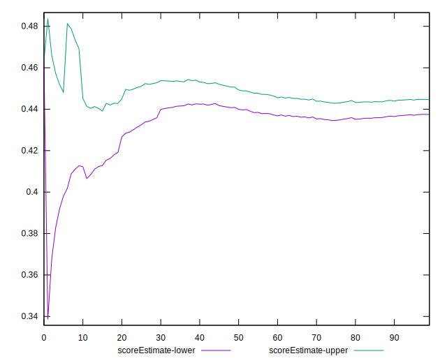
## P Score


```yaml
p90min: 0.4117647058823529
p90max: 0.48
p90range: 0.06823529411764706
p90mean: 0.44177117000646393
p90median: 0.44588235294117645
p90stdev: 0.01753281150042485
p90skewness: -0.15887533659799555
p90eccentricity: 1.000000000000001
p90discretization: 2.6
outlandishness: 1.0164840917578581
confidence: 0.014775319381848506
p90confidence: 0.007204584744503584

```

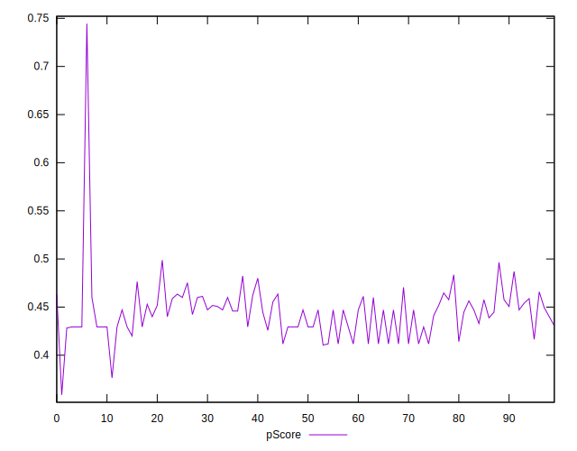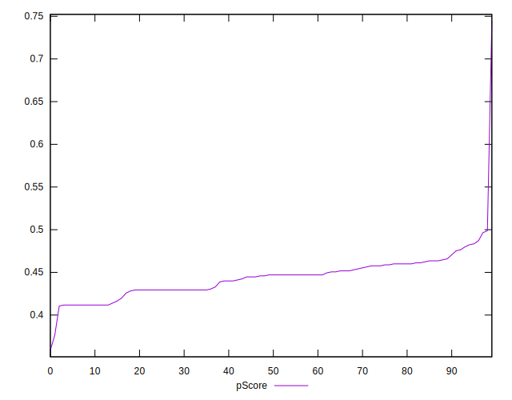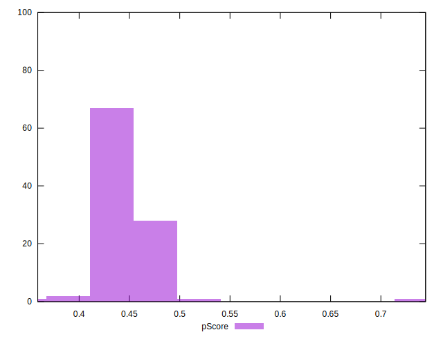
## Score Difference


```yaml
p90min: 0
p90max: 5.551115123125783e-17
p90range: 5.551115123125783e-17
p90mean: 3.660075905357659e-18
p90median: 0
p90stdev: 1.377602524196339e-17
p90skewness: 3.4981787978833734
p90eccentricity: 1
p90discretization: 45.5
outlandishness: 5.175624999999999
confidence: 7.769863928982763e-18
p90confidence: 5.6608457403275565e-18

```

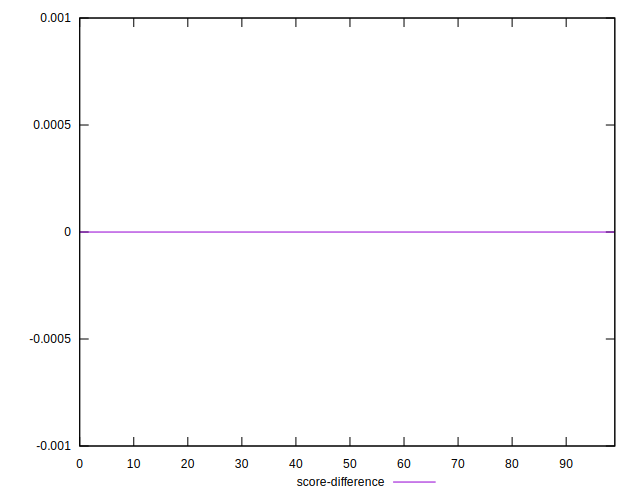
## P Score Difference


```yaml
p90min: -0.004117647058823559
p90max: 0.003529411764705892
p90range: 0.007647058823529451
p90mean: -0.00046541693600516586
p90median: -0.0005882352941176117
p90stdev: 0.0020902422751135027
p90skewness: 0.0015791799988147375
p90eccentricity: 1.0000000000000002
p90discretization: 4.333333333333333
outlandishness: 0.1895204856348065
confidence: 0.0009599669684180743
p90confidence: 0.0008589225753801284

```

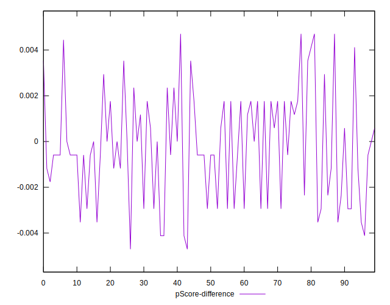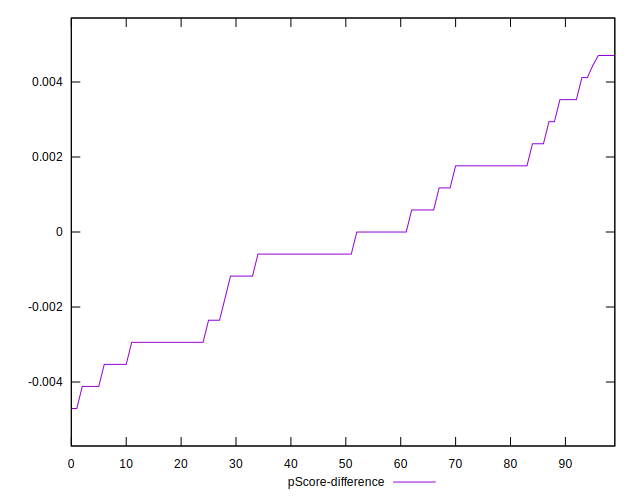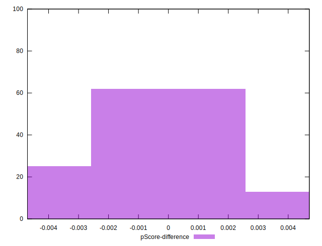