# //uses-webp-images/samples/pages+cached+noexternal+nomedia

[→ Parent](../..)


## Raw


```yaml
p90min: 1060
p90max: 1500
p90range: 440
p90mean: 1290.3296703296703
p90median: 1260
p90stdev: 131.3702138070708
p90skewness: 0.27004142659070335
p90eccentricity: 0.9999999999999991
p90discretization: 3.5
outlandishness: 0.9710271244991933
confidence: 75.2817548464318
p90confidence: 53.982662064989654

```

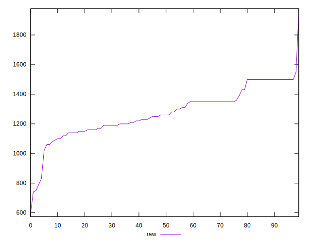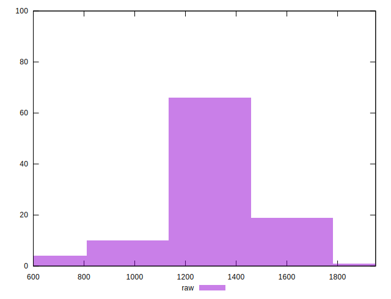
## Score


```yaml
p90min: 0.41
p90max: 0.46
p90range: 0.050000000000000044
p90mean: 0.4359340659340658
p90median: 0.44
p90stdev: 0.015827228032869317
p90skewness: -0.36261123547675755
p90eccentricity: 1
p90discretization: 15.166666666666666
outlandishness: 1.0141155082747517
confidence: 0.010184271606685558
p90confidence: 0.00650372620675399

```

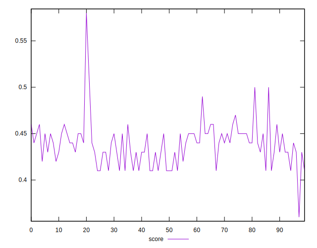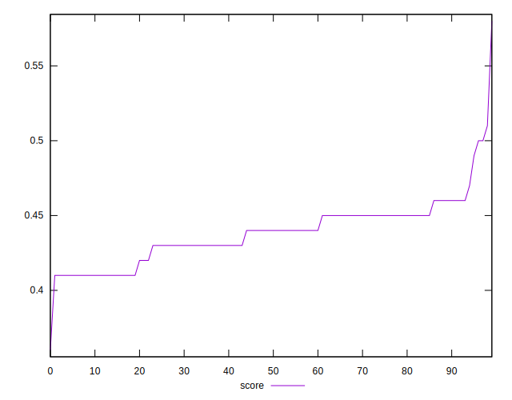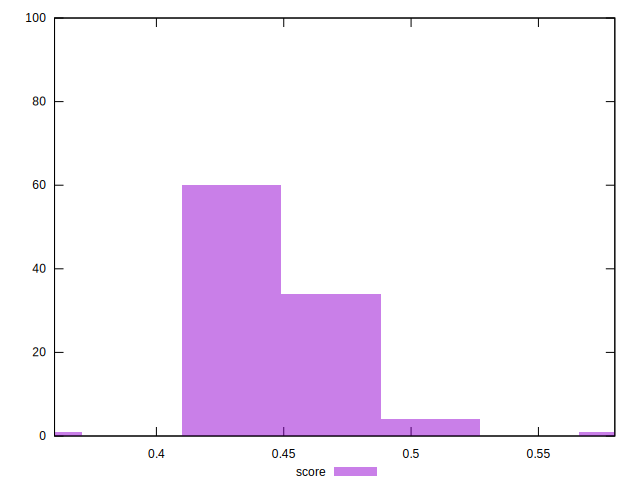
## Raw Estimate

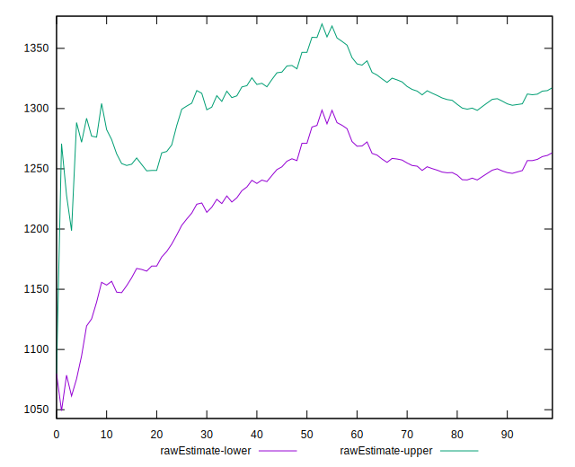
## Score Estimate

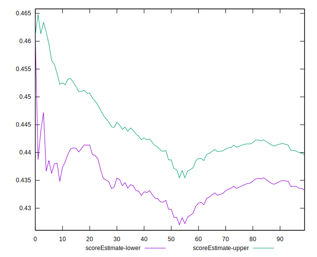
## P Score


```yaml
p90min: 0.4117647058823529
p90max: 0.46352941176470586
p90range: 0.051764705882352935
p90mean: 0.43643180349062705
p90median: 0.44
p90stdev: 0.015455319271420095
p90skewness: -0.2700414265906671
p90eccentricity: 0.9999999999999997
p90discretization: 3.5
outlandishness: 1.0134071342143096
confidence: 0.01009026579181127
p90confidence: 0.006350901419410526

```

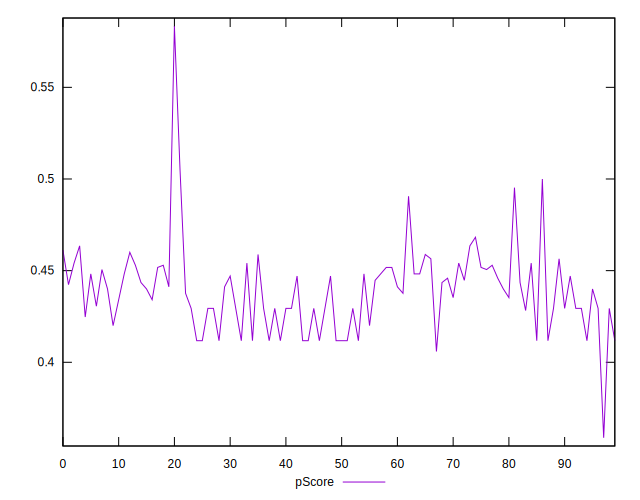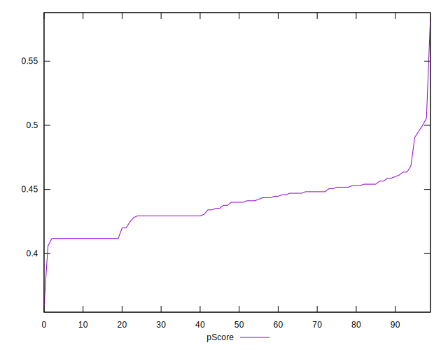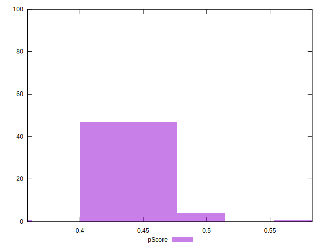
## Score Difference


```yaml
p90min: 0
p90max: 5.551115123125783e-17
p90range: 5.551115123125783e-17
p90mean: 6.710139159822375e-18
p90median: 0
p90stdev: 1.809589959464585e-17
p90skewness: 2.3259895254981826
p90eccentricity: 1
p90discretization: 45.5
outlandishness: 2.7375206611570246
confidence: 8.703988572289726e-18
p90confidence: 7.435968963363077e-18

```

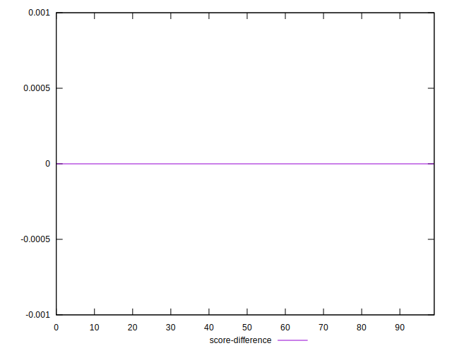
## P Score Difference


```yaml
p90min: -0.003529411764705892
p90max: 0.004705882352941171
p90range: 0.008235294117647063
p90mean: 0.000618401206636505
p90median: 0.0005882352941176117
p90stdev: 0.0020297967291194453
p90skewness: 0.016293256941740712
p90eccentricity: 0.9999999999999992
p90discretization: 4.55
outlandishness: 0.3161547755965382
confidence: 0.0009432143495309853
p90confidence: 0.0008340842852672493

```

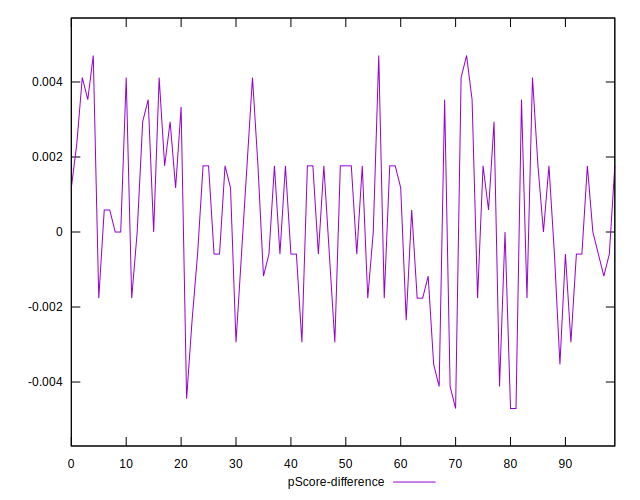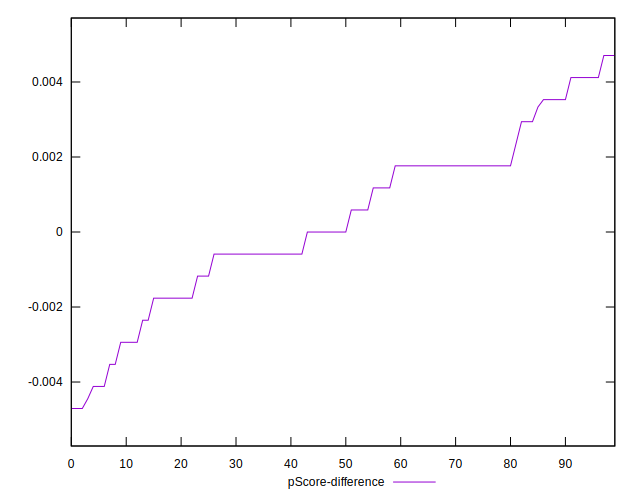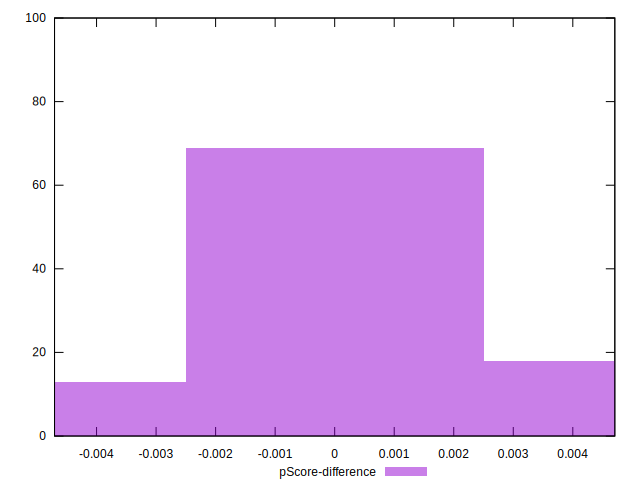