# //uses-webp-images/samples/pages+cached+noexternal

[→ Parent](../..)


## Raw


```yaml
p90min: 1020
p90max: 1570
p90range: 550
p90mean: 1314.8351648351647
p90median: 1340
p90stdev: 142.50785702158637
p90skewness: -0.09364002849032284
p90eccentricity: 1.0000000000000007
p90discretization: 3.5
outlandishness: 1.008940915788476
confidence: 81.24991396885525
p90confidence: 58.559343585296574

```

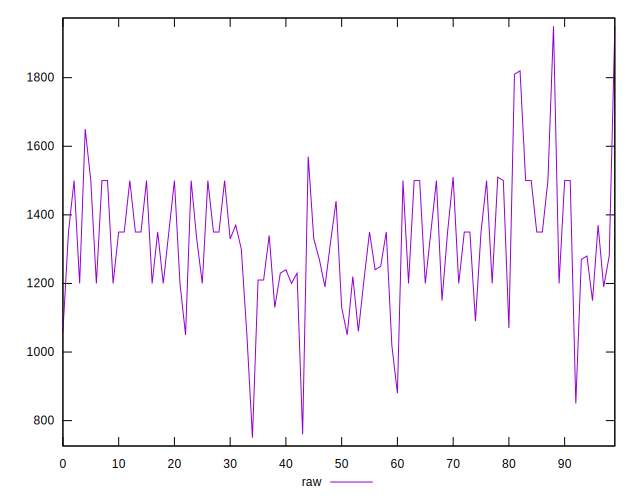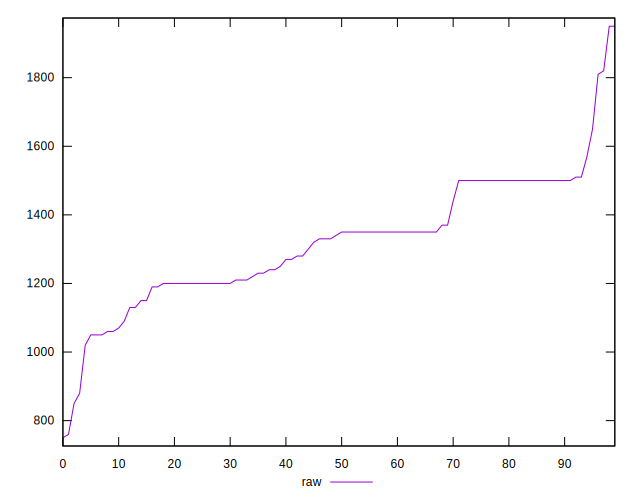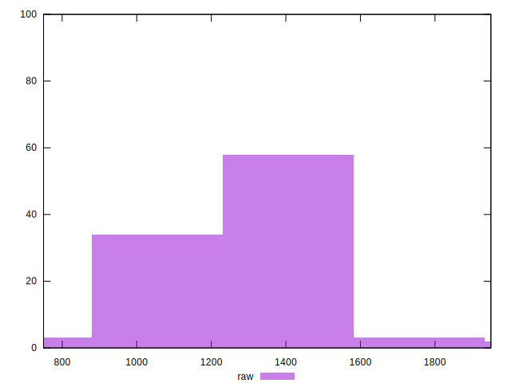
## Score


```yaml
p90min: 0.4
p90max: 0.47
p90range: 0.06999999999999995
p90mean: 0.4335164835164833
p90median: 0.43
p90stdev: 0.017501875966867624
p90skewness: -0.06563367956813643
p90eccentricity: 1.0000000000000004
p90discretization: 11.375
outlandishness: 0.9966972815631922
confidence: 0.009730268787569885
p90confidence: 0.0071918727118028825

```

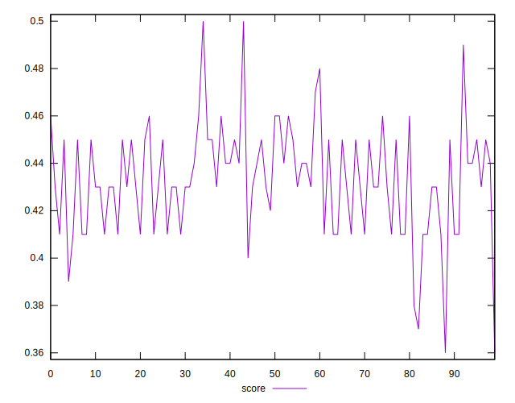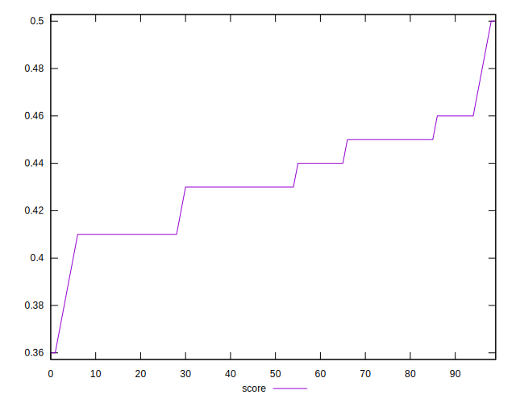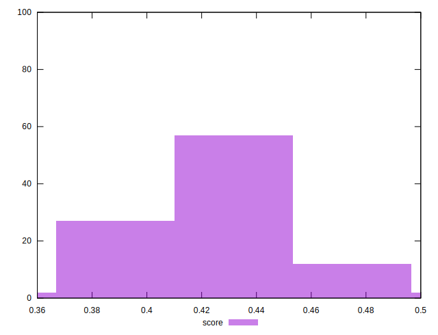
## Raw Estimate

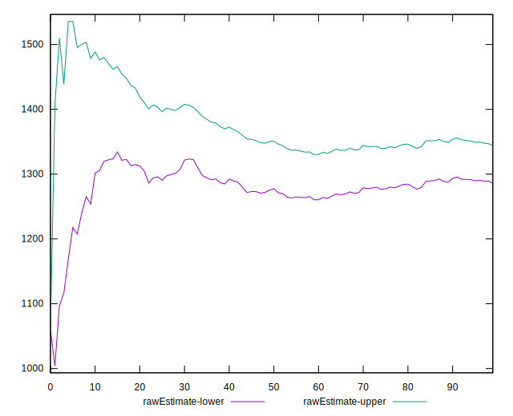
## Score Estimate

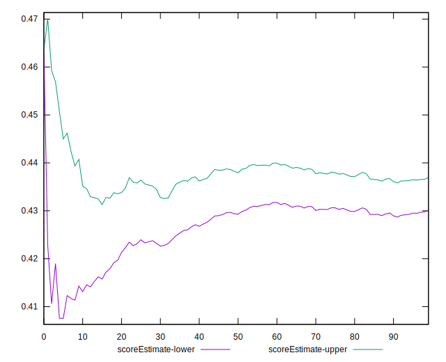
## P Score


```yaml
p90min: 0.4035294117647059
p90max: 0.4682352941176471
p90range: 0.06470588235294117
p90mean: 0.4335488041370395
p90median: 0.43058823529411766
p90stdev: 0.0167656302378337
p90skewness: 0.09364002849031199
p90eccentricity: 1.0000000000000004
p90discretization: 3.5
outlandishness: 0.9968195895881655
confidence: 0.009558813408100608
p90confidence: 0.006889334539446734

```

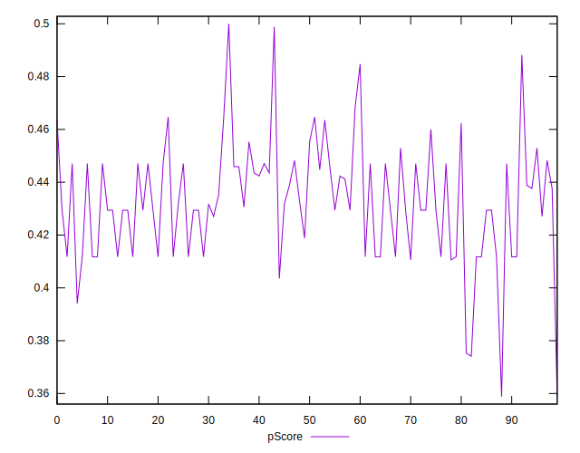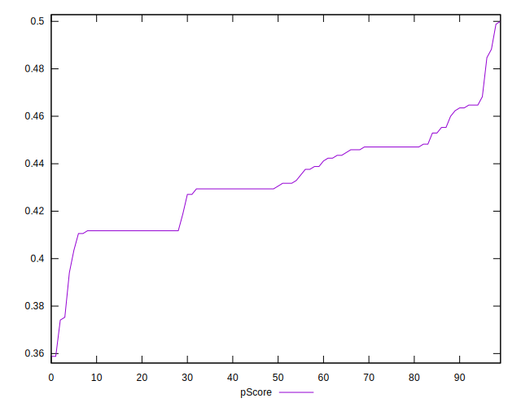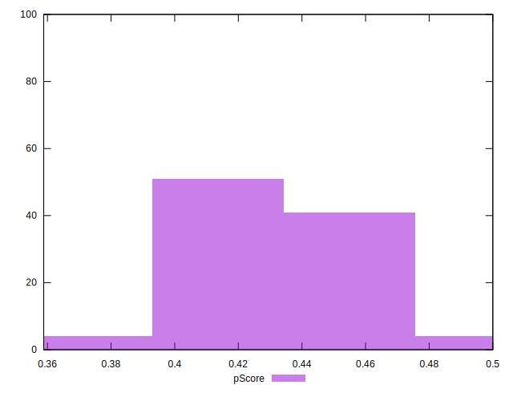
## Score Difference


```yaml
p90min: 0
p90max: 5.551115123125783e-17
p90range: 5.551115123125783e-17
p90mean: 9.150189763394147e-18
p90median: 0
p90stdev: 2.059639762299117e-17
p90skewness: 1.8066640771652356
p90eccentricity: 1.0000000000000007
p90discretization: 45.5
outlandishness: 2.119936
confidence: 9.293316709112387e-18
p90confidence: 8.463473875980288e-18

```

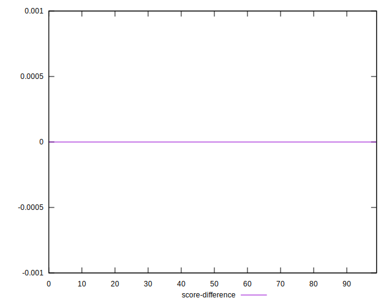
## P Score Difference


```yaml
p90min: -0.004117647058823559
p90max: 0.004117647058823559
p90range: 0.008235294117647118
p90mean: 0.000012928248222375462
p90median: -0.0005882352941176117
p90stdev: 0.0021853328924394456
p90skewness: -0.06361205131913003
p90eccentricity: 1.0000000000000004
p90discretization: 5.055555555555555
outlandishness: 20.702499999975387
confidence: 0.0009866732122528169
p90confidence: 0.0008979972218460029

```

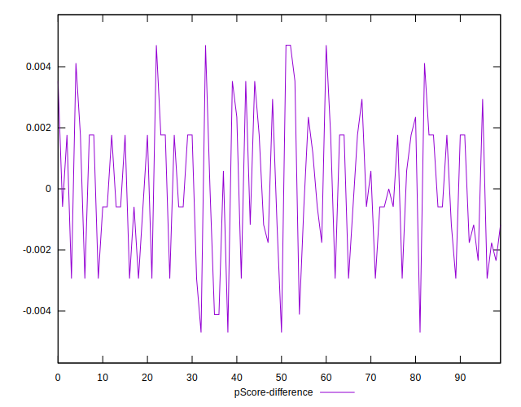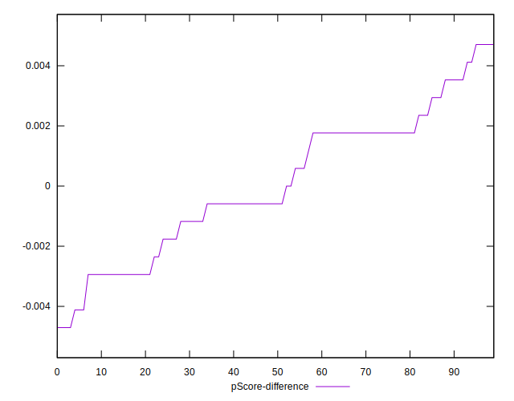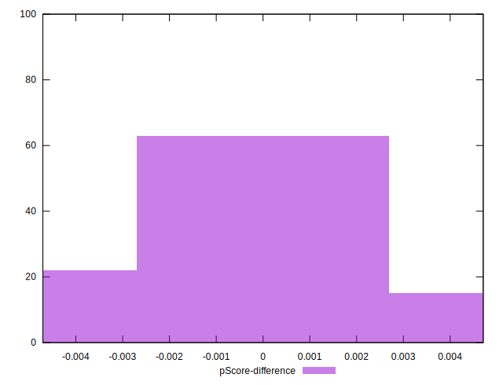