# //uses-webp-images/samples/pages+cached

[→ Parent](../..)


## Raw


```yaml
p90min: 990
p90max: 1510
p90range: 520
p90mean: 1304.9450549450548
p90median: 1310
p90stdev: 128.17719214211448
p90skewness: -0.0933322858468728
p90eccentricity: 1.0000000000000013
p90discretization: 2.676470588235294
outlandishness: 0.9312664446716454
confidence: 76.35563887985609
p90confidence: 52.67058526683013

```

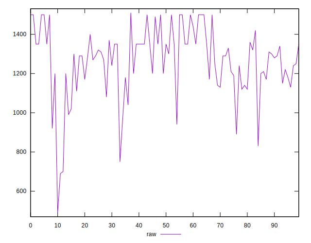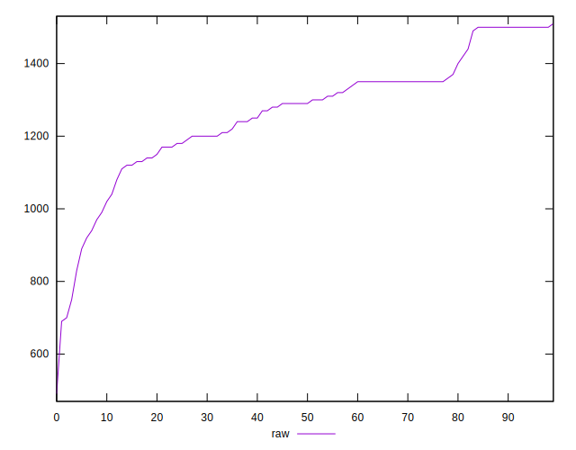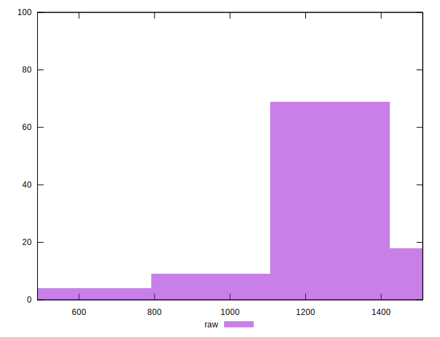
## Score


```yaml
p90min: 0.41
p90max: 0.47
p90range: 0.06
p90mean: 0.4357142857142858
p90median: 0.44
p90stdev: 0.016317108741336787
p90skewness: 0.024468719700127064
p90eccentricity: 1
p90discretization: 13
outlandishness: 1.0285949895189468
confidence: 0.01198876501778079
p90confidence: 0.006705028038965222

```

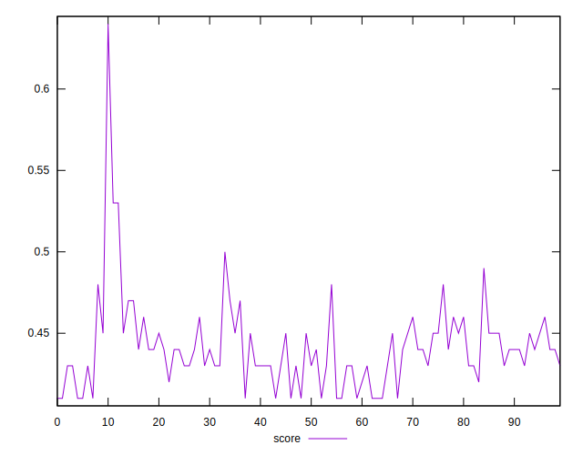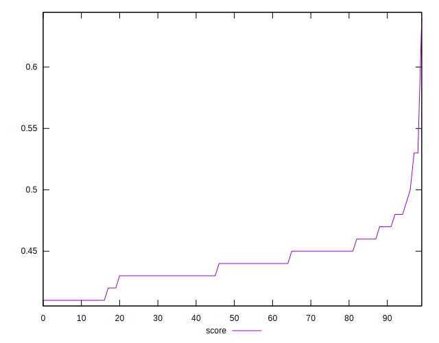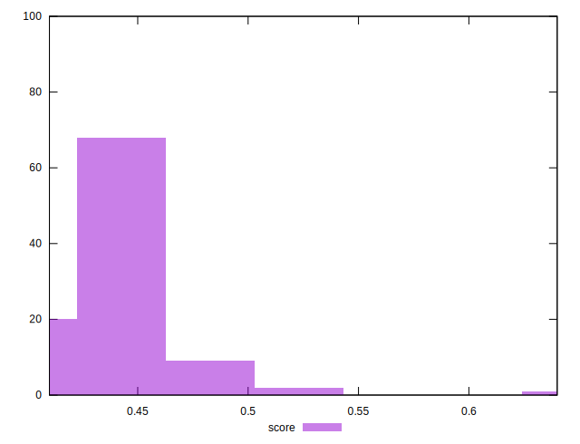
## Raw Estimate

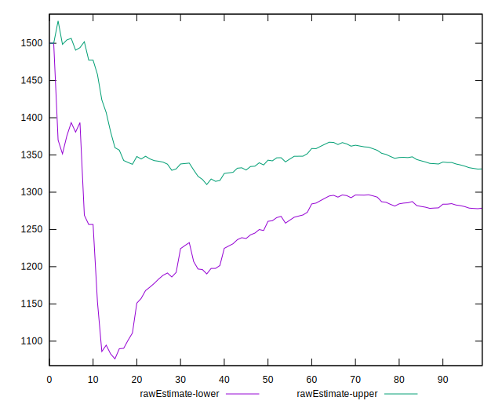
## Score Estimate

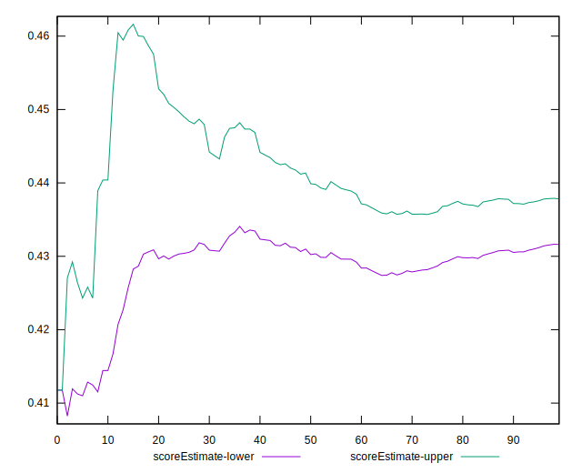
## P Score


```yaml
p90min: 0.41058823529411764
p90max: 0.4717647058823529
p90range: 0.06117647058823528
p90mean: 0.4347123464770523
p90median: 0.4341176470588235
p90stdev: 0.015079669663778179
p90skewness: 0.09333228584688297
p90eccentricity: 1.0000000000000002
p90discretization: 2.676470588235294
outlandishness: 1.0324190028821607
confidence: 0.011979620225491816
p90confidence: 0.006196539443156457

```

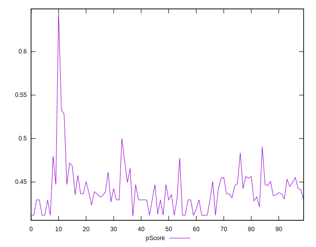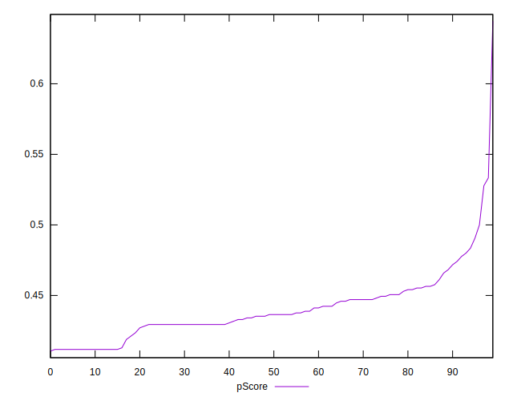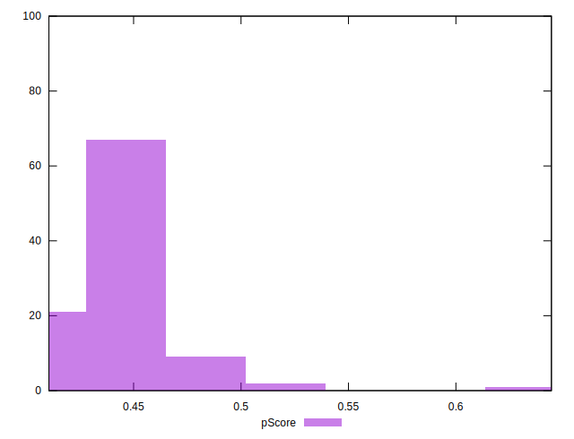
## Score Difference


```yaml
p90min: 0
p90max: 5.551115123125783e-17
p90range: 5.551115123125783e-17
p90mean: 7.320151810715318e-18
p90median: 0
p90stdev: 1.8782050784418233e-17
p90skewness: 2.1760588382464605
p90eccentricity: 0.9999999999999966
p90discretization: 45.5
outlandishness: 2.5360562499999992
confidence: 8.863015602540674e-18
p90confidence: 7.717922282380814e-18

```

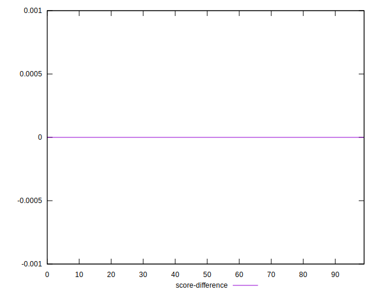
## P Score Difference


```yaml
p90min: -0.004117647058823559
p90max: 0.004117647058823504
p90range: 0.008235294117647063
p90mean: -0.00014939309056955503
p90median: -0.0005882352941176117
p90stdev: 0.002236546809461136
p90skewness: -0.046216914479455654
p90eccentricity: 0.9999999999999983
p90discretization: 3.9565217391304346
outlandishness: 1.7457015625000347
confidence: 0.0009915673304780005
p90confidence: 0.0009190420500112863

```

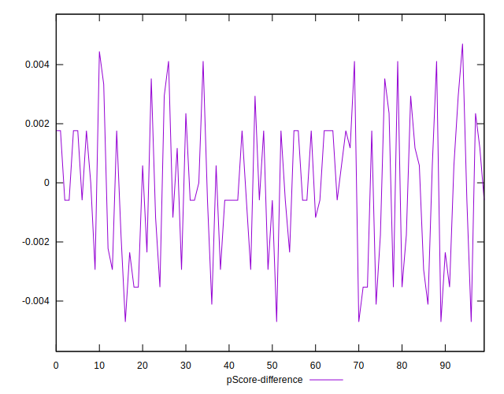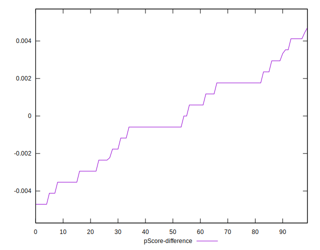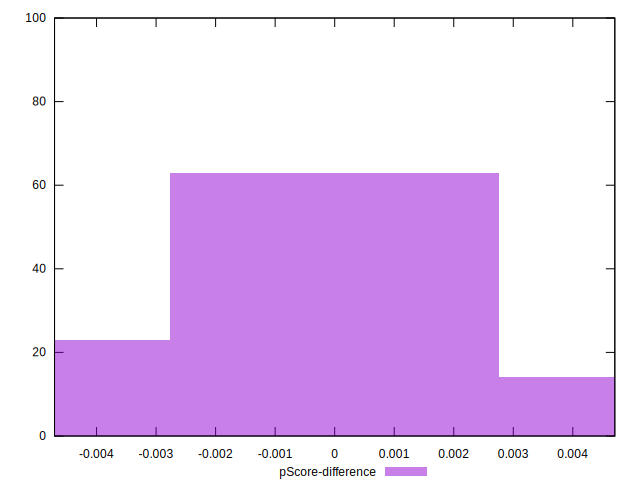