# //uses-webp-images/samples/pages

[→ Parent](../..)


## Raw


```yaml
p90min: 1350
p90max: 1800
p90range: 450
p90mean: 1609.2307692307693
p90median: 1650
p90stdev: 83.44545852088001
p90skewness: -1.533330704330162
p90eccentricity: 1.0000000000000033
p90discretization: 15.166666666666666
outlandishness: 0.946872257809044
confidence: 64.87236824977072
p90confidence: 34.28941658575832

```

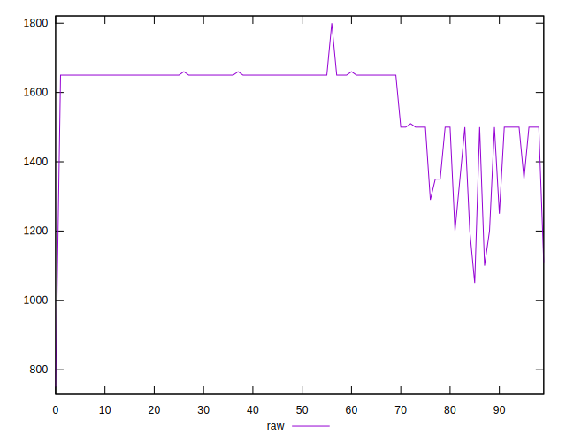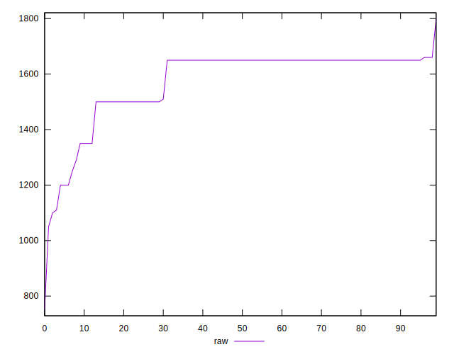
## Score


```yaml
p90min: 0.38
p90max: 0.43
p90range: 0.04999999999999999
p90mean: 0.39560439560439553
p90median: 0.39
p90stdev: 0.01091513630051781
p90skewness: 1.6959440221250552
p90eccentricity: 0.9999999999999988
p90discretization: 22.75
outlandishness: 1.0279763117361116
confidence: 0.00822054785218862
p90confidence: 0.004485248955821031

```

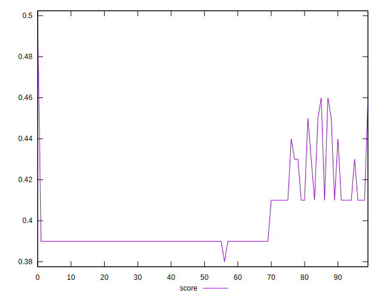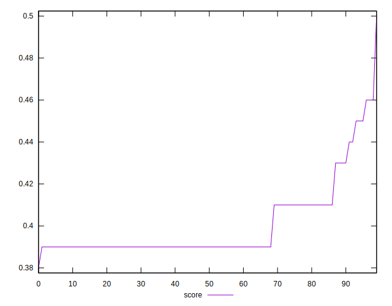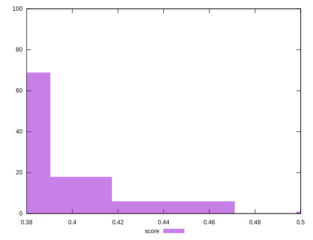
## Raw Estimate

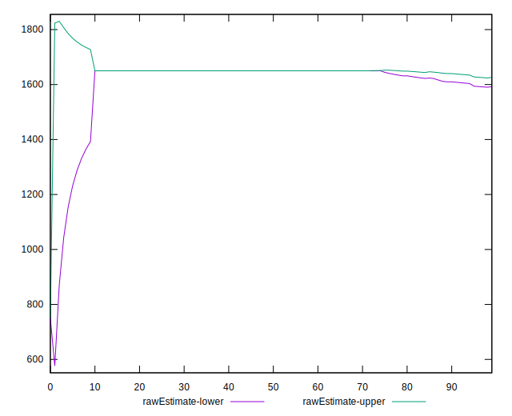
## Score Estimate

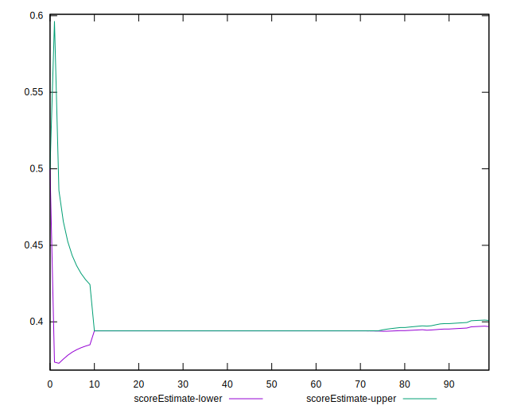
## P Score


```yaml
p90min: 0.3764705882352941
p90max: 0.4294117647058824
p90range: 0.05294117647058827
p90mean: 0.39891402714932156
p90median: 0.3941176470588235
p90stdev: 0.009817112767162392
p90skewness: 1.5333307043301727
p90eccentricity: 0.9999999999999962
p90discretization: 15.166666666666666
outlandishness: 1.0257213800401264
confidence: 0.007632043323502424
p90confidence: 0.004034049010089191

```

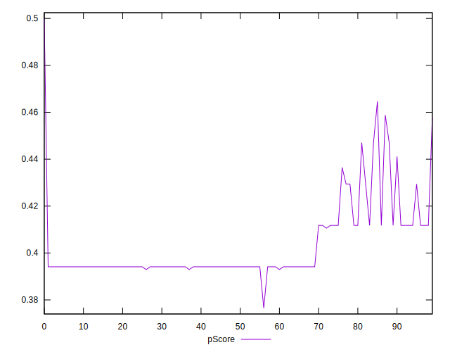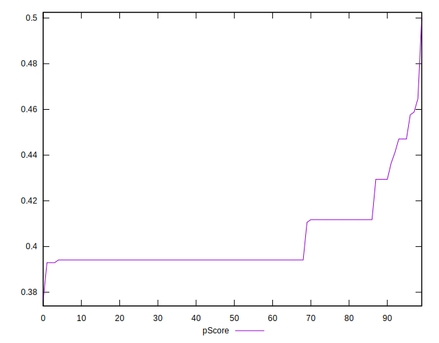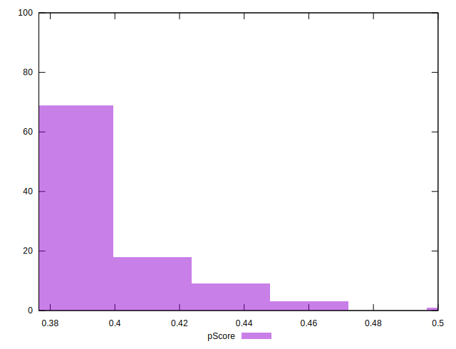
## Score Difference


```yaml
p90min: 0
p90max: 5.551115123125783e-17
p90range: 5.551115123125783e-17
p90mean: 5.490113858036488e-18
p90median: 0
p90stdev: 1.6571698478915293e-17
p90skewness: 2.6871671344879346
p90eccentricity: 1.0000000000000002
p90discretization: 45.5
outlandishness: 3.3124000000000002
confidence: 8.359908028435056e-18
p90confidence: 6.809644080689149e-18

```

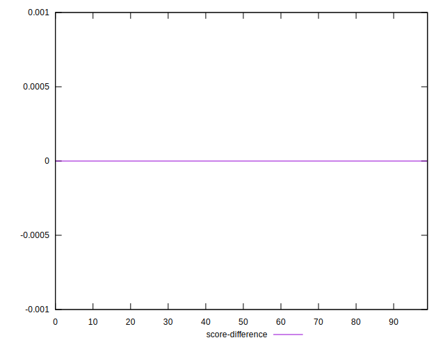
## P Score Difference


```yaml
p90min: -0.0005882352941176117
p90max: 0.004705882352941171
p90range: 0.0052941176470587825
p90mean: 0.0034259857789269385
p90median: 0.004117647058823504
p90stdev: 0.0012289318307243452
p90skewness: -1.5304962429209075
p90eccentricity: 0.9999999999999986
p90discretization: 11.375
outlandishness: 0.7223396315414734
confidence: 0.0007996811299278003
p90confidence: 0.0005049927970455252

```

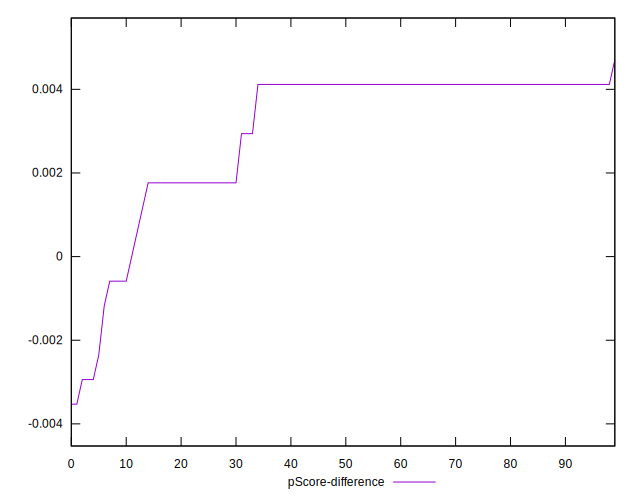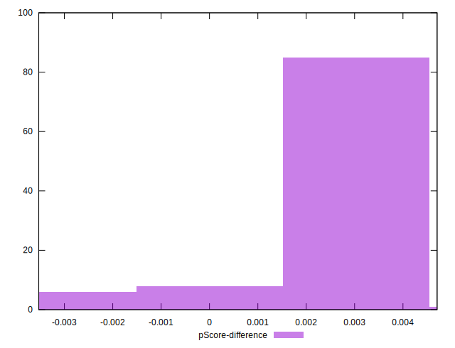