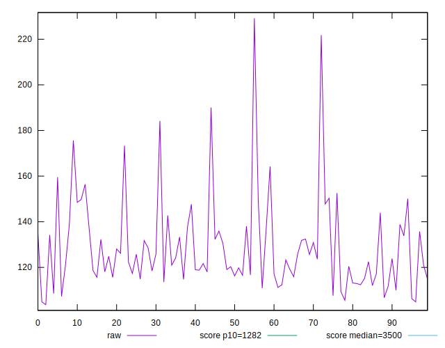
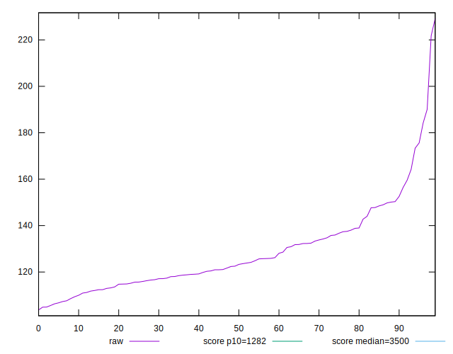
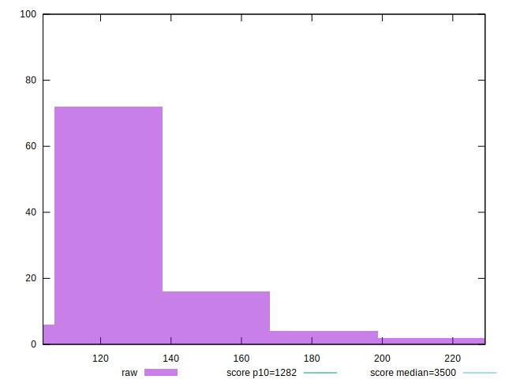
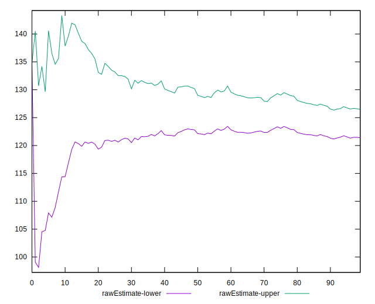
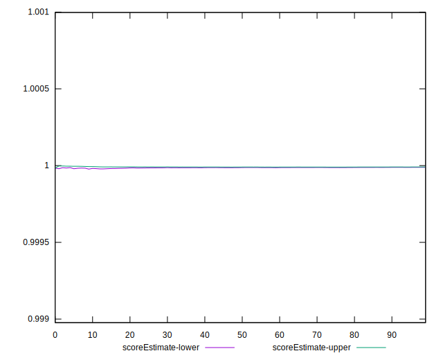
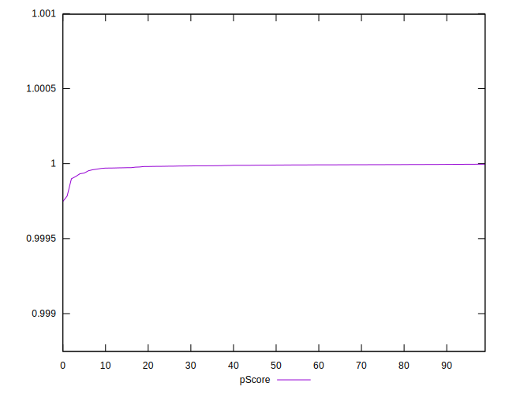
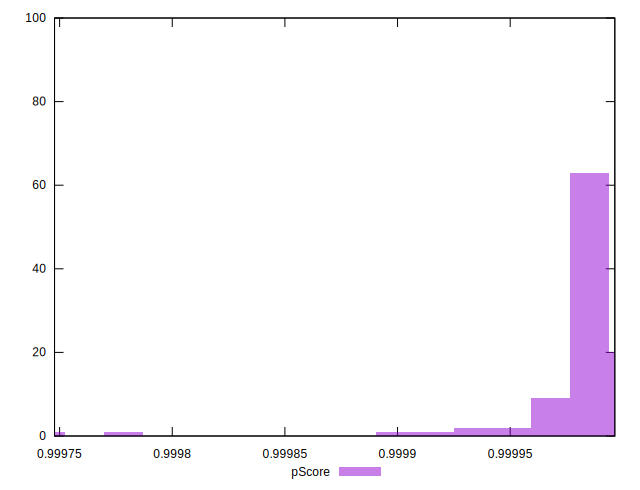
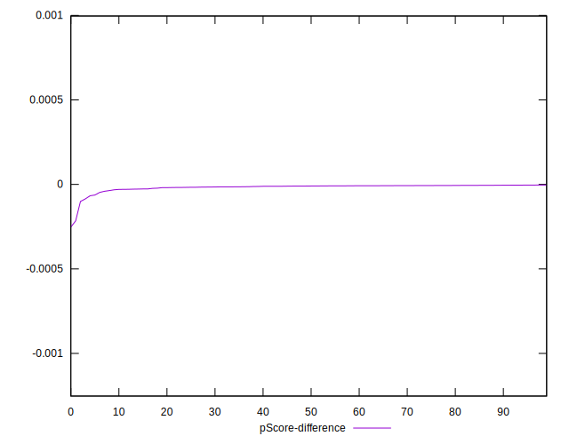
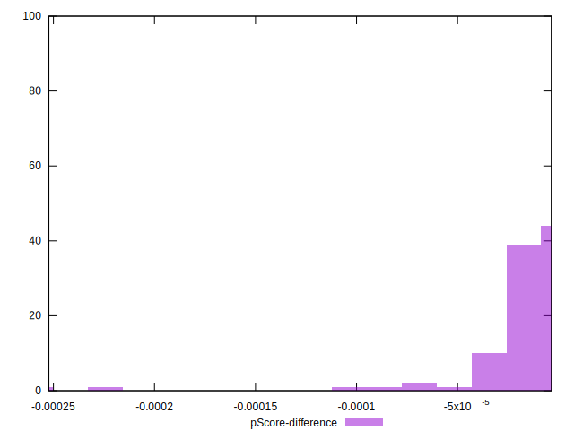

# //bootup-time/samples/pages+cached+noadtech+nomedia+nocss

[→ Parent](../..)


## Raw


```yaml
p90min: 103.65599999999998
p90max: 152.56400000000002
p90range: 48.908000000000044
p90mean: 123.93103296703296
p90median: 120.96799999999996
p90stdev: 12.39340319868062
p90skewness: 0.5588691633377919
p90eccentricity: 0.9999999999999996
p90discretization: 1
outlandishness: 1.0888883279463868
confidence: 8.65941648310016
p90confidence: 5.092698544984245

```


## Score


```yaml
p90min: 1
p90max: 1
p90range: 0
p90mean: 1
p90median: 1
p90stdev: 0
p90skewness: .nan
p90eccentricity: .nan
p90discretization: 91
outlandishness: 1
confidence: 0
p90confidence: 0

```


## Raw Estimate


## Score Estimate


## P Score


```yaml
p90min: 0.9999679992755253
p90max: 0.9999964497433138
p90range: 0.00002845046778854332
p90mean: 0.99998853815958
p90median: 0.9999912105048112
p90stdev: 0.000006994758912341426
p90skewness: -1.283531455879681
p90eccentricity: 0.9999999999999999
p90discretization: 1
outlandishness: 0.9999838730588347
confidence: 0.000013562010533263447
p90confidence: 0.000002874287067466952

```


## Score Difference


```yaml
p90min: 0
p90max: 0
p90range: 0
p90mean: 0
p90median: 0
p90stdev: 0
p90skewness: .nan
p90eccentricity: .nan
p90discretization: 91
outlandishness: .nan
confidence: 0
p90confidence: 0

```


## P Score Difference


```yaml
p90min: -0.000032000724474734454
p90max: -0.0000035502566861911333
p90range: 0.00002845046778854332
p90mean: -0.000011461840420323842
p90median: -0.00000878949518878791
p90stdev: 0.0000069947589123414275
p90skewness: -1.2835314558843902
p90eccentricity: 1
p90discretization: 1
outlandishness: 2.901914013920811
confidence: 0.000013562010533313096
p90confidence: 0.0000028742870674286626

```

