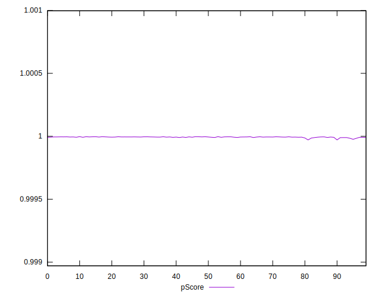

# //bootup-time/samples/pages+cached+noadtech+nomedia

[→ Parent](../..)


## Raw


```yaml
p90min: 101.15599999999998
p90max: 125.26799999999999
p90range: 24.11200000000001
p90mean: 112.90553846153844
p90median: 112.58799999999998
p90stdev: 5.7950251273435125
p90skewness: 0.20238545353681406
p90eccentricity: 0.9999999999999996
p90discretization: 1
outlandishness: 1.02809656522726
confidence: 3.597457909389334
p90confidence: 2.3812923344018486

```


## Score


```yaml
p90min: 1
p90max: 1
p90range: 0
p90mean: 1
p90median: 1
p90stdev: 0
p90skewness: .nan
p90eccentricity: .nan
p90discretization: 91
outlandishness: 1
confidence: 0
p90confidence: 0

```


## Raw Estimate


## Score Estimate


## P Score


```yaml
p90min: 0.9999892660004291
p90max: 0.999996934190778
p90range: 0.000007668190348808501
p90mean: 0.9999938981844966
p90median: 0.9999942060682112
p90stdev: 0.0000018552446726785688
p90skewness: -0.6357478228841169
p90eccentricity: 1.0000000000000002
p90discretization: 1.011111111111111
outlandishness: 0.9999981684049866
confidence: 0.000001712742357273811
p90confidence: 7.623573359261115e-7

```


## Score Difference


```yaml
p90min: 0
p90max: 0
p90range: 0
p90mean: 0
p90median: 0
p90stdev: 0
p90skewness: .nan
p90eccentricity: .nan
p90discretization: 91
outlandishness: .nan
confidence: 0
p90confidence: 0

```


## P Score Difference


```yaml
p90min: -0.000010733999570855524
p90max: -0.0000030658092220470223
p90range: 0.000007668190348808501
p90mean: -0.0000061018155033426254
p90median: -0.000005793931788788953
p90stdev: 0.000001855244672678569
p90skewness: -0.6357478230143231
p90eccentricity: 0.9999999999999999
p90discretization: 1.011111111111111
outlandishness: 1.322696019257698
confidence: 0.000001712742357220409
p90confidence: 7.623573358886405e-7

```

