# //bootup-time/samples/pages+cached+noadtech

[→ Parent](../..)


## Raw


```yaml
p90min: 105.41599999999997
p90max: 125.19199999999994
p90range: 19.775999999999968
p90mean: 114.19964835164825
p90median: 113.65599999999998
p90stdev: 4.597630910179019
p90skewness: 0.32675175293147696
p90eccentricity: 0.9999999999999996
p90discretization: 1
outlandishness: 1.020675219728797
confidence: 5.140543966514514
p90confidence: 1.8892589768350092

```

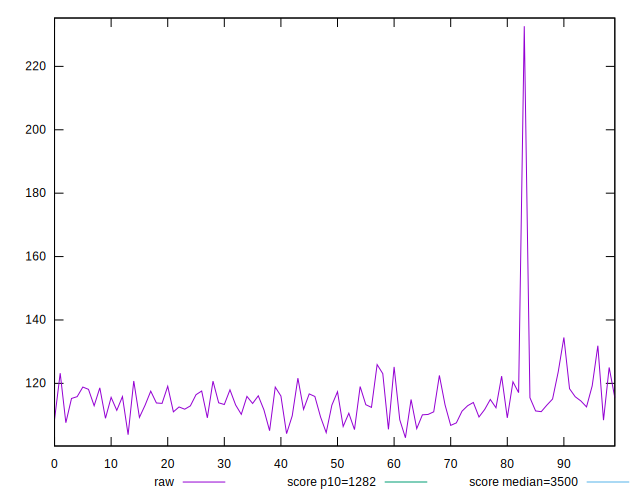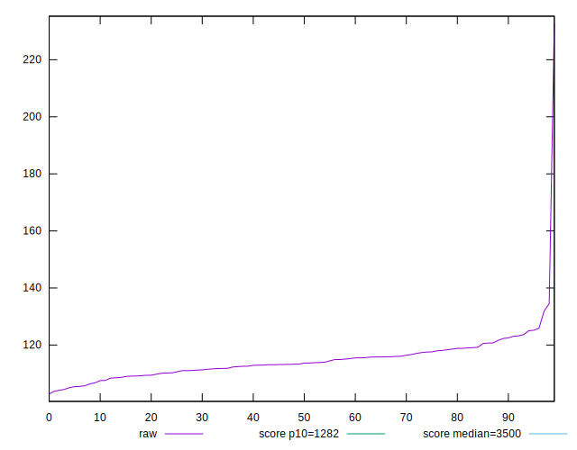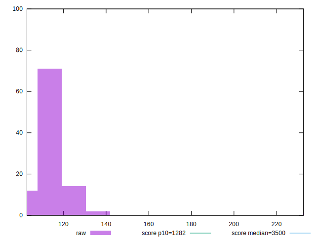
## Score


```yaml
p90min: 1
p90max: 1
p90range: 0
p90mean: 1
p90median: 1
p90stdev: 0
p90skewness: .nan
p90eccentricity: .nan
p90discretization: 91
outlandishness: 1
confidence: 0
p90confidence: 0

```


## Raw Estimate

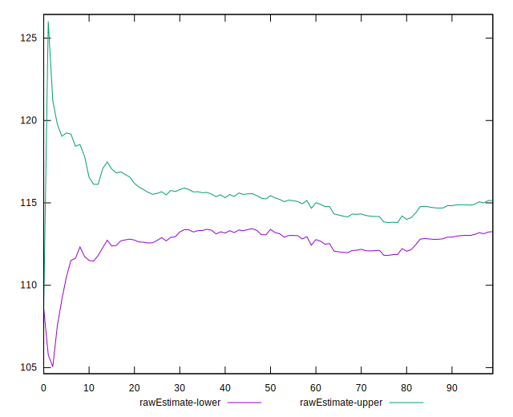
## Score Estimate

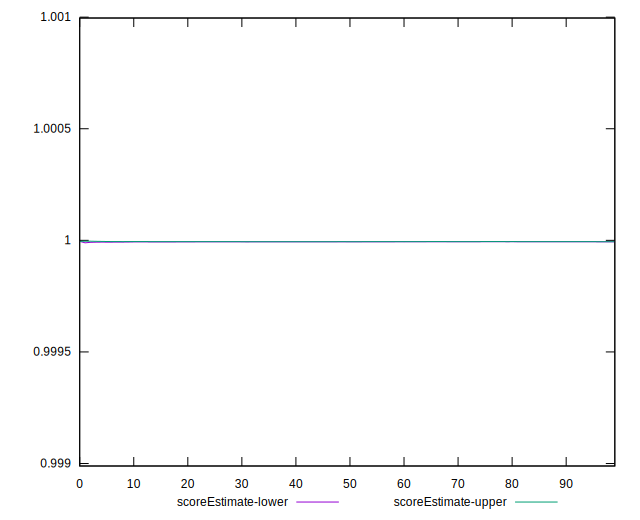
## P Score


```yaml
p90min: 0.9999856450004947
p90max: 0.999996004993063
p90range: 0.000010359992568265142
p90mean: 0.9999933725679487
p90median: 0.999993826293903
p90stdev: 0.0000017753884419675317
p90skewness: -1.3990178748301196
p90eccentricity: 1.0000000000000002
p90discretization: 1
outlandishness: 0.9999949321495775
confidence: 0.000010346606487354748
p90confidence: 7.295428052778163e-7

```

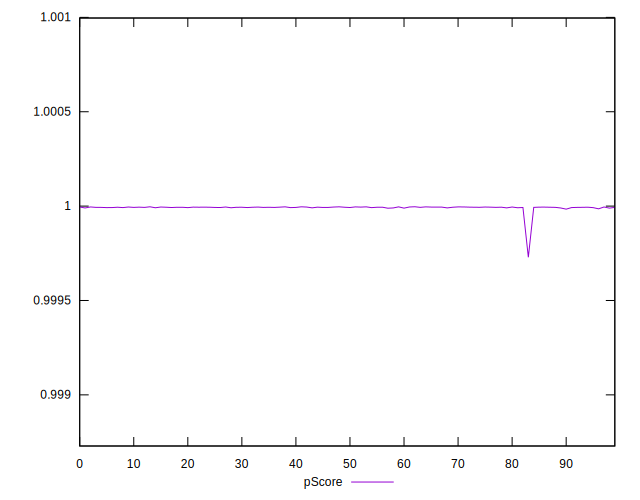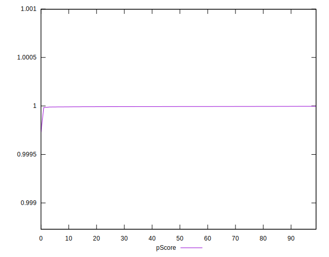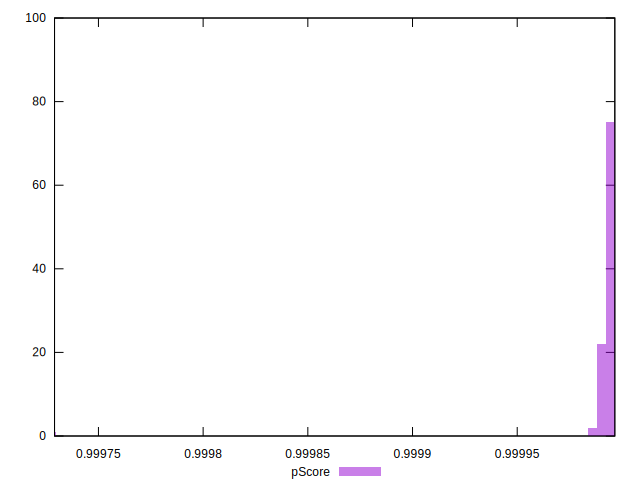
## Score Difference


```yaml
p90min: 0
p90max: 0
p90range: 0
p90mean: 0
p90median: 0
p90stdev: 0
p90skewness: .nan
p90eccentricity: .nan
p90discretization: 91
outlandishness: .nan
confidence: 0
p90confidence: 0

```


## P Score Difference


```yaml
p90min: -0.000014354999505306054
p90max: -0.0000039950069370409125
p90range: 0.000010359992568265142
p90mean: -0.00000662743205147599
p90median: -0.000006173706097012399
p90stdev: 0.0000017753884419675321
p90skewness: -1.3990178752238773
p90eccentricity: 1
p90discretization: 1
outlandishness: 1.9108552225780369
confidence: 0.000010346606487437219
p90confidence: 7.295428051717407e-7

```

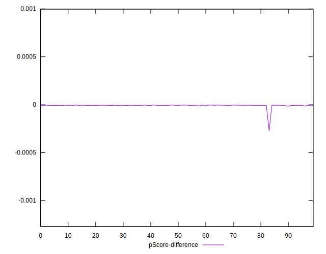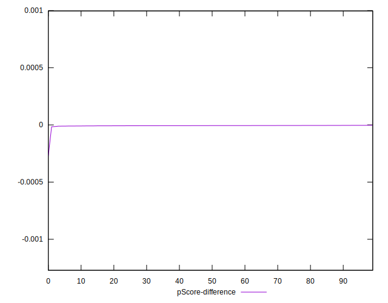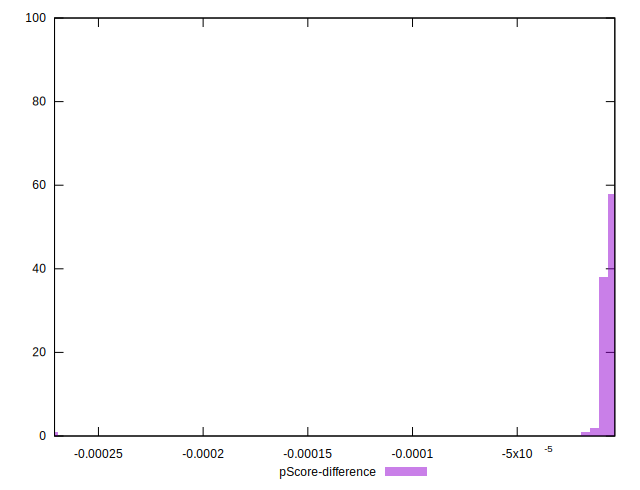