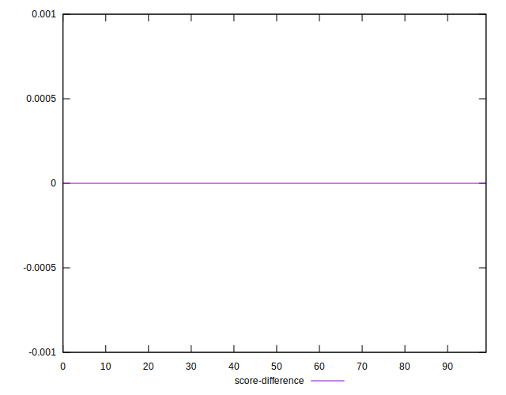

# //bootup-time/samples/pages+cached

[→ Parent](../..)


## Raw


```yaml
p90min: 990.0560000000005
p90max: 1217.8520000000008
p90range: 227.79600000000028
p90mean: 1076.2494065934068
p90median: 1068.3640000000005
p90stdev: 55.23836251720288
p90skewness: 0.6239367413380476
p90eccentricity: 0.9999999999999997
p90discretization: 1
outlandishness: 1.0603235482899207
confidence: 49.47501709147218
p90confidence: 22.6985537312803

```


## Score


```yaml
p90min: 0.91
p90max: 0.95
p90range: 0.039999999999999925
p90mean: 0.933076923076923
p90median: 0.94
p90stdev: 0.008980113278160116
p90skewness: -0.6432533181212667
p90eccentricity: 1
p90discretization: 18.2
outlandishness: 0.9885080629672095
confidence: 0.008368013382347161
p90confidence: 0.0036901090920973267

```


## Raw Estimate


## Score Estimate


## P Score


```yaml
p90min: 0.9110183058713588
p90max: 0.946441986960491
p90range: 0.035423681089132186
p90mean: 0.9336141266464288
p90median: 0.9350072616296949
p90stdev: 0.008531982724577945
p90skewness: -0.7069931060299326
p90eccentricity: 1.0000000000000002
p90discretization: 1
outlandishness: 0.9881151703882458
confidence: 0.008433619678904103
p90confidence: 0.0035059632379195182

```


## Score Difference


```yaml
p90min: 0
p90max: 1.1102230246251565e-16
p90range: 1.1102230246251565e-16
p90mean: 4.636096146786368e-17
p90median: 0
p90stdev: 5.4751821324166454e-17
p90skewness: 0.3342423883661904
p90eccentricity: 1.0000000000000013
p90discretization: 45.5
outlandishness: 1.2668094875346256
confidence: 2.172076816740011e-17
p90confidence: 2.2498624173100724e-17

```


## P Score Difference


```yaml
p90min: -0.004076934371136098
p90max: 0.004851761075639671
p90range: 0.00892869544677577
p90mean: 0.000730450970549458
p90median: 0.0007978732131977972
p90stdev: 0.0025411918319724904
p90skewness: -0.17175605150864617
p90eccentricity: 0.9999999999999999
p90discretization: 1
outlandishness: 0.22909424178972018
confidence: 0.001117967768085786
p90confidence: 0.0010442268146807219

```

