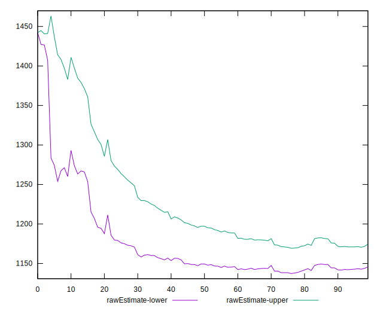
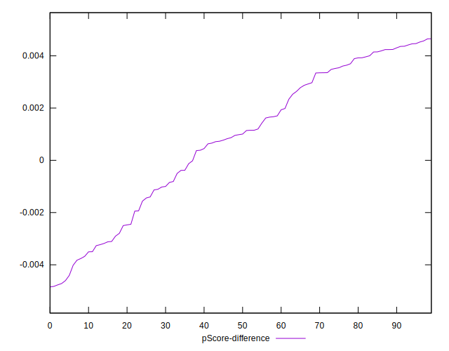

# //bootup-time/samples/pages

[→ Parent](../..)


## Raw


```yaml
p90min: 1004.7640000000007
p90max: 1364.9479999999994
p90range: 360.1839999999987
p90mean: 1160.0736703296695
p90median: 1154.948
p90stdev: 70.30013093403056
p90skewness: 0.5061482950646689
p90eccentricity: 0.9999999999999999
p90discretization: 1
outlandishness: 1.0417576181127526
confidence: 40.12954871852526
p90confidence: 28.887737192158056

```


## Score


```yaml
p90min: 0.89
p90max: 0.94
p90range: 0.04999999999999993
p90mean: 0.9195604395604401
p90median: 0.92
p90stdev: 0.011570337967661434
p90skewness: -0.5954221584359931
p90eccentricity: 0.9999999999999977
p90discretization: 15.166666666666666
outlandishness: 0.990971712831409
confidence: 0.0068440640175275735
p90confidence: 0.0047544844937472686

```


## Raw Estimate


## Score Estimate


## P Score


```yaml
p90min: 0.8852313706300994
p90max: 0.944361059738024
p90range: 0.0591296891079246
p90mean: 0.9203227621306147
p90median: 0.9214252079334528
p90stdev: 0.011539413345561881
p90skewness: -0.6269661360646666
p90eccentricity: 0.9999999999999999
p90discretization: 1
outlandishness: 0.9909421364055098
confidence: 0.006829595455670967
p90confidence: 0.004741776944783949

```


## Score Difference


```yaml
p90min: 0
p90max: 0
p90range: 0
p90mean: 0
p90median: 0
p90stdev: 0
p90skewness: .nan
p90eccentricity: .nan
p90discretization: 91
outlandishness: .inf
confidence: 8.528132291650266e-18
p90confidence: 0

```


## P Score Difference


```yaml
p90min: -0.00367631068141816
p90max: 0.004653554496008794
p90range: 0.008329865177426954
p90mean: 0.001255974467733636
p90median: 0.0012002018201603404
p90stdev: 0.0025506012134814664
p90skewness: -0.37070582107747585
p90eccentricity: 0.9999999999999999
p90discretization: 1
outlandishness: 0.3520351185970568
confidence: 0.0011477710814966281
p90confidence: 0.0010480933187193434

```

