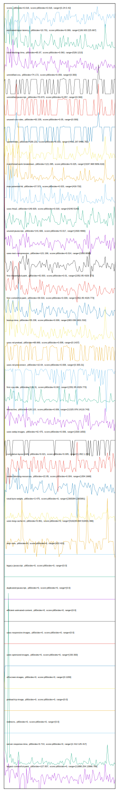

# //correlation/pages+cached

[→ Parent](../..)

[0. score, p90stdev=0.018, score:p90stdev=0.018, range=[0.24:0.42]](../../meta/score/samples/pages+cached)  
[1. estimated-input-latency, p90stdev=10.701, score:p90stdev=0.069, range=[106.933:225.667]](../../estimated-input-latency/samples/pages+cached/)  
[2. total-blocking-time, p90stdev=65.97, score:p90stdev=0.063, range=[526:1213]](../../total-blocking-time/samples/pages+cached/)  
[3. unminified-css, p90stdev=74.172, score:p90stdev=0.059, range=[0:300]](../../unminified-css/samples/pages+cached/)  
[4. unminified-javascript, p90stdev=70.673, score:p90stdev=0.057, range=[0:300]](../../unminified-javascript/samples/pages+cached/)  
[5. unused-css-rules, p90stdev=62.235, score:p90stdev=0.05, range=[0:300]](../../unused-css-rules/samples/pages+cached/)  
[6. speed-index, p90stdev=189.231, score:p90stdev=0.033, range=[4431.297:9466.782]](../../speed-index/samples/pages+cached/)  
[7. mainthread-work-breakdown, p90stdev=121.095, score:p90stdev=0.025, range=[3197.968:5656.616]](../../mainthread-work-breakdown/samples/pages+cached/)  
[8. max-potential-fid, p90stdev=27.572, score:p90stdev=0.023, range=[419:732]](../../max-potential-fid/samples/pages+cached/)  
[9. uses-http2, p90stdev=149.929, score:p90stdev=0.018, range=[4240:5140]](../../uses-http2/samples/pages+cached/)  
[10. unused-javascript, p90stdev=141.606, score:p90stdev=0.017, range=[1500:4990]](../../unused-javascript/samples/pages+cached/)  
[11. uses-text-compression, p90stdev=121.199, score:p90stdev=0.014, range=[3300:8090]](../../uses-text-compression/samples/pages+cached/)  
[12. first-meaningful-paint, p90stdev=42.003, score:p90stdev=0.01, range=[2352.85:4329.773]](../../first-meaningful-paint/samples/pages+cached/)  
[13. first-contentful-paint, p90stdev=39.533, score:p90stdev=0.009, range=[2352.85:4329.773]](../../first-contentful-paint/samples/pages+cached/)  
[14. bootup-time, p90stdev=55.238, score:p90stdev=0.009, range=[983.036:1601.532]](../../bootup-time/samples/pages+cached/)  
[15. uses-rel-preload, p90stdev=68.669, score:p90stdev=0.008, range=[0:1437]](../../uses-rel-preload/samples/pages+cached/)  
[16. uses-rel-preconnect, p90stdev=10.64, score:p90stdev=0.008, range=[0:305.01]](../../uses-rel-preconnect/samples/pages+cached/)  
[17. first-cpu-idle, p90stdev=116.31, score:p90stdev=0.007, range=[2352.85:4329.773]](../../first-cpu-idle/samples/pages+cached/)  
[18. interactive, p90stdev=128.115, score:p90stdev=0.006, range=[11325.976:14119.743]](../../interactive/samples/pages+cached/)  
[19. uses-webp-images, p90stdev=42.475, score:p90stdev=0.006, range=[1500:1650]](../../uses-webp-images/samples/pages+cached/)  
[20. cumulative-layout-shift, p90stdev=0.021, score:p90stdev=0.005, range=[1.052:1.291]](../../cumulative-layout-shift/samples/pages+cached/)  
[21. render-blocking-resources, p90stdev=22.85, score:p90stdev=0.004, range=[1354:1668]](../../render-blocking-resources/samples/pages+cached/)  
[22. total-byte-weight, p90stdev=3.475, score:p90stdev=0, range=[2365084:2365981]](../../total-byte-weight/samples/pages+cached/)  
[23. uses-long-cache-ttl, p90stdev=0.861, score:p90stdev=0, range=[519228.094:519431.996]](../../uses-long-cache-ttl/samples/pages+cached/)  
[24. uses-passive-event-listeners, p90stdev=NaN, score:p90stdev=0, range=[NaN:NaN]](../../uses-passive-event-listeners/samples/pages+cached/)  
[25. no-document-write, p90stdev=NaN, score:p90stdev=0, range=[NaN:NaN]](../../no-document-write/samples/pages+cached/)  
[26. dom-size, p90stdev=0, score:p90stdev=0, range=[422:422]](../../dom-size/samples/pages+cached/)  
[27. legacy-javascript, p90stdev=0, score:p90stdev=0, range=[0:0]](../../legacy-javascript/samples/pages+cached/)  
[28. duplicated-javascript, p90stdev=0, score:p90stdev=0, range=[0:0]](../../duplicated-javascript/samples/pages+cached/)  
[29. efficient-animated-content, p90stdev=0, score:p90stdev=0, range=[0:0]](../../efficient-animated-content/samples/pages+cached/)  
[30. uses-responsive-images, p90stdev=0, score:p90stdev=0, range=[0:0]](../../uses-responsive-images/samples/pages+cached/)  
[31. uses-optimized-images, p90stdev=0, score:p90stdev=0, range=[150:300]](../../uses-optimized-images/samples/pages+cached/)  
[32. offscreen-images, p90stdev=0, score:p90stdev=0, range=[0:1200]](../../offscreen-images/samples/pages+cached/)  
[33. preload-lcp-image, p90stdev=0, score:p90stdev=0, range=[0:0]](../../preload-lcp-image/samples/pages+cached/)  
[34. unsized-images, p90stdev=NaN, score:p90stdev=0, range=[NaN:NaN]](../../unsized-images/samples/pages+cached/)  
[35. third-party-summary, p90stdev=NaN, score:p90stdev=0, range=[NaN:NaN]](../../third-party-summary/samples/pages+cached/)  
[36. font-display, p90stdev=NaN, score:p90stdev=0, range=[NaN:NaN]](../../font-display/samples/pages+cached/)  
[37. redirects, p90stdev=0, score:p90stdev=0, range=[0:0]](../../redirects/samples/pages+cached/)  
[38. server-response-time, p90stdev=0.713, score:p90stdev=0, range=[2.412:125.417]](../../server-response-time/samples/pages+cached/)  
[39. largest-contentful-paint, p90stdev=127.837, score:p90stdev=0, range=[11888.254:13966.789]](../../largest-contentful-paint/samples/pages+cached/)  
