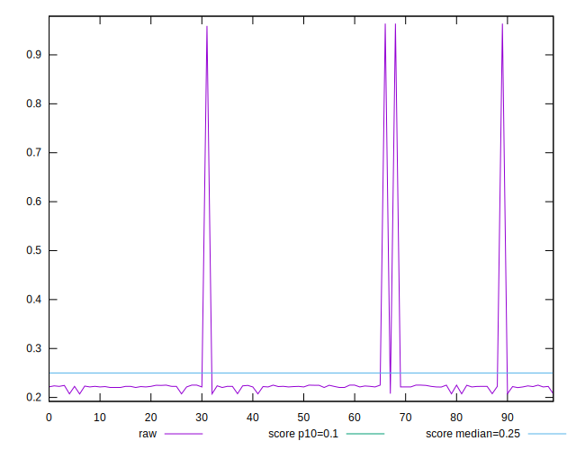
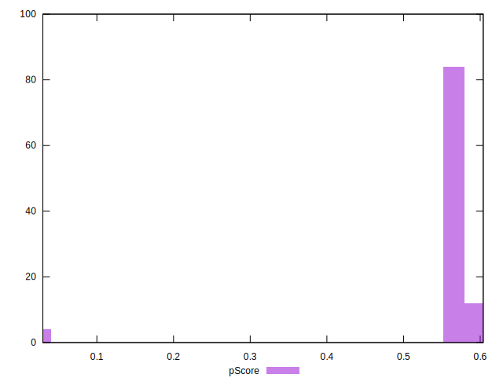

# //cumulative-layout-shift/samples/pages+cached+noadtech+nomedia+nocss

[→ Parent](../..)


## Raw


```yaml
p90min: 0.20740965440538192
p90max: 0.2251631639268663
p90range: 0.017753509521484384
p90mean: 0.22160571508908303
p90median: 0.22252071804470486
p90stdev: 0.004320263669236599
p90skewness: -2.515427612034834
p90eccentricity: 1.0000000000000002
p90discretization: 3.9565217391304346
outlandishness: 1.278080177679718
confidence: 0.05701574602456999
p90confidence: 0.0017752832010348718

```


## Score


```yaml
p90min: 0.56
p90max: 0.6
p90range: 0.039999999999999925
p90mean: 0.5670329670329676
p90median: 0.56
p90stdev: 0.010638361591455755
p90skewness: 2.145318157430145
p90eccentricity: 0.9999999999999986
p90discretization: 30.333333333333332
outlandishness: 0.9312698842617633
confidence: 0.0416697008903375
p90confidence: 0.004371516663283392

```


## Raw Estimate


## Score Estimate


## P Score


```yaml
p90min: 0.5581760832428186
p90max: 0.6030366643018541
p90range: 0.044860581059035454
p90mean: 0.5670310491083759
p90median: 0.5646846677471791
p90stdev: 0.010921345932832848
p90skewness: 2.54458407095232
p90eccentricity: 1.0000000000000007
p90discretization: 3.9565217391304346
outlandishness: 0.9318049572781935
confidence: 0.041739006581906546
p90confidence: 0.00448780061858467

```


## Score Difference


```yaml
p90min: 0
p90max: 1.1102230246251565e-16
p90range: 1.1102230246251565e-16
p90mean: 3.294068314821893e-17
p90median: 0
p90stdev: 5.071549942110496e-17
p90skewness: 0.8900816650006732
p90eccentricity: 1.0000000000000004
p90discretization: 45.5
outlandishness: 1.4721777777777778
confidence: 2.0889572573495356e-17
p90confidence: 2.084001835246562e-17

```


## P Score Difference


```yaml
p90min: -0.0033363227596551193
p90max: 0.004684667747179017
p90range: 0.008020990506834136
p90mean: 0.0004217640951605403
p90median: -0.000003993503521759756
p90stdev: 0.0027017176960703153
p90skewness: 0.28628554900043013
p90eccentricity: 1.0000000000000007
p90discretization: 3.64
outlandishness: 0.13562867242325763
confidence: 0.001156338391251781
p90confidence: 0.001110190119627531

```

