# //cumulative-layout-shift/samples/pages+cached+noadtech+nomedia

[→ Parent](../..)


## Raw


```yaml
p90min: 1.1363893093532984
p90max: 1.221075924343533
p90range: 0.08468661499023455
p90mean: 1.1478229224050147
p90median: 1.152278103298611
p90stdev: 0.011124602091100128
p90skewness: 2.877178398240498
p90eccentricity: 1.0000000000000007
p90discretization: 5.352941176470588
outlandishness: 1.0166754083659144
confidence: 0.03773231558402124
p90confidence: 0.004571322660502641

```

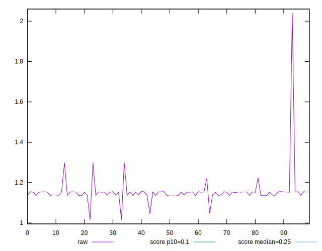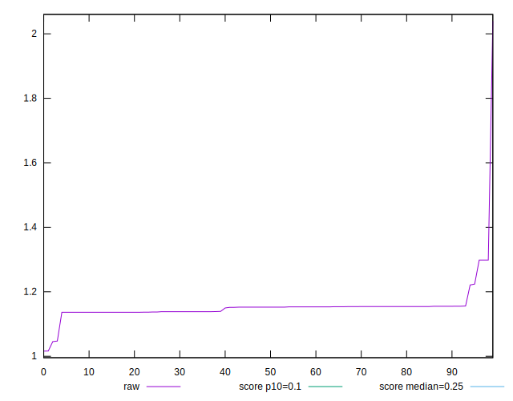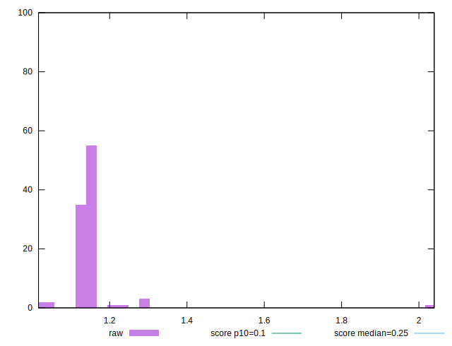
## Score


```yaml
p90min: 0.02
p90max: 0.02
p90range: 0
p90mean: 0.020000000000000014
p90median: 0.02
p90stdev: 1.3877787807814457e-17
p90skewness: -1
p90eccentricity: 1
p90discretization: 91
outlandishness: 0.9312249999999997
confidence: 0.0011435176354408702
p90confidence: 6.938893903907228e-18

```

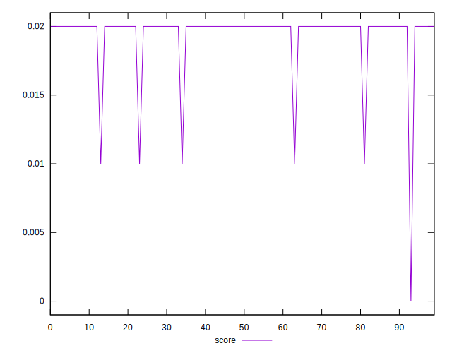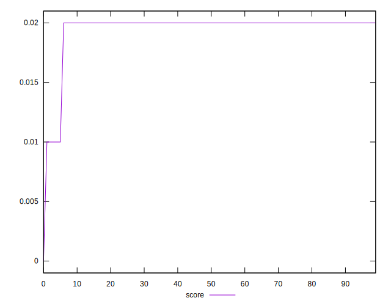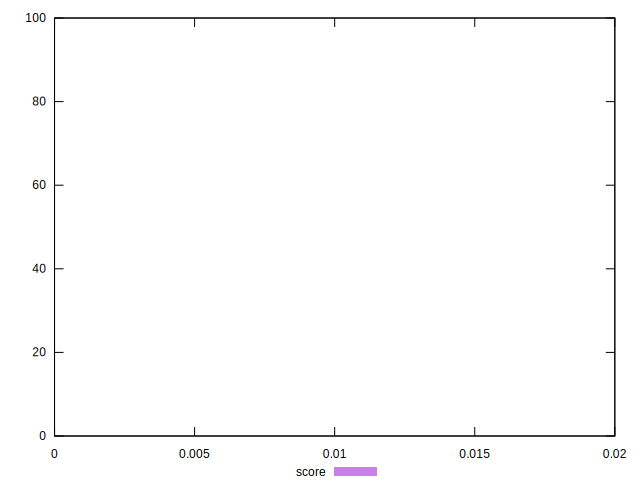
## Raw Estimate

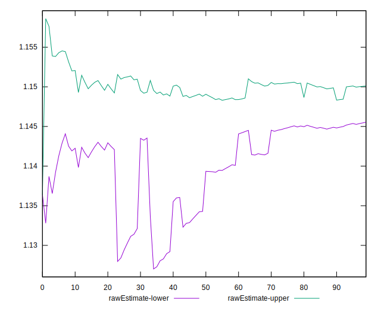
## Score Estimate

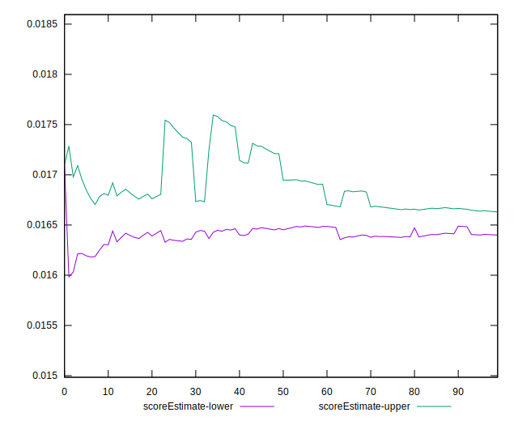
## P Score


```yaml
p90min: 0.0132683625634048
p90max: 0.01709866264333404
p90range: 0.0038303000799292386
p90mean: 0.016524497169581112
p90median: 0.016292603706659137
p90stdev: 0.0005306693529370232
p90skewness: -2.2442397827836364
p90eccentricity: 0.9999999999999988
p90discretization: 5.352941176470588
outlandishness: 0.9915898672454004
confidence: 0.0009424984642404655
p90confidence: 0.00021806270628375868

```

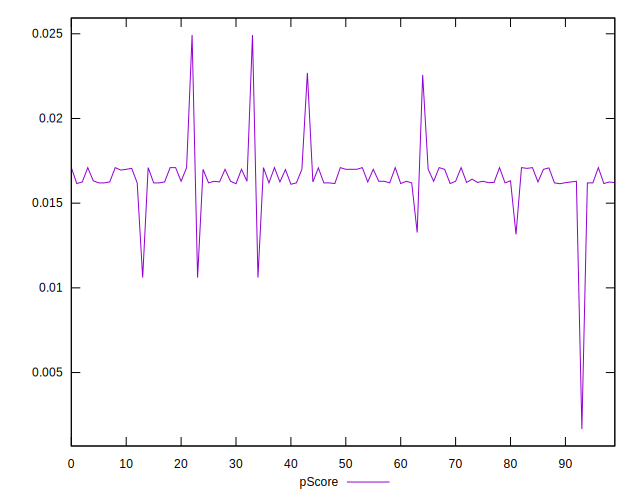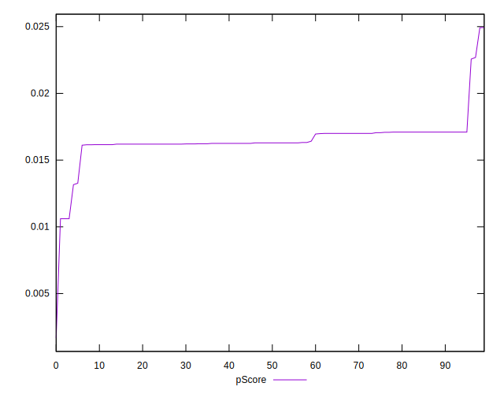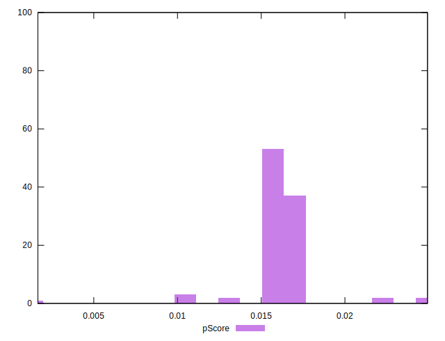
## Score Difference


```yaml
p90min: 0
p90max: 0
p90range: 0
p90mean: 0
p90median: 0
p90stdev: 0
p90skewness: .nan
p90eccentricity: .nan
p90discretization: 91
outlandishness: .nan
confidence: 0
p90confidence: 0

```


## P Score Difference


```yaml
p90min: -0.0038831566784804754
p90max: 0.000607400130950406
p90range: 0.004490556809430881
p90mean: -0.0033948540659403644
p90median: -0.0037073962933408637
p90stdev: 0.0005846226007356724
p90skewness: 3.5468395255469525
p90eccentricity: 1.0000000000000002
p90discretization: 5.352941176470588
outlandishness: 0.7023666603122971
confidence: 0.000740595852512513
p90confidence: 0.00024023318053982296

```

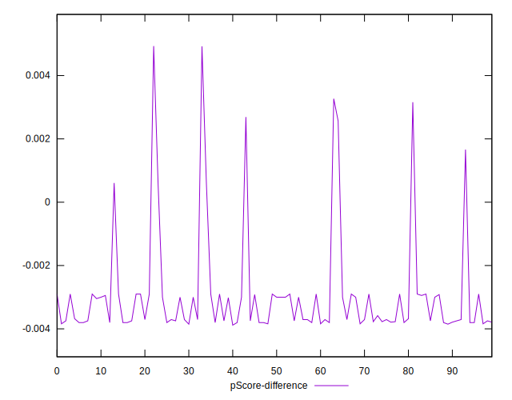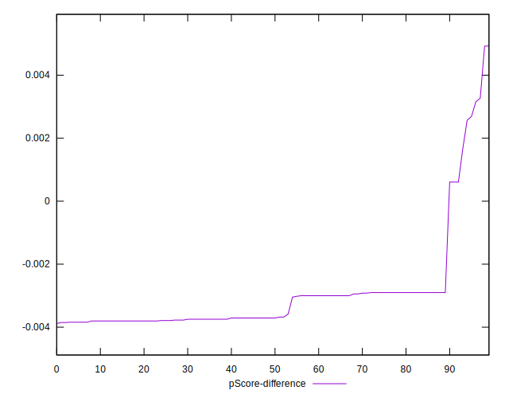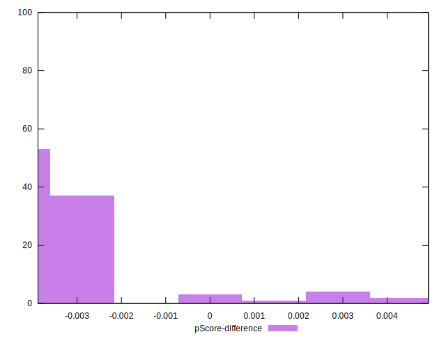