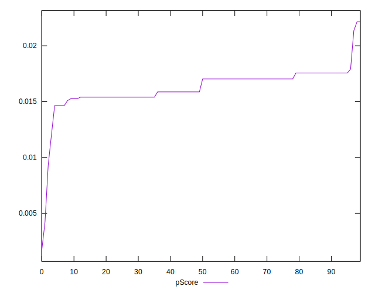

# //cumulative-layout-shift/samples/pages+cached+noadtech

[→ Parent](../..)


## Raw


```yaml
p90min: 1.1276367187499998
p90max: 1.1876797909206813
p90range: 0.0600430721706815
p90mean: 1.152114559709224
p90median: 1.1609122178819444
p90stdev: 0.0188653874503907
p90skewness: 0.1267696391328408
p90eccentricity: 0.9999999999999997
p90discretization: 13
outlandishness: 1.0230746176796202
confidence: 0.04111873510274222
p90confidence: 0.007752166993921339

```


## Score


```yaml
p90min: 0.02
p90max: 0.02
p90range: 0
p90mean: 0.020000000000000014
p90median: 0.02
p90stdev: 1.3877787807814457e-17
p90skewness: -1
p90eccentricity: 1
p90discretization: 91
outlandishness: 0.9025
confidence: 0.0014133501288643782
p90confidence: 6.938893903907228e-18

```


## Raw Estimate


## Score Estimate


## P Score


```yaml
p90min: 0.01464798855058913
p90max: 0.01756212014953079
p90range: 0.0029141315989416605
p90mean: 0.01636304729941451
p90median: 0.017030207866815195
p90stdev: 0.0009205956184851096
p90skewness: -0.09104568313022497
p90eccentricity: 0.9999999999999999
p90discretization: 13
outlandishness: 0.9735550472565818
confidence: 0.0009605725904720044
p90confidence: 0.00037829124830515704

```


## Score Difference


```yaml
p90min: 0
p90max: 0
p90range: 0
p90mean: 0
p90median: 0
p90stdev: 0
p90skewness: .nan
p90eccentricity: .nan
p90discretization: 91
outlandishness: .nan
confidence: 0
p90confidence: 0

```


## P Score Difference


```yaml
p90min: -0.0049044249153822154
p90max: 0.001349695026251558
p90range: 0.006254119941633773
p90mean: -0.003475963934181334
p90median: -0.002969792133184806
p90stdev: 0.0010586691615302023
p90skewness: 1.0439506598001018
p90eccentricity: 0.9999999999999983
p90discretization: 10.11111111111111
outlandishness: 0.6745115589421643
confidence: 0.0008825852434111575
p90confidence: 0.00043502844312517074

```

