# //cumulative-layout-shift/samples/pages+cached

[→ Parent](../..)


## Raw


```yaml
p90min: 1.1406689402262369
p90max: 1.2104139489067924
p90range: 0.06974500868055555
p90mean: 1.169570121644036
p90median: 1.1573681589762368
p90stdev: 0.020968038177700148
p90skewness: 0.3023983002248842
p90eccentricity: 1.000000000000001
p90discretization: 3.3703703703703702
outlandishness: 1.0023936821389532
confidence: 0.012592918441850731
p90confidence: 0.008616188451781692

```

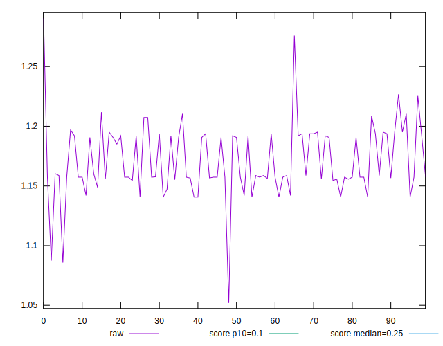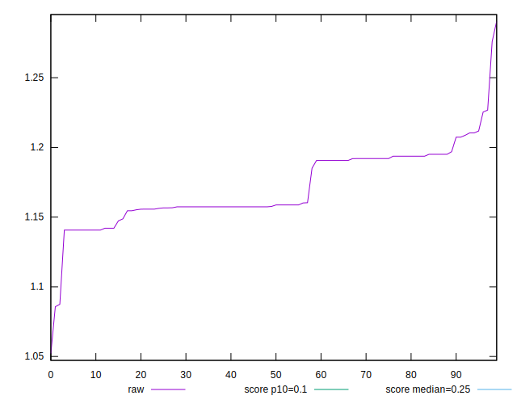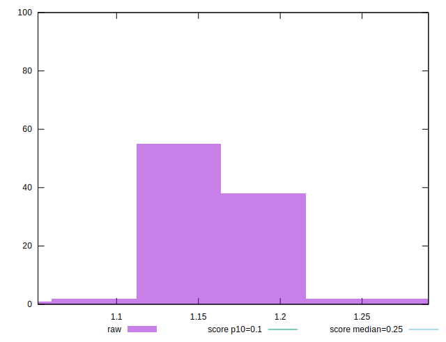
## Score


```yaml
p90min: 0.01
p90max: 0.02
p90range: 0.01
p90mean: 0.016373626373626382
p90median: 0.02
p90stdev: 0.004807613814115901
p90skewness: -0.5714379011031255
p90eccentricity: 1.000000000000001
p90discretization: 45.5
outlandishness: 0.9311602360254047
confidence: 0.00193471379663359
p90confidence: 0.0019755451737905744

```

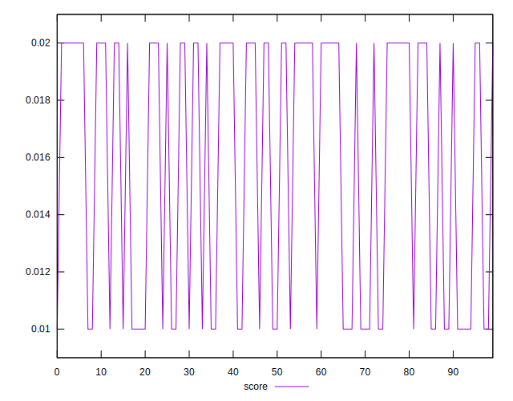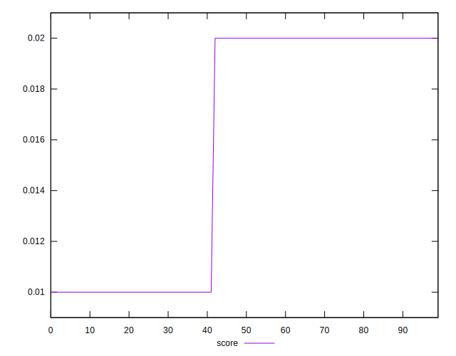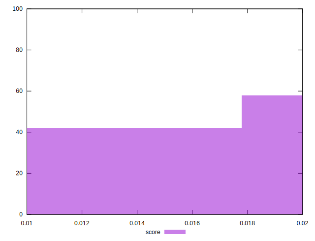
## Raw Estimate

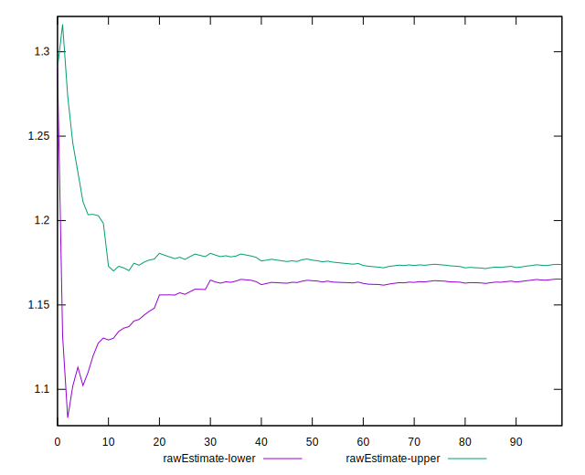
## Score Estimate

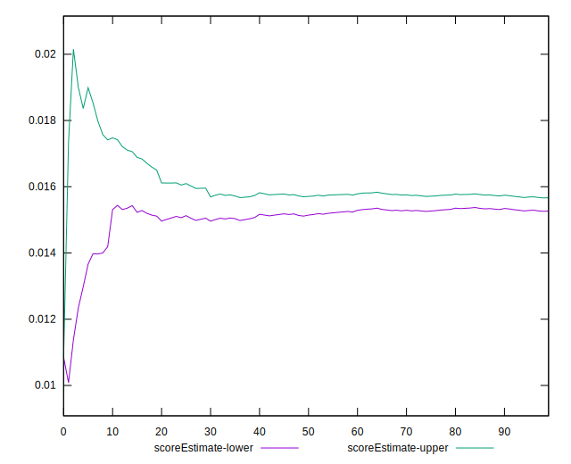
## P Score


```yaml
p90min: 0.013692009132918626
p90max: 0.016877152400296802
p90range: 0.0031851432673781765
p90mean: 0.015499153015214814
p90median: 0.01604363041196122
p90stdev: 0.0009659687084797713
p90skewness: -0.24785413648765334
p90eccentricity: 0.9999999999999991
p90discretization: 3.5
outlandishness: 0.9977357860812496
confidence: 0.0005908469317778553
p90confidence: 0.00039693596321460287

```

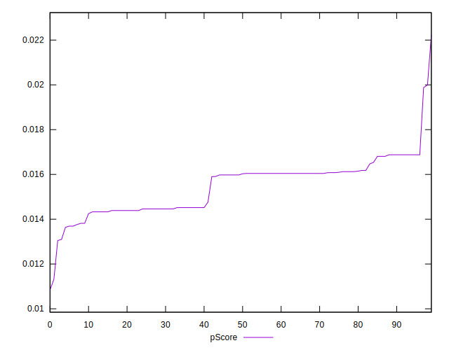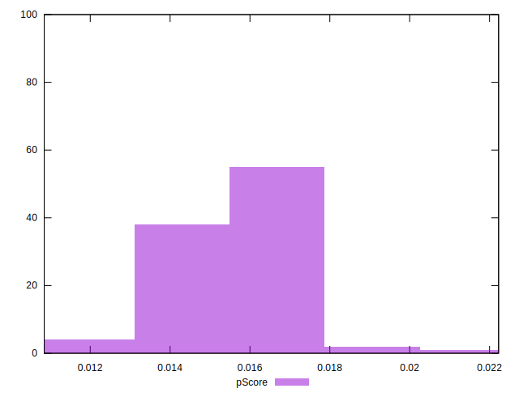
## Score Difference


```yaml
p90min: 0
p90max: 0
p90range: 0
p90mean: 0
p90median: 0
p90stdev: 0
p90skewness: .nan
p90eccentricity: .nan
p90discretization: 91
outlandishness: .nan
confidence: 0
p90confidence: 0

```


## P Score Difference


```yaml
p90min: -0.0040995730935938605
p90max: 0.0044622338393637915
p90range: 0.008561806932957652
p90mean: -0.0007995020217656395
p90median: -0.003192420057278416
p90stdev: 0.0037506028049630446
p90skewness: 0.5142001722586814
p90eccentricity: 1
p90discretization: 2.84375
outlandishness: 0.15860500243474393
confidence: 0.0015253398527666196
p90confidence: 0.00154119809881458

```

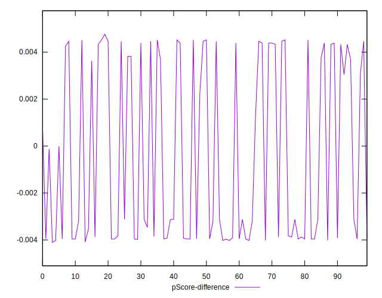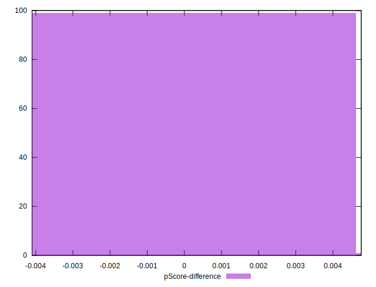