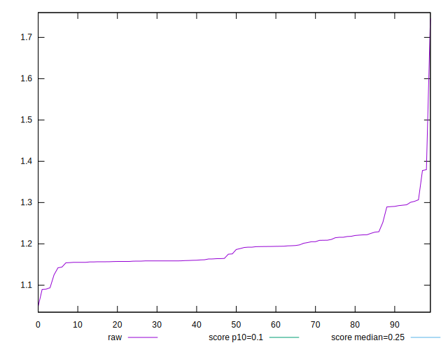

# //cumulative-layout-shift/samples/pages

[→ Parent](../..)


## Raw


```yaml
p90min: 1.093710659450955
p90max: 1.294596891615126
p90range: 0.20088623216417112
p90mean: 1.1861783130352312
p90median: 1.1749564412434896
p90stdev: 0.038984929160569066
p90skewness: 1.0929456708737195
p90eccentricity: 1.0000000000000002
p90discretization: 1.1518987341772151
outlandishness: 1.0163592835748763
confidence: 0.030243196361208646
p90confidence: 0.016019691188089435

```


## Score


```yaml
p90min: 0.01
p90max: 0.02
p90range: 0.01
p90mean: 0.014615384615384624
p90median: 0.01
p90stdev: 0.004985185152621427
p90skewness: 0.15430334996208542
p90eccentricity: 1.0000000000000018
p90discretization: 45.5
outlandishness: 1.039326592797784
confidence: 0.0020364770911604664
p90confidence: 0.002048512806872526

```


## Raw Estimate


## Score Estimate


## P Score


```yaml
p90min: 0.01054009786156912
p90max: 0.017713625979970227
p90range: 0.007173528118401107
p90mean: 0.014723883806375987
p90median: 0.01518443314525103
p90stdev: 0.0016030278098000746
p90skewness: -0.9762913515430313
p90eccentricity: 1.0000000000000002
p90discretization: 1.1818181818181819
outlandishness: 0.9864240466777587
confidence: 0.0009699031390145788
p90confidence: 0.0006587163560858901

```


## Score Difference


```yaml
p90min: 0
p90max: 0
p90range: 0
p90mean: 0
p90median: 0
p90stdev: 0
p90skewness: .nan
p90eccentricity: .nan
p90discretization: 91
outlandishness: .nan
confidence: 0
p90confidence: 0

```


## P Score Difference


```yaml
p90min: -0.00481556685474897
p90max: 0.004386981929361608
p90range: 0.009202548784110578
p90mean: -0.0007469886528554148
p90median: -0.0022863740200297737
p90stdev: 0.003494177108617734
p90skewness: 0.3004427935938009
p90eccentricity: 0.9999999999999997
p90discretization: 1.1818181818181819
outlandishness: 0.13691714606854993
confidence: 0.0014322764776132728
p90confidence: 0.0014358276247212849

```

