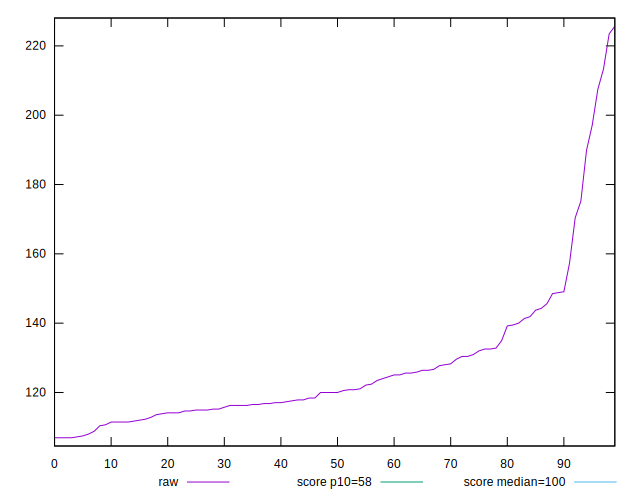
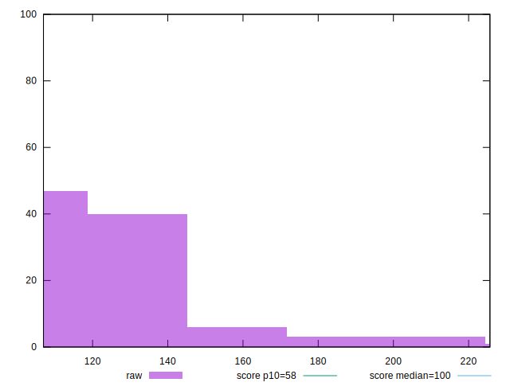
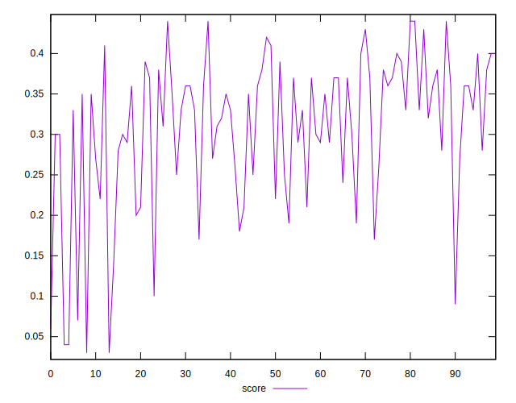
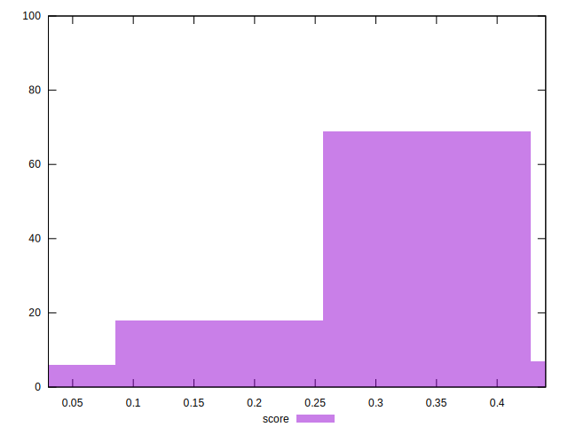
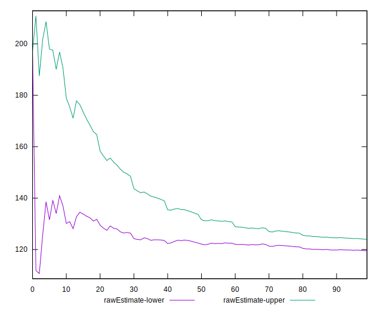
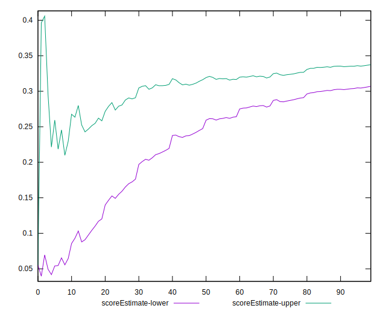
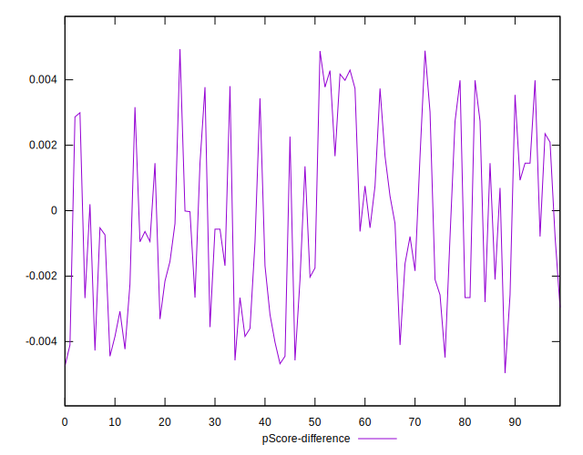
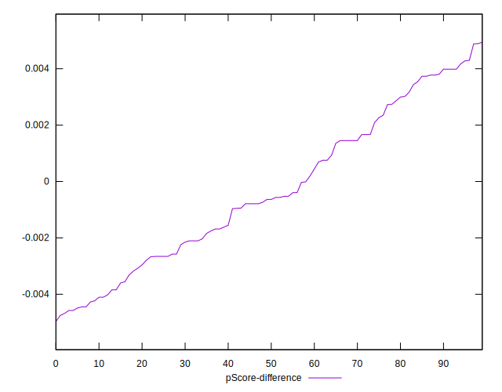
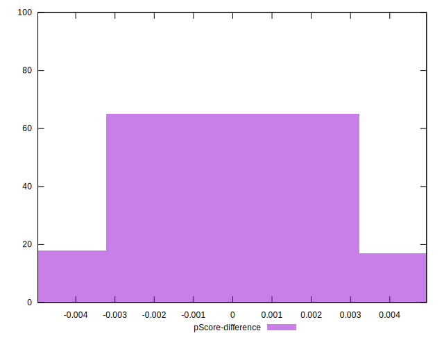

# //estimated-input-latency/samples/pages+cached

[→ Parent](../..)


## Raw


```yaml
p90min: 106.93333333333285
p90max: 149.0666666666667
p90range: 42.13333333333384
p90mean: 121.72307692307693
p90median: 118.4
p90stdev: 10.701065974890868
p90skewness: 0.8837874226859924
p90eccentricity: 0.9999999999999997
p90discretization: 1.4444444444444444
outlandishness: 1.112126457962831
confidence: 9.579855920072703
p90confidence: 4.397283155115048

```


## Score


```yaml
p90min: 0.17
p90max: 0.44
p90range: 0.27
p90mean: 0.32879120879120877
p90median: 0.35
p90stdev: 0.06935868176300256
p90skewness: -0.5160017513324753
p90eccentricity: 0.9999999999999992
p90discretization: 3.5
outlandishness: 0.8616455805499156
confidence: 0.03942785067974652
p90confidence: 0.02850087679985036

```


## Raw Estimate


## Score Estimate


## P Score


```yaml
p90min: 0.1738056945590517
p90max: 0.43734235988761555
p90range: 0.26353666532856385
p90mean: 0.3284683843299786
p90median: 0.34555146483621235
p90stdev: 0.06898513082876839
p90skewness: -0.5267922897255818
p90eccentricity: 0.9999999999999997
p90discretization: 1.4444444444444444
outlandishness: 0.8616764582897845
confidence: 0.03933491784234855
p90confidence: 0.02834737721069358

```


## Score Difference


```yaml
p90min: 0
p90max: 0
p90range: 0
p90mean: 0
p90median: 0
p90stdev: 0
p90skewness: .nan
p90eccentricity: .nan
p90discretization: 91
outlandishness: .inf
confidence: 5.903332266662038e-18
p90confidence: 0

```


## P Score Difference


```yaml
p90min: -0.004574953841826712
p90max: 0.003984014044244477
p90range: 0.00855896788607119
p90mean: -0.00046681633447736773
p90median: -0.0007376497702408502
p90stdev: 0.002608729822651957
p90skewness: 0.19291092910753713
p90eccentricity: 0.9999999999999996
p90discretization: 1.4444444444444444
outlandishness: 0.3971806578919453
confidence: 0.0011265223227129235
p90confidence: 0.0010719795329091658

```

