# //estimated-input-latency/samples/pages

[→ Parent](../..)


## Raw


```yaml
p90min: 98
p90max: 170.13333333333333
p90range: 72.13333333333333
p90mean: 131.37362637362642
p90median: 129.93333333333334
p90stdev: 15.950221341476334
p90skewness: 0.3466853692996012
p90eccentricity: 1.0000000000000004
p90discretization: 1.011111111111111
outlandishness: 1.0566052648283826
confidence: 9.041708791622398
p90confidence: 6.554266630053689

```

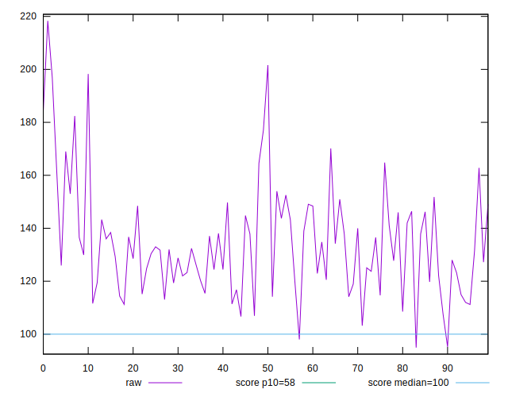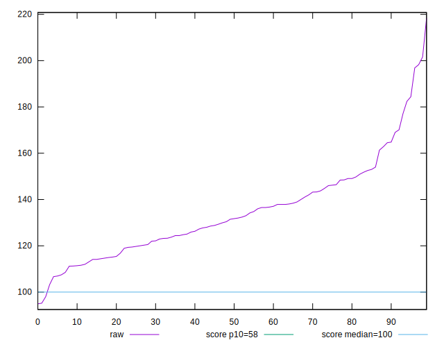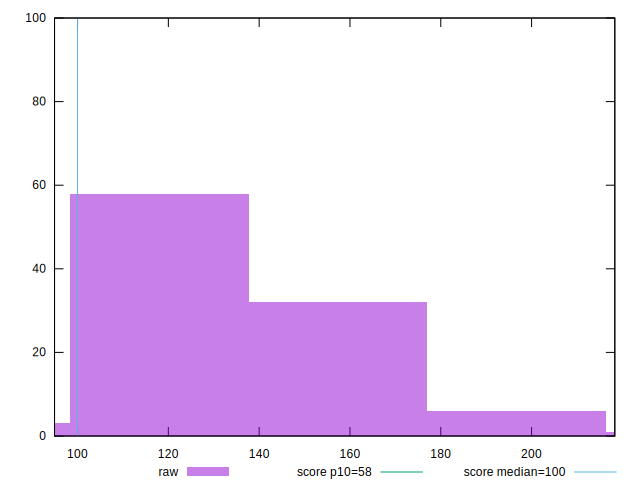
## Score


```yaml
p90min: 0.08
p90max: 0.44
p90range: 0.36
p90mean: 0.2646153846153847
p90median: 0.26
p90stdev: 0.08906483244636022
p90skewness: 0.048031239154103476
p90eccentricity: 1.0000000000000007
p90discretization: 2.757575757575758
outlandishness: 0.9976176996011359
confidence: 0.04328017660234762
p90confidence: 0.03659853030982896

```

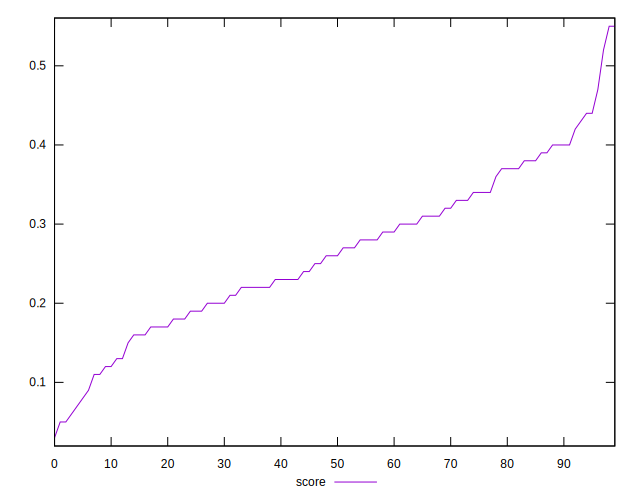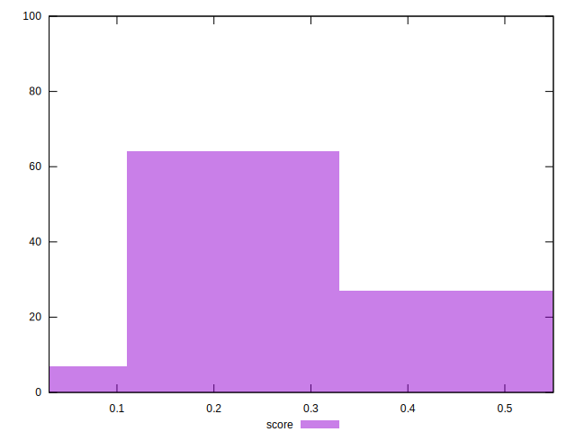
## Raw Estimate

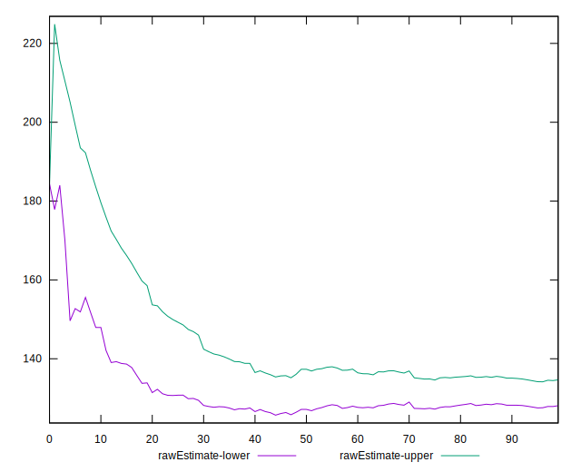
## Score Estimate

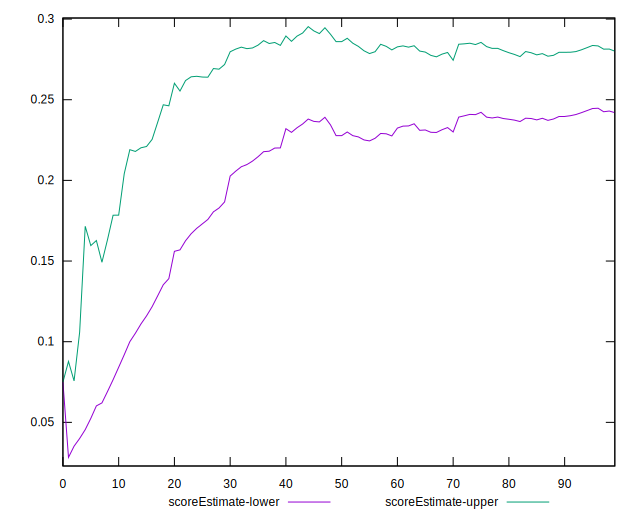
## P Score


```yaml
p90min: 0.0786785408152667
p90max: 0.43965794898797456
p90range: 0.36097940817270785
p90mean: 0.26500489553055195
p90median: 0.25990277701712705
p90stdev: 0.0890731720959151
p90skewness: 0.02937607838993039
p90eccentricity: 1.0000000000000002
p90discretization: 1.011111111111111
outlandishness: 0.9974288729936385
confidence: 0.04317306445128666
p90confidence: 0.03660195723950055

```

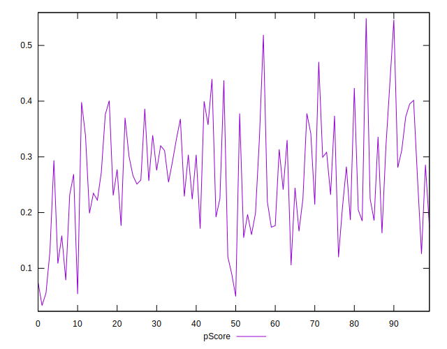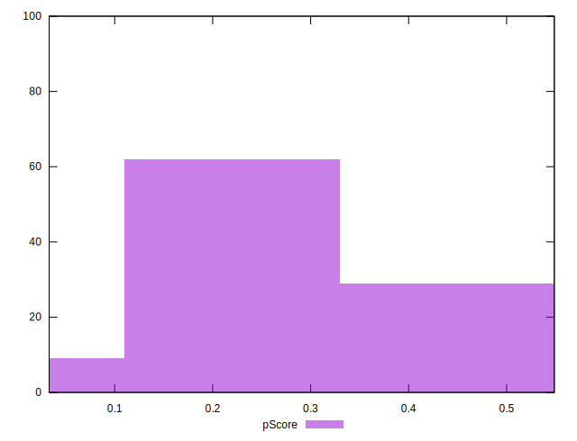
## Score Difference


```yaml
p90min: 0
p90max: 0
p90range: 0
p90mean: 0
p90median: 0
p90stdev: 0
p90skewness: .nan
p90eccentricity: .nan
p90discretization: 91
outlandishness: .inf
confidence: 2.1650898205369663e-18
p90confidence: 0

```

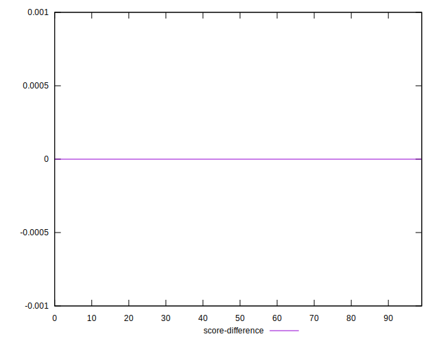
## P Score Difference


```yaml
p90min: -0.004218278239265516
p90max: 0.004922211702954982
p90range: 0.009140489942220498
p90mean: 0.00041873627039816887
p90median: 0.00023578293168624587
p90stdev: 0.002628118924383986
p90skewness: 0.018517125917289337
p90eccentricity: 1.0000000000000004
p90discretization: 1.011111111111111
outlandishness: 0.7556335118586284
confidence: 0.0011253249239896244
p90confidence: 0.0010799469046307417

```

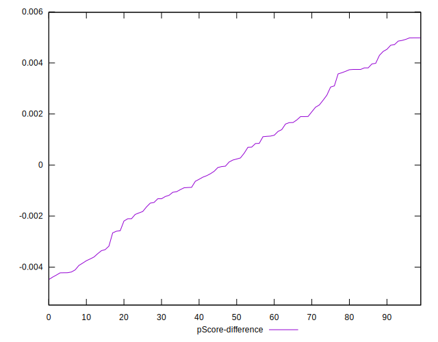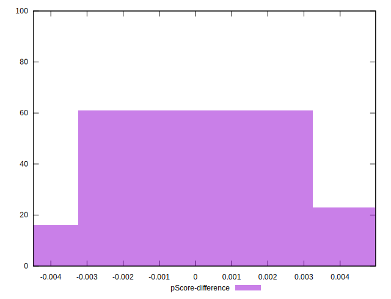