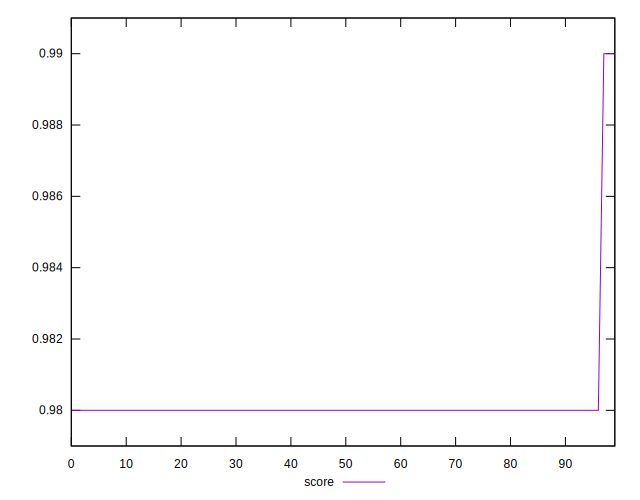

# //first-contentful-paint/samples/pages+cached+noadtech+nomedia+nocss

[→ Parent](../..)


## Raw


```yaml
p90min: 1603.369
p90max: 1712.9769999999999
p90range: 109.60799999999995
p90mean: 1625.1106500000005
p90median: 1620.3745000000001
p90stdev: 17.448259474563724
p90skewness: 3.0523695496971
p90eccentricity: 0.9999999999999999
p90discretization: 1
outlandishness: 1.0113313362646192
confidence: 13.227081297392488
p90confidence: 7.16984061714993

```


## Score


```yaml
p90min: 0.98
p90max: 0.98
p90range: 0
p90mean: 0.9800000000000001
p90median: 0.98
p90stdev: 1.1102230246251565e-16
p90skewness: -1
p90eccentricity: 1
p90discretization: 91
outlandishness: 1.0006123386089132
confidence: 0.0006686896191274716
p90confidence: 0

```


## Raw Estimate


## Score Estimate


## P Score


```yaml
p90min: 0.9783439269725559
p90max: 0.9853061344335794
p90range: 0.006962207461023495
p90mean: 0.9840466998286725
p90median: 0.9843448946653593
p90stdev: 0.0010919618846369158
p90skewness: -3.3296614445231687
p90eccentricity: 0.9999999999999997
p90discretization: 1
outlandishness: 0.9987663197274422
confidence: 0.0008645244281364484
p90confidence: 0.0004487090924032433

```


## Score Difference


```yaml
p90min: 0
p90max: 0
p90range: 0
p90mean: 0
p90median: 0
p90stdev: 0
p90skewness: .nan
p90eccentricity: .nan
p90discretization: 91
outlandishness: .nan
confidence: 0
p90confidence: 0

```


## P Score Difference


```yaml
p90min: -0.0019927641727006673
p90max: 0.0049392941941479585
p90range: 0.006932058366848626
p90mean: 0.0038112420673354318
p90median: 0.004304333105013658
p90stdev: 0.0015007778112340153
p90skewness: -2.870072390409999
p90eccentricity: 0.9999999999999997
p90discretization: 1
outlandishness: 0.678565077860545
confidence: 0.0010137324885376746
p90confidence: 0.0006166997759283555

```

