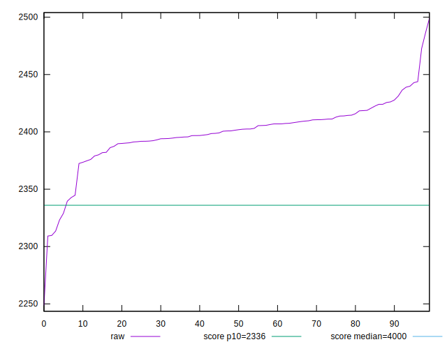
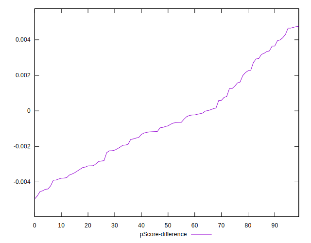

# //first-contentful-paint/samples/pages+cached+noadtech+nomedia

[→ Parent](../..)


## Raw


```yaml
p90min: 2339.565
p90max: 2443.8225
p90range: 104.25750000000016
p90mean: 2402.1208747252745
p90median: 2402.3025
p90stdev: 18.852651368598004
p90skewness: -0.6184763421474984
p90eccentricity: 1
p90discretization: 1
outlandishness: 0.9972701481449785
confidence: 13.173431242987135
p90confidence: 7.746933481852466

```


## Score


```yaml
p90min: 0.88
p90max: 0.9
p90range: 0.020000000000000018
p90mean: 0.8885714285714289
p90median: 0.89
p90stdev: 0.004340311573215711
p90skewness: -0.7241086474650446
p90eccentricity: 1.0000000000000033
p90discretization: 30.333333333333332
outlandishness: 1.0007396865727194
confidence: 0.0025939736448792328
p90confidence: 0.0017835212878449802

```


## Raw Estimate


## Score Estimate


## P Score


```yaml
p90min: 0.8798095661137249
p90max: 0.8993607699191268
p90range: 0.019551203805401984
p90mean: 0.8877989369219459
p90median: 0.8877911835144783
p90stdev: 0.00354921182073969
p90skewness: 0.5396728445055794
p90eccentricity: 0.9999999999999999
p90discretization: 1
outlandishness: 1.0012643480541348
confidence: 0.0024474945480958965
p90confidence: 0.0014584424944108498

```


## Score Difference


```yaml
p90min: 0
p90max: 0
p90range: 0
p90mean: 0
p90median: 0
p90stdev: 0
p90skewness: .nan
p90eccentricity: .nan
p90discretization: 91
outlandishness: .nan
confidence: 0
p90confidence: 0

```


## P Score Difference


```yaml
p90min: -0.004957650026565896
p90max: 0.003648173558949419
p90range: 0.008605823585515315
p90mean: -0.0010313274031315514
p90median: -0.0011640152727047104
p90stdev: 0.0022704781516014083
p90skewness: 0.32607460062879884
p90eccentricity: 1
p90discretization: 1
outlandishness: 0.274150776605834
confidence: 0.0010475144474997515
p90confidence: 0.0009329851206898486

```

