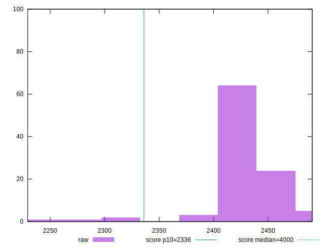
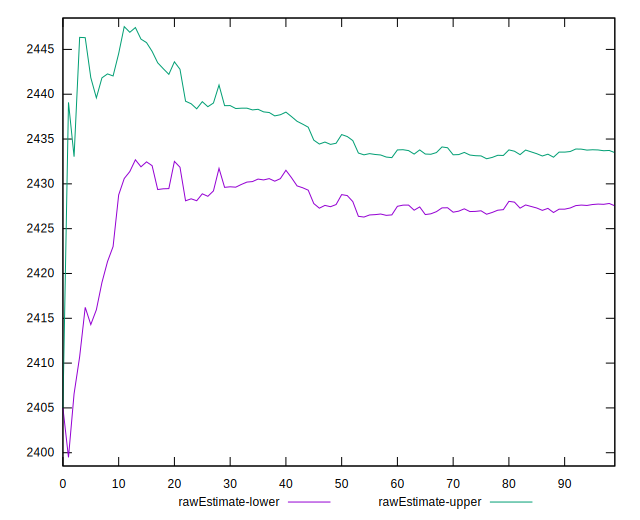
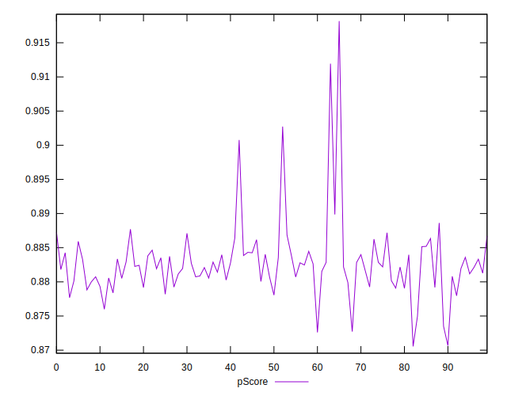
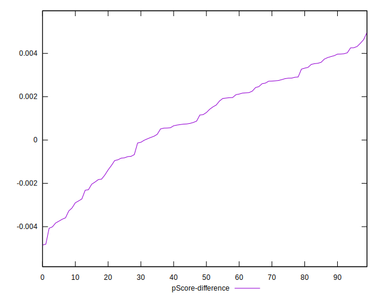

# //first-contentful-paint/samples/pages+cached+noadtech

[→ Parent](../..)


## Raw


```yaml
p90min: 2391.3075
p90max: 2468.40225
p90range: 77.0947500000002
p90mean: 2430.5168406593416
p90median: 2431.23
p90stdev: 14.436878685575664
p90skewness: -0.1606477681249126
p90eccentricity: 1.0000000000000002
p90discretization: 1
outlandishness: 0.9974537239921663
confidence: 13.637960216646206
p90confidence: 5.932403706834521

```


## Score


```yaml
p90min: 0.87
p90max: 0.89
p90range: 0.020000000000000018
p90mean: 0.8815384615384618
p90median: 0.88
p90stdev: 0.003900711944900844
p90skewness: 1.3475515061503407
p90eccentricity: 1.0000000000000024
p90discretization: 30.333333333333332
outlandishness: 1.0010473945341405
confidence: 0.0027718076486993315
p90confidence: 0.0016028809623747087

```


## Raw Estimate


## Score Estimate


## P Score


```yaml
p90min: 0.8749671868393428
p90max: 0.8898621288312336
p90range: 0.014894941991890787
p90mean: 0.8823796442566713
p90median: 0.8822568959790082
p90stdev: 0.002788566417058133
p90skewness: 0.12750009699578976
p90eccentricity: 1.0000000000000002
p90discretization: 1
outlandishness: 1.001183782097349
confidence: 0.0025199713948866886
p90confidence: 0.0011458780051838424

```


## Score Difference


```yaml
p90min: 0
p90max: 0
p90range: 0
p90mean: 0
p90median: 0
p90stdev: 0
p90skewness: .nan
p90eccentricity: .nan
p90discretization: 91
outlandishness: .nan
confidence: 0
p90confidence: 0

```


## P Score Difference


```yaml
p90min: -0.0031356694715615197
p90max: 0.00496718683934283
p90range: 0.00810285631090435
p90mean: 0.0013847052545032947
p90median: 0.0018024030485738196
p90stdev: 0.0020676465170782255
p90skewness: -0.3821356422050031
p90eccentricity: 0.9999999999999996
p90discretization: 1
outlandishness: 0.4241012596687539
confidence: 0.000981661351999654
p90confidence: 0.0008496375241133932

```

