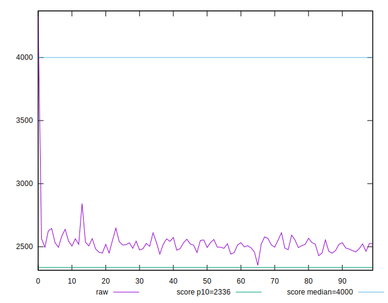

# //first-contentful-paint/samples/pages+cached

[→ Parent](../..)


## Raw


```yaml
p90min: 2449.17
p90max: 2625.0225
p90range: 175.85249999999996
p90mean: 2516.862708791208
p90median: 2518.2825000000003
p90stdev: 39.53255433094264
p90skewness: 0.3134441627117843
p90eccentricity: 1.0000000000000002
p90discretization: 1
outlandishness: 1.0168807763559533
confidence: 74.20753458135368
p90confidence: 16.2447213806563

```


## Score


```yaml
p90min: 0.84
p90max: 0.88
p90range: 0.040000000000000036
p90mean: 0.8637362637362633
p90median: 0.86
p90stdev: 0.009096352565527427
p90skewness: -0.4547180041218628
p90eccentricity: 0.9999999999999988
p90discretization: 18.2
outlandishness: 0.9913673121871944
confidence: 0.01764403079880128
p90confidence: 0.00373787415227933

```


## Raw Estimate


## Score Estimate


## P Score


```yaml
p90min: 0.8422166010173116
p90max: 0.8787633847101899
p90range: 0.03654678369287834
p90mean: 0.8650707717384927
p90median: 0.8648824779217363
p90stdev: 0.00814786679763566
p90skewness: -0.37673400799941575
p90eccentricity: 0.9999999999999996
p90discretization: 1
outlandishness: 0.9881614673845939
confidence: 0.01779994758132153
p90confidence: 0.0033481222808486866

```


## Score Difference


```yaml
p90min: 0
p90max: 0
p90range: 0
p90mean: 0
p90median: 0
p90stdev: 0
p90skewness: .nan
p90eccentricity: .nan
p90discretization: 91
outlandishness: .nan
confidence: 0
p90confidence: 0

```


## P Score Difference


```yaml
p90min: -0.0047142241091305825
p90max: 0.00469742710028298
p90range: 0.009411651209413563
p90mean: -0.00033440126194302837
p90median: -0.0004708029407592962
p90stdev: 0.002723948214688477
p90skewness: 0.058547277917953236
p90eccentricity: 1
p90discretization: 1
outlandishness: 0.03784993054684495
confidence: 0.0011728123598239814
p90confidence: 0.0011193250866745976

```

