# //first-contentful-paint/samples/pages

[→ Parent](../..)


## Raw


```yaml
p90min: 2076.871
p90max: 4872.724499999999
p90range: 2795.8534999999993
p90mean: 3643.525109890112
p90median: 3372.614
p90stdev: 727.0813349505255
p90skewness: -0.1982499721482734
p90eccentricity: 1.0000000000000002
p90discretization: 1
outlandishness: 1.1449101595445688
confidence: 425.616656528211
p90confidence: 298.77233857621377

```

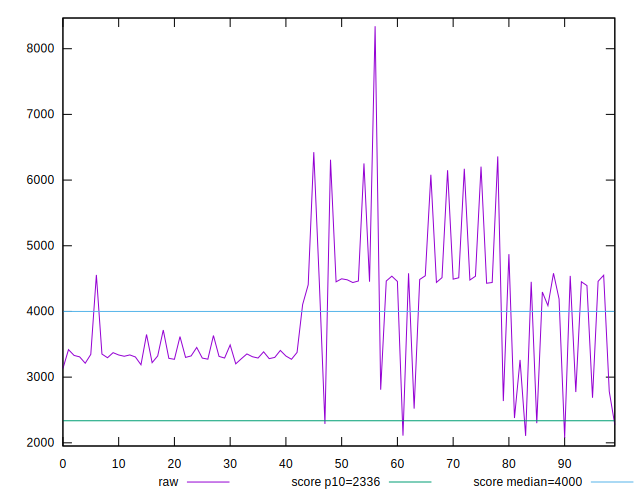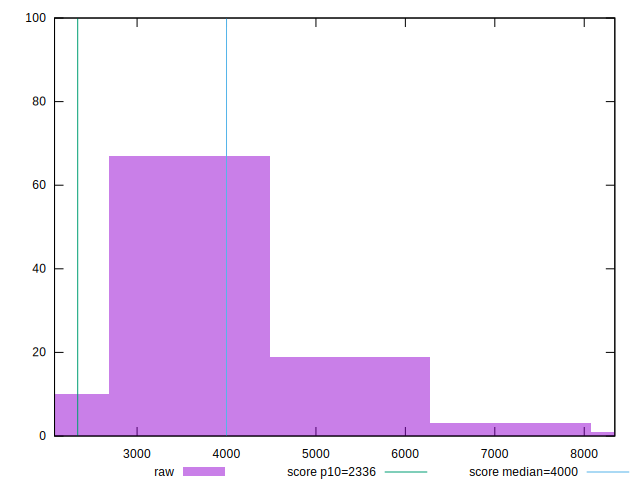
## Score


```yaml
p90min: 0.32
p90max: 0.94
p90range: 0.6199999999999999
p90mean: 0.5927472527472525
p90median: 0.66
p90stdev: 0.17218738791905358
p90skewness: 0.1612065635899668
p90eccentricity: 1.0000000000000013
p90discretization: 3.1379310344827585
outlandishness: 0.8650413850879227
confidence: 0.08264757947055701
p90confidence: 0.0707552595410883

```

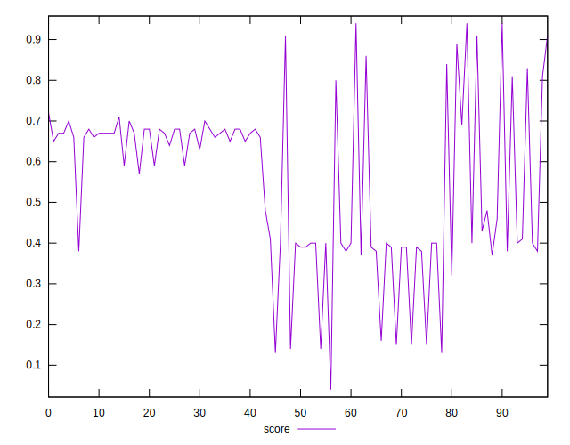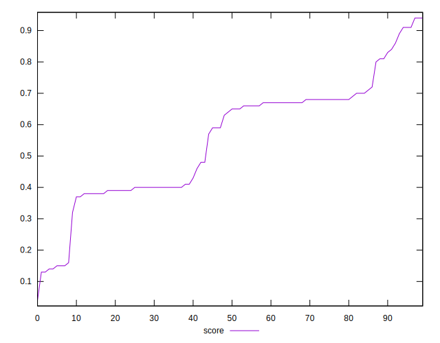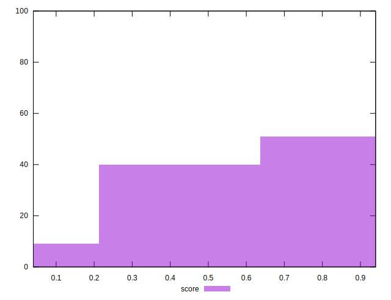
## Raw Estimate

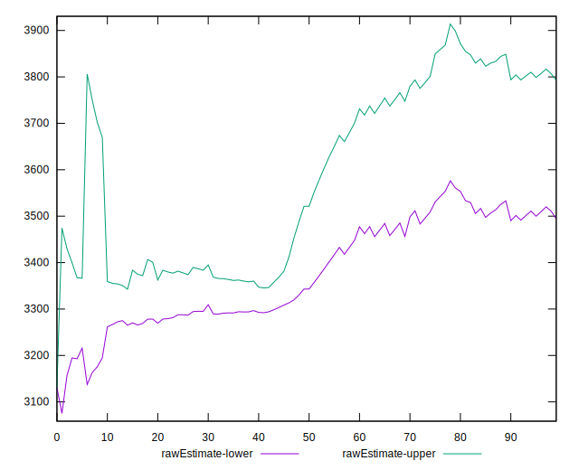
## Score Estimate

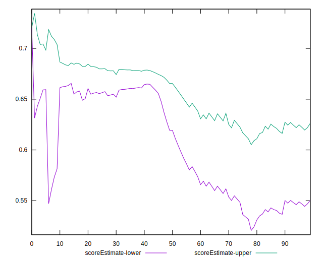
## P Score


```yaml
p90min: 0.3190885013709499
p90max: 0.9408212534970621
p90range: 0.6217327521261122
p90mean: 0.5928078877787875
p90median: 0.6578143294213998
p90stdev: 0.17192008543406306
p90skewness: 0.1585428551415342
p90eccentricity: 0.9999999999999993
p90discretization: 1
outlandishness: 0.8652403980466736
confidence: 0.08252420487084544
p90confidence: 0.07064541957586168

```

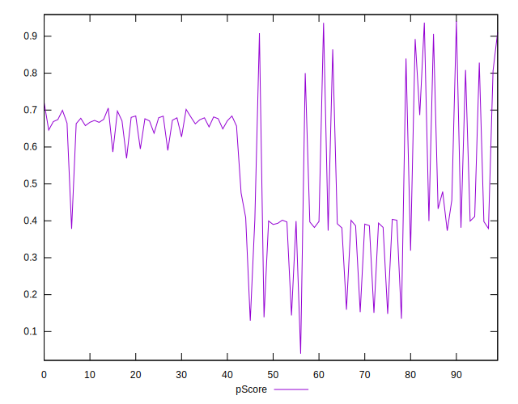
## Score Difference


```yaml
p90min: 0
p90max: 5.551115123125783e-17
p90range: 5.551115123125783e-17
p90mean: 1.2200253017858864e-18
p90median: 0
p90stdev: 8.138583863080828e-18
p90skewness: 6.520925694263994
p90eccentricity: 0.9999999999999978
p90discretization: 45.5
outlandishness: 82.80999999999999
confidence: 1.2688134664576155e-17
p90confidence: 3.3443077364057966e-18

```

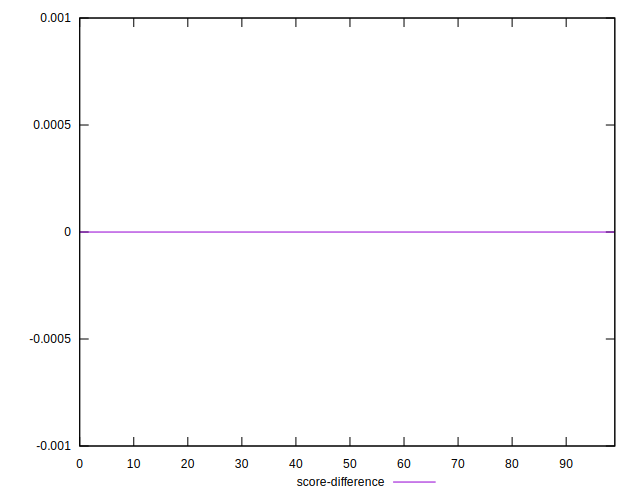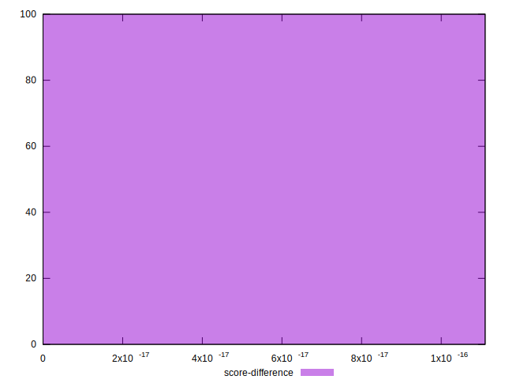
## P Score Difference


```yaml
p90min: -0.004146558628168484
p90max: 0.0040935596471814995
p90range: 0.008240118275349984
p90mean: -0.0001232089345705254
p90median: -0.0005316223335048997
p90stdev: 0.0023505816940188407
p90skewness: 0.10635372710798287
p90eccentricity: 0.9999999999999992
p90discretization: 1
outlandishness: 0.9456594539089821
confidence: 0.0010308919314419313
p90confidence: 0.0009659012767591332

```

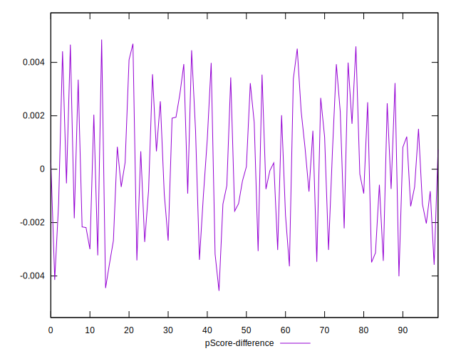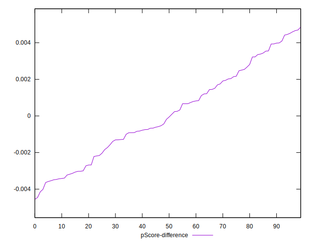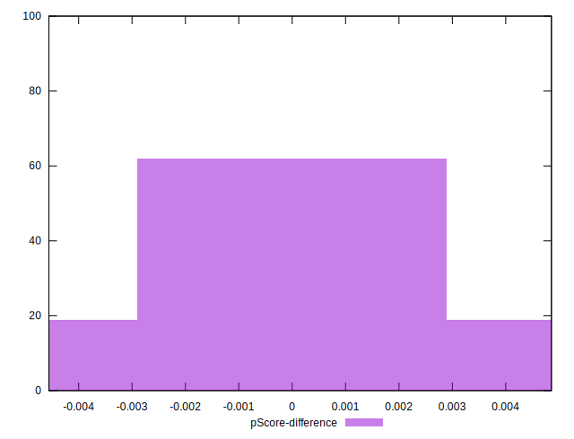