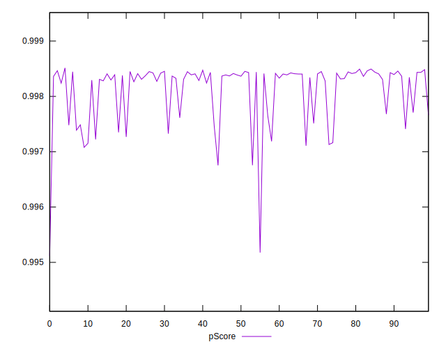

# //first-cpu-idle/samples/pages+cached+noadtech+nomedia+nocss

[→ Parent](../..)


## Raw


```yaml
p90min: 1622.5395000000003
p90max: 1783.0749999999998
p90range: 160.5354999999995
p90mean: 1661.4050945054953
p90median: 1641.8378
p90stdev: 44.61586164079822
p90skewness: 1.6642845902260064
p90eccentricity: 0.9999999999999997
p90discretization: 1
outlandishness: 1.0183927970429856
confidence: 26.258448633342596
p90confidence: 18.333554554692455

```


## Score


```yaml
p90min: 1
p90max: 1
p90range: 0
p90mean: 1
p90median: 1
p90stdev: 0
p90skewness: .nan
p90eccentricity: .nan
p90discretization: 91
outlandishness: 1
confidence: 0
p90confidence: 0

```


## Raw Estimate


## Score Estimate


## P Score


```yaml
p90min: 0.9971871264268284
p90max: 0.9985148170890992
p90range: 0.0013276906622707862
p90mean: 0.9982265998385228
p90median: 0.9983877247138564
p90stdev: 0.0003637806076099254
p90skewness: -1.741328757329451
p90eccentricity: 0.9999999999999996
p90discretization: 1
outlandishness: 0.9997073873782997
confidence: 0.00024566848316220913
p90confidence: 0.00014948476551346346

```


## Score Difference


```yaml
p90min: 0
p90max: 0
p90range: 0
p90mean: 0
p90median: 0
p90stdev: 0
p90skewness: .nan
p90eccentricity: .nan
p90discretization: 91
outlandishness: .nan
confidence: 0
p90confidence: 0

```


## P Score Difference


```yaml
p90min: -0.002812873573171615
p90max: -0.0014851829109008285
p90range: 0.0013276906622707862
p90mean: -0.0017734001614775926
p90median: -0.0016122752861436052
p90stdev: 0.0003637806076099254
p90skewness: -1.7413287573289677
p90eccentricity: 1
p90discretization: 1
outlandishness: 1.1715035349037075
confidence: 0.00024566848316224296
p90confidence: 0.00014948476551346086

```

