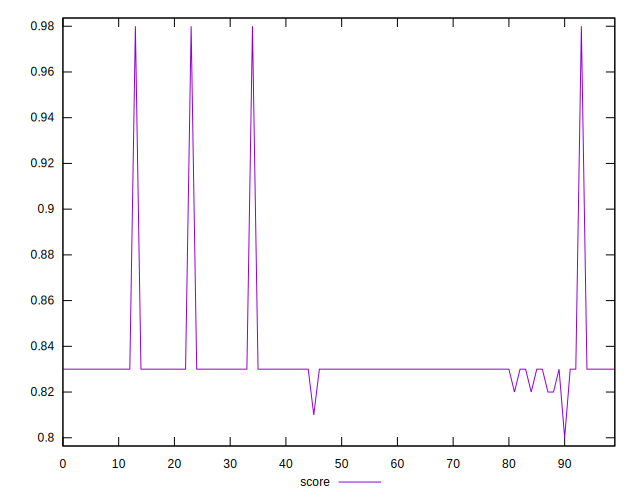

# //first-cpu-idle/samples/pages+cached+noadtech+nomedia

[→ Parent](../..)


## Raw


```yaml
p90min: 4131.868000000001
p90max: 4205.66
p90range: 73.79199999999855
p90mean: 4158.983648351648
p90median: 4156.791999999999
p90stdev: 14.871047799655607
p90skewness: 0.5583680296466126
p90eccentricity: 1
p90discretization: 1
outlandishness: 0.9706777561696482
confidence: 132.69307712589853
p90confidence: 6.110812524824723

```


## Score


```yaml
p90min: 0.82
p90max: 0.83
p90range: 0.010000000000000009
p90mean: 0.8298901098901086
p90median: 0.83
p90stdev: 0.0010425091187368284
p90skewness: -9.38142372516257
p90eccentricity: 1.000000000000001
p90discretization: 45.5
outlandishness: 1.0125950252700624
confidence: 0.01170077158934446
p90confidence: 0.0004283879566420179

```


## Raw Estimate


## Score Estimate


## P Score


```yaml
p90min: 0.8243247613068396
p90max: 0.8339433022568998
p90range: 0.009618540950060206
p90mean: 0.8304258205277394
p90median: 0.8307143417561254
p90stdev: 0.001935742008213009
p90skewness: -0.5679091244266218
p90eccentricity: 0.9999999999999991
p90discretization: 1
outlandishness: 1.0123815759601853
confidence: 0.011843798436428576
p90confidence: 0.0007954353094670186

```


## Score Difference


```yaml
p90min: 1.1102230246251565e-16
p90max: 1.1102230246251565e-16
p90range: 0
p90mean: 1.1102230246251565e-16
p90median: 1.1102230246251565e-16
p90stdev: 0
p90skewness: .nan
p90eccentricity: .nan
p90discretization: 91
outlandishness: 0.8835999999999999
confidence: 1.0335413782903708e-17
p90confidence: 0

```


## P Score Difference


```yaml
p90min: -0.002763097511353396
p90max: 0.0035862402148393313
p90range: 0.0063493377261927275
p90mean: 0.0005906648826005734
p90median: 0.0007361753035569629
p90stdev: 0.001613652821844775
p90skewness: -0.24255507746473703
p90eccentricity: 1.0000000000000004
p90discretization: 1
outlandishness: 0.5829902856196807
confidence: 0.0007519578613658832
p90confidence: 0.0006630823871520176

```

