# //first-cpu-idle/samples/pages+cached+noadtech

[→ Parent](../..)


## Raw


```yaml
p90min: 4140.923999999999
p90max: 4212.82
p90range: 71.89600000000064
p90mean: 4171.478672527472
p90median: 4170.688
p90stdev: 14.220648821769833
p90skewness: 0.47538563386137794
p90eccentricity: 1.0000000000000004
p90discretization: 1
outlandishness: 0.9772399125551867
confidence: 120.8272981709024
p90confidence: 5.843550508472617

```

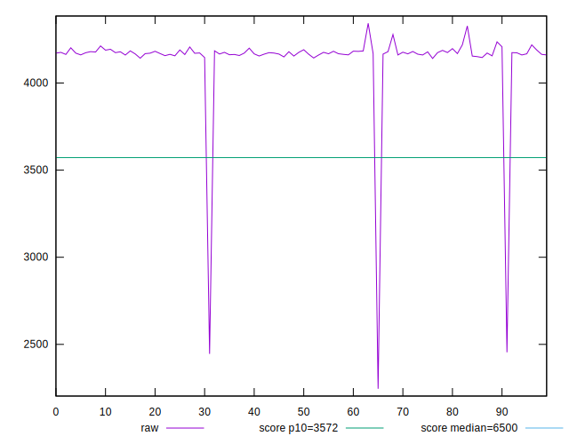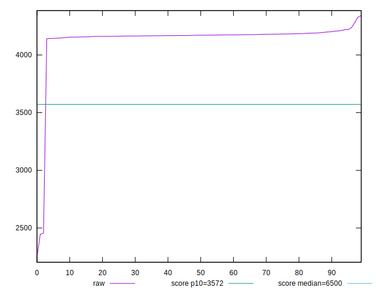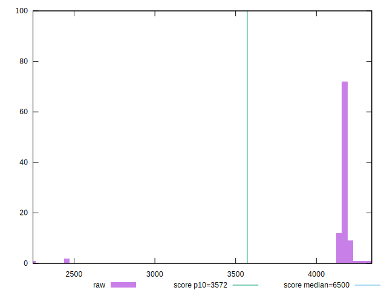
## Score


```yaml
p90min: 0.82
p90max: 0.83
p90range: 0.010000000000000009
p90mean: 0.8295604395604381
p90median: 0.83
p90stdev: 0.002049973418261276
p90skewness: -4.4492670195749895
p90eccentricity: 1.0000000000000033
p90discretization: 45.5
outlandishness: 1.00903608467598
confidence: 0.010475159489852004
p90confidence: 0.000842375292489983

```

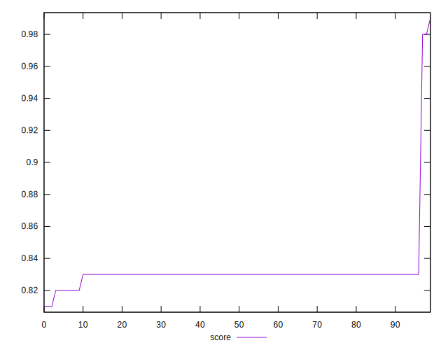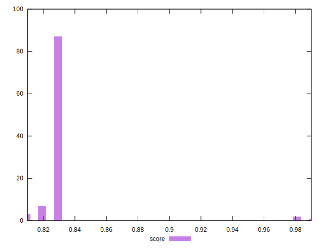
## Raw Estimate

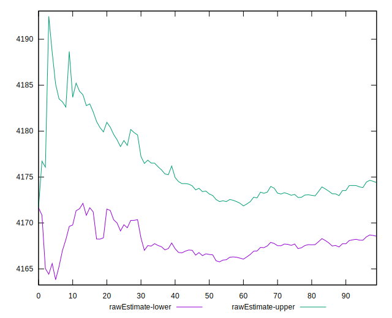
## Score Estimate

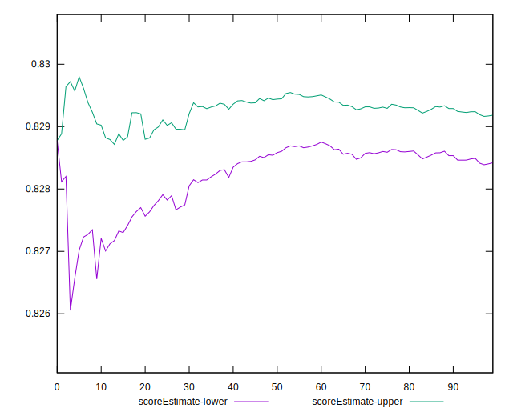
## P Score


```yaml
p90min: 0.8233822414431928
p90max: 0.8327724658558139
p90range: 0.009390224412621051
p90mean: 0.8287988236463812
p90median: 0.8289052071335987
p90stdev: 0.0018564728308362447
p90skewness: -0.4875071389980354
p90eccentricity: 0.9999999999999997
p90discretization: 1
outlandishness: 1.0093546386146226
confidence: 0.01054409450760363
p90confidence: 0.0007628620107678064

```

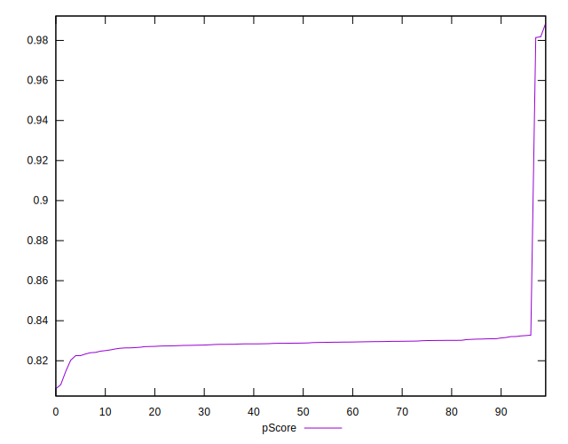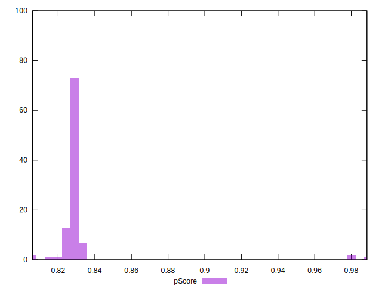
## Score Difference


```yaml
p90min: 1.1102230246251565e-16
p90max: 1.1102230246251565e-16
p90range: 0
p90mean: 1.1102230246251565e-16
p90median: 1.1102230246251565e-16
p90stdev: 0
p90skewness: .nan
p90eccentricity: .nan
p90discretization: 91
outlandishness: 0.8835999999999999
confidence: 1.0335413782903683e-17
p90confidence: 0

```

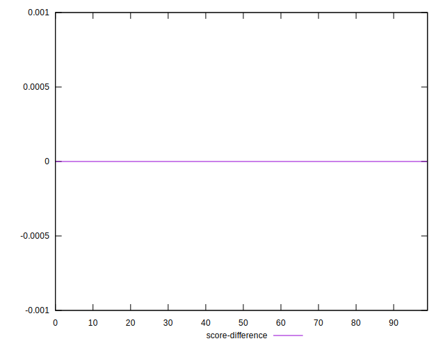
## P Score Difference


```yaml
p90min: -0.003982524236921692
p90max: 0.0025725710520930756
p90range: 0.006555095289014767
p90mean: -0.0008076429440707169
p90median: -0.0007917919512323568
p90stdev: 0.0015356055526045452
p90skewness: 0.23115038411244374
p90eccentricity: 1.0000000000000002
p90discretization: 1
outlandishness: 0.6155325566967317
confidence: 0.0007775977641662952
p90confidence: 0.0006310111950728293

```

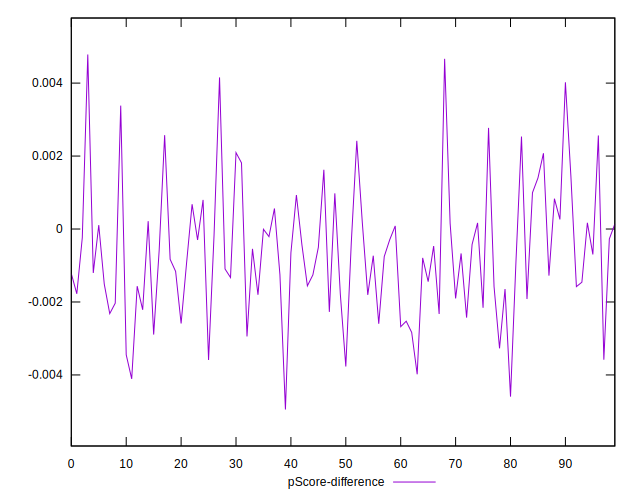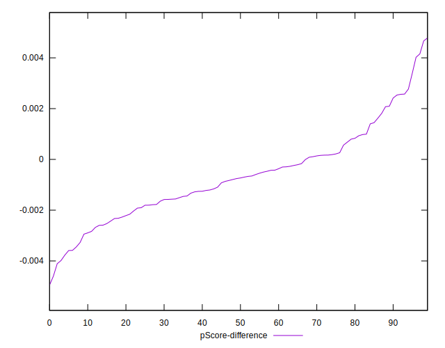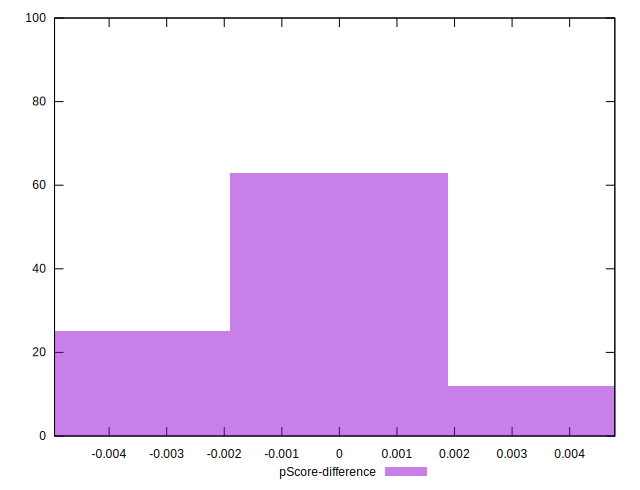