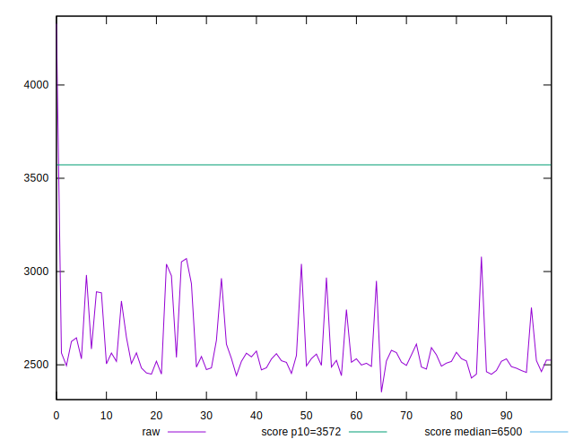
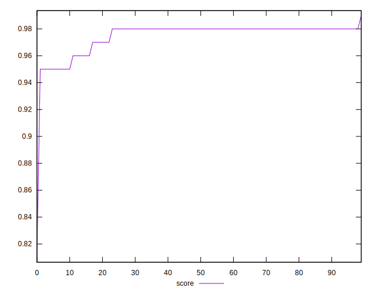

# //first-cpu-idle/samples/pages+cached

[→ Parent](../..)


## Raw


```yaml
p90min: 2352.8495000000003
p90max: 2963.888
p90range: 611.0384999999997
p90mean: 2549.209928571429
p90median: 2520.5099999999998
p90stdev: 116.30957822232821
p90skewness: 2.140741523811693
p90eccentricity: 1.0000000000000009
p90discretization: 1
outlandishness: 1.0443769866241635
confidence: 95.38178596392208
p90confidence: 47.793944107591415

```


## Score


```yaml
p90min: 0.95
p90max: 0.99
p90range: 0.040000000000000036
p90mean: 0.9774725274725276
p90median: 0.98
p90stdev: 0.006888979348860439
p90skewness: -2.44643669811654
p90eccentricity: 0.9999999999999999
p90discretization: 18.2
outlandishness: 0.9920921431136676
confidence: 0.007530343851880783
p90confidence: 0.002830820118085331

```


## Raw Estimate


## Score Estimate


## P Score


```yaml
p90min: 0.9536230366746201
p90max: 0.9851949599874628
p90range: 0.03157192331284264
p90mean: 0.9770470013224922
p90median: 0.9787157041980104
p90stdev: 0.006128385271878075
p90skewness: -2.480535653639733
p90eccentricity: 0.9999999999999996
p90discretization: 1
outlandishness: 0.9919738624236133
confidence: 0.007525071577116682
p90confidence: 0.002518276720031132

```


## Score Difference


```yaml
p90min: 0
p90max: 1.1102230246251565e-16
p90range: 1.1102230246251565e-16
p90mean: 1.2200253017858864e-18
p90median: 0
p90stdev: 1.1574176270033065e-17
p90skewness: 9.381423725166236
p90eccentricity: 1.0000000000000018
p90discretization: 45.5
outlandishness: 82.80999999999999
confidence: 1.3055982858434594e-17
p90confidence: 4.756061729361273e-18

```


## P Score Difference


```yaml
p90min: -0.004530213567160768
p90max: 0.0035483931693600645
p90range: 0.008078606736520832
p90mean: -0.0007483475464924949
p90median: -0.0010088032411131875
p90stdev: 0.0019109809018270072
p90skewness: 0.1726518767646681
p90eccentricity: 1.0000000000000007
p90discretization: 1
outlandishness: 0.41459651474468817
confidence: 0.0009056223016572988
p90confidence: 0.0007852604730283546

```

