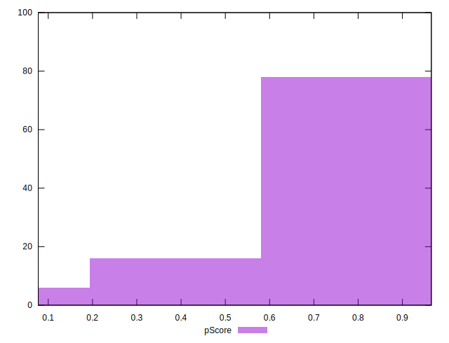
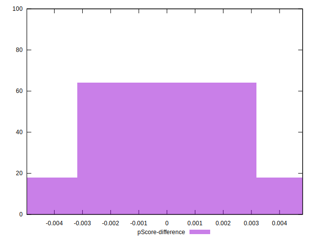

# //first-cpu-idle/samples/pages

[→ Parent](../..)


## Raw


```yaml
p90min: 3130.751
p90max: 7777.190000000001
p90range: 4646.439000000001
p90mean: 5051.044868131866
p90median: 5570.205999999999
p90stdev: 1215.4378075387183
p90skewness: -0.16386292077197176
p90eccentricity: 0.9999999999999999
p90discretization: 1
outlandishness: 1.1758775609999286
confidence: 839.1847546636927
p90confidence: 499.4478316198274

```


## Score


```yaml
p90min: 0.37
p90max: 0.97
p90range: 0.6
p90mean: 0.7119780219780222
p90median: 0.63
p90stdev: 0.1565438518081901
p90skewness: 0.2597540917622768
p90eccentricity: 1.0000000000000004
p90discretization: 3.033333333333333
outlandishness: 0.8674109106388833
confidence: 0.08560838197792231
p90confidence: 0.06432701603823143

```


## Raw Estimate


## Score Estimate


## P Score


```yaml
p90min: 0.3685380329361125
p90max: 0.9653314240604107
p90range: 0.5967933911242982
p90mean: 0.7118823486308142
p90median: 0.6324999676088503
p90stdev: 0.15671310053654436
p90skewness: 0.254979536640753
p90eccentricity: 0.9999999999999993
p90discretization: 1
outlandishness: 0.8671951840516411
confidence: 0.08574122823202401
p90confidence: 0.06439656374347535

```


## Score Difference


```yaml
p90min: 0
p90max: 0
p90range: 0
p90mean: 0
p90median: 0
p90stdev: 0
p90skewness: .nan
p90eccentricity: .nan
p90discretization: 91
outlandishness: .inf
confidence: 9.86665348183046e-18
p90confidence: 0

```


## P Score Difference


```yaml
p90min: -0.004712751348566413
p90max: 0.004356864485422052
p90range: 0.009069615833988465
p90mean: -0.00022813179604860937
p90median: -0.0005296475081654206
p90stdev: 0.002582906139008898
p90skewness: 0.21773695865117612
p90eccentricity: 1
p90discretization: 1
outlandishness: 0.5655123430053514
confidence: 0.0011182676048837295
p90confidence: 0.0010613680621124164

```

