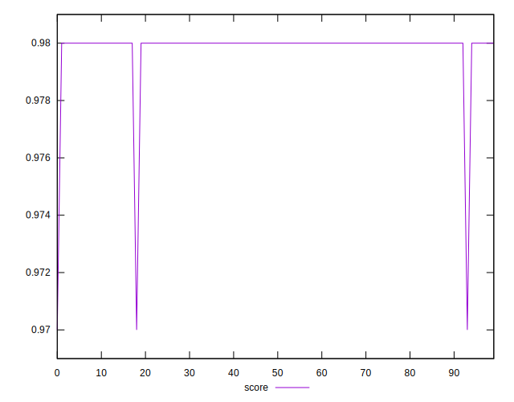
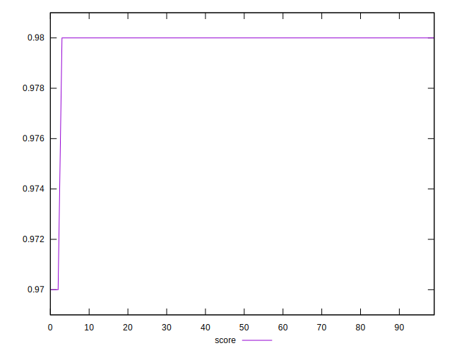

# //first-meaningful-paint/samples/pages+cached+noadtech+nomedia+nocss

[→ Parent](../..)


## Raw


```yaml
p90min: 1622.5395000000003
p90max: 1731.9769999999999
p90range: 109.43749999999955
p90mean: 1647.039221428572
p90median: 1641.8378
p90stdev: 18.67557492980012
p90skewness: 2.4634182346180515
p90eccentricity: 1
p90discretization: 1
outlandishness: 1.011346647886863
confidence: 13.614758344160236
p90confidence: 7.674169213010373

```


## Score


```yaml
p90min: 0.98
p90max: 0.98
p90range: 0
p90mean: 0.9800000000000001
p90median: 0.98
p90stdev: 1.1102230246251565e-16
p90skewness: -1
p90eccentricity: 1
p90discretization: 91
outlandishness: 0.9993878488129954
confidence: 0.0006686896191274716
p90confidence: 0

```


## Raw Estimate


## Score Estimate


## P Score


```yaml
p90min: 0.9769460485542166
p90max: 0.984219478277748
p90range: 0.007273429723531399
p90mean: 0.9827248613235062
p90median: 0.9830707925510478
p90stdev: 0.0012210089393192563
p90skewness: -2.704930010003991
p90eccentricity: 1.0000000000000009
p90discretization: 1
outlandishness: 0.99867912916727
confidence: 0.0009347105269534861
p90confidence: 0.0005017371216766708

```


## Score Difference


```yaml
p90min: 0
p90max: 0
p90range: 0
p90mean: 0
p90median: 0
p90stdev: 0
p90skewness: .nan
p90eccentricity: .nan
p90discretization: 91
outlandishness: .nan
confidence: 0
p90confidence: 0

```


## P Score Difference


```yaml
p90min: -0.0003590305519571846
p90max: 0.0048754588276738176
p90range: 0.005234489379631002
p90mean: 0.00295172373551574
p90median: 0.0031038780562389068
p90stdev: 0.0008374926104587081
p90skewness: -1.0565142056014334
p90eccentricity: 1
p90discretization: 1
outlandishness: 0.6477430098544235
confidence: 0.0007945852891180398
p90confidence: 0.00034414255151257993

```

