# //first-meaningful-paint/samples/pages+cached+noadtech+nomedia

[→ Parent](../..)


## Raw


```yaml
p90min: 2379.96
p90max: 2539.3975000000005
p90range: 159.43750000000045
p90mean: 2468.3842593406594
p90median: 2495.9825
p90stdev: 51.020440461078586
p90skewness: -0.34197432425299906
p90eccentricity: 1.0000000000000007
p90discretization: 1
outlandishness: 0.9959680651230635
confidence: 23.594224476330055
p90confidence: 20.965324756662085

```

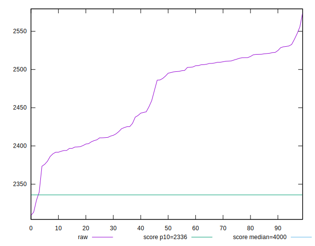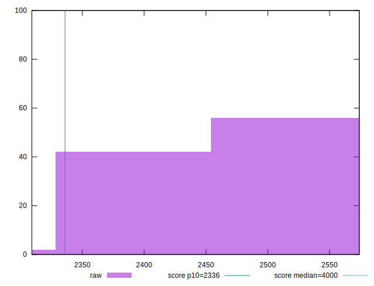
## Score


```yaml
p90min: 0.86
p90max: 0.89
p90range: 0.030000000000000027
p90mean: 0.876043956043956
p90median: 0.87
p90stdev: 0.01078043821400504
p90skewness: 0.09779125204042398
p90eccentricity: 0.9999999999999999
p90discretization: 22.75
outlandishness: 1.0001279519100217
confidence: 0.004733059397341144
p90confidence: 0.004429898803954169

```

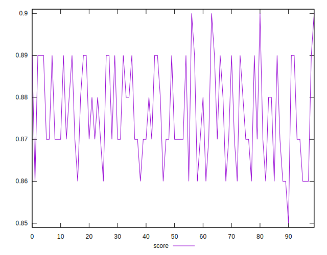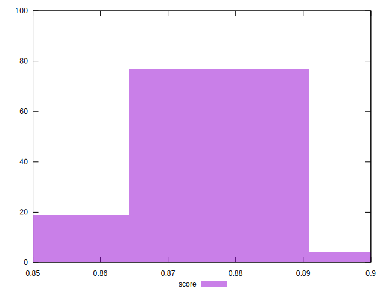
## Raw Estimate

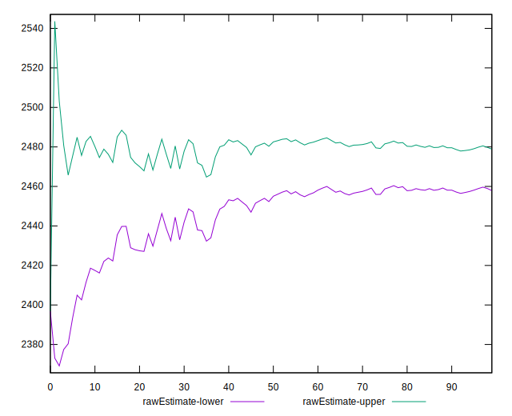
## Score Estimate

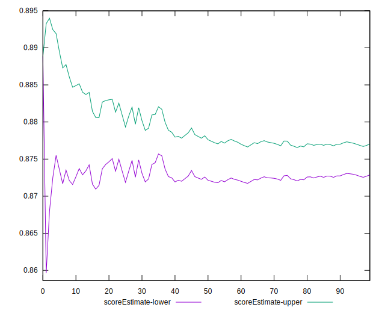
## P Score


```yaml
p90min: 0.8605128753384825
p90max: 0.8919803733494519
p90range: 0.031467498010969375
p90mean: 0.87478734716084
p90median: 0.8694329961844245
p90stdev: 0.010073516249326548
p90skewness: 0.3246967863980329
p90eccentricity: 1
p90discretization: 1
outlandishness: 1.0020911873397453
confidence: 0.004620687539431012
p90confidence: 0.0041394103559289075

```

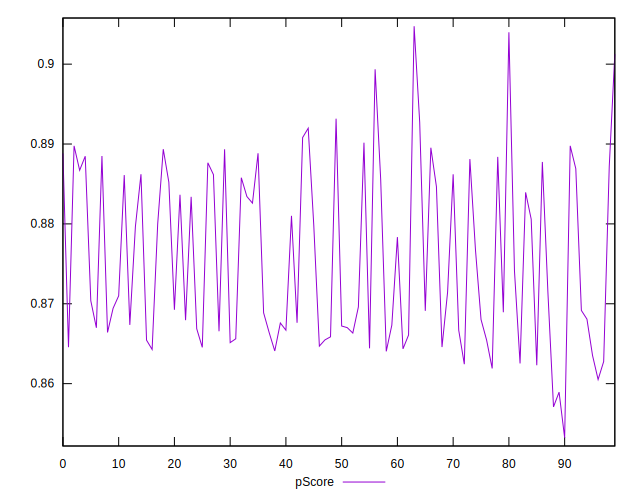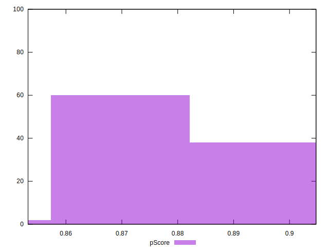
## Score Difference


```yaml
p90min: 0
p90max: 0
p90range: 0
p90mean: 0
p90median: 0
p90stdev: 0
p90skewness: .nan
p90eccentricity: .nan
p90discretization: 91
outlandishness: .nan
confidence: 0
p90confidence: 0

```

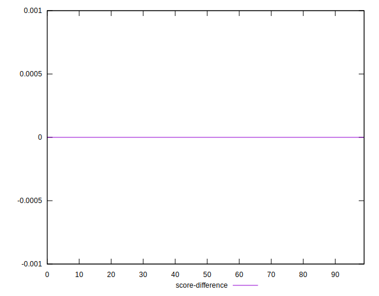
## P Score Difference


```yaml
p90min: -0.004867360643376117
p90max: 0.0041167282894777335
p90range: 0.008984088932853851
p90mean: -0.0008866226477203156
p90median: -0.0011316429048386922
p90stdev: 0.0026084194610091365
p90skewness: 0.400166102312486
p90eccentricity: 1.0000000000000004
p90discretization: 1
outlandishness: 0.20197069712970558
confidence: 0.001149751002459427
p90confidence: 0.0010718519990702779

```

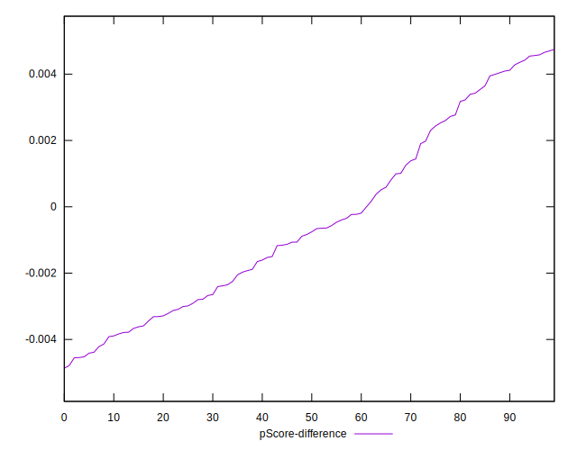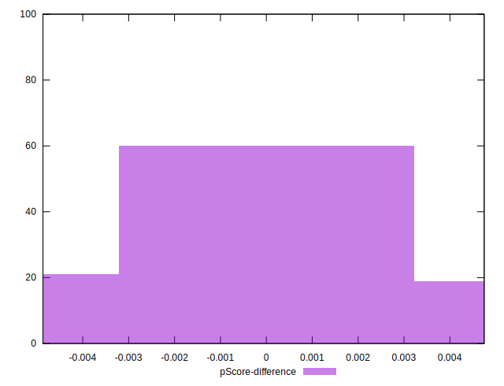