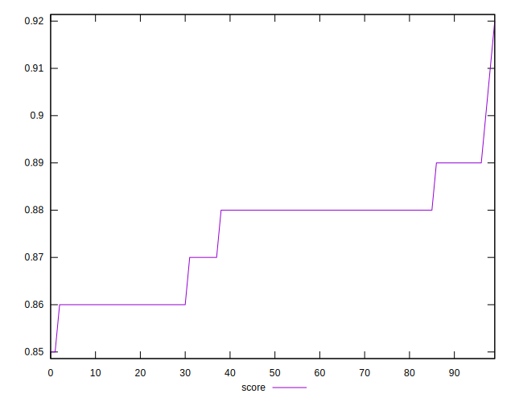
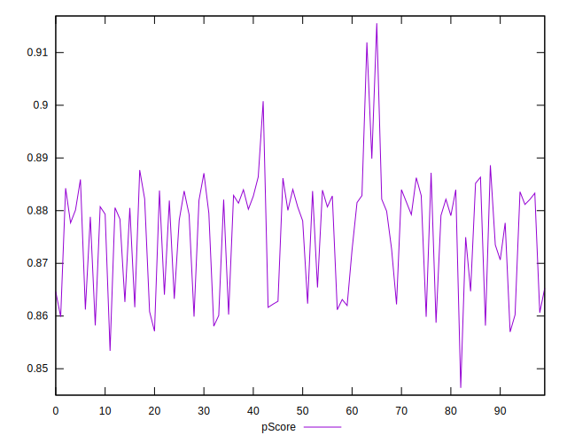

# //first-meaningful-paint/samples/pages+cached+noadtech

[→ Parent](../..)


## Raw


```yaml
p90min: 2391.3075
p90max: 2550.3999999999996
p90range: 159.09249999999975
p90mean: 2463.5446153846165
p90median: 2442.5625000000005
p90stdev: 48.27544359732259
p90skewness: 0.5912252200934375
p90eccentricity: 0.9999999999999992
p90discretization: 1
outlandishness: 1.0005284707176356
confidence: 24.17012601780698
p90confidence: 19.83735035690006

```


## Score


```yaml
p90min: 0.86
p90max: 0.89
p90range: 0.030000000000000027
p90mean: 0.8736263736263737
p90median: 0.88
p90stdev: 0.01011108449705359
p90skewness: -0.3247852207608727
p90eccentricity: 0.999999999999998
p90discretization: 22.75
outlandishness: 1.0029178486309873
confidence: 0.0048801135340046375
p90confidence: 0.004154847904233483

```


## Raw Estimate


## Score Estimate


## P Score


```yaml
p90min: 0.8582129979715709
p90max: 0.8898621288312336
p90range: 0.0316491308596627
p90mean: 0.8757684905264445
p90median: 0.8800554746865581
p90stdev: 0.009654304542017943
p90skewness: -0.6122417698408439
p90eccentricity: 1.000000000000001
p90discretization: 1
outlandishness: 0.9994624288170749
confidence: 0.004749686272420783
p90confidence: 0.003967147837101281

```


## Score Difference


```yaml
p90min: 0
p90max: 0
p90range: 0
p90mean: 0
p90median: 0
p90stdev: 0
p90skewness: .nan
p90eccentricity: .nan
p90discretization: 91
outlandishness: .nan
confidence: 0
p90confidence: 0

```


## P Score Difference


```yaml
p90min: -0.00363244984286204
p90max: 0.004697992697075382
p90range: 0.008330442539937422
p90mean: 0.001013238553040168
p90median: 0.0011887184706080856
p90stdev: 0.0021545186675664863
p90skewness: -0.29717399313123766
p90eccentricity: 1.0000000000000002
p90discretization: 1
outlandishness: 0.39036700284527376
confidence: 0.000995772191217385
p90confidence: 0.0008853350373225425

```

