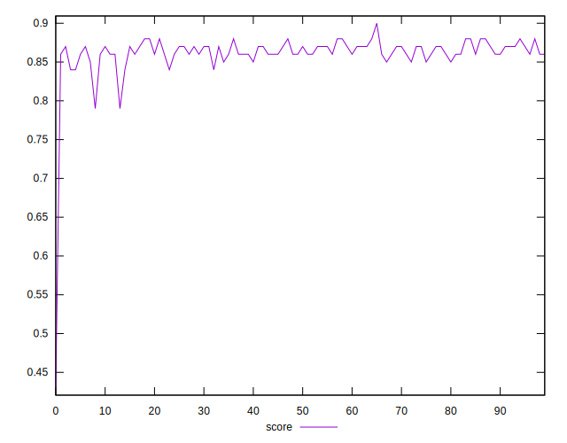
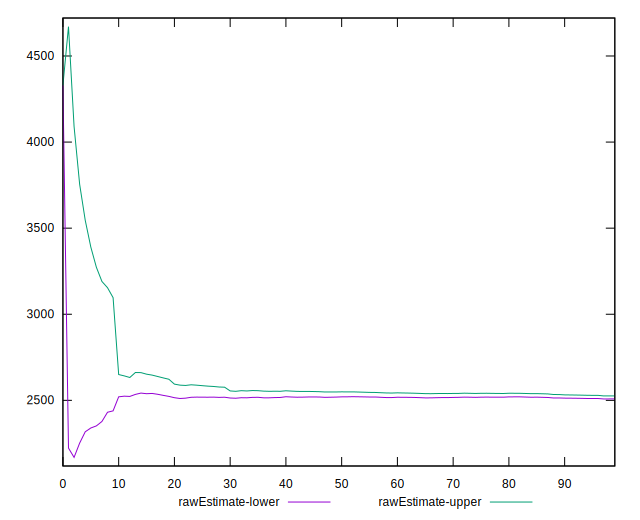

# //first-meaningful-paint/samples/pages+cached

[→ Parent](../..)


## Raw


```yaml
p90min: 2441.7825
p90max: 2631.4529999999995
p90range: 189.67049999999972
p90mean: 2516.988532967033
p90median: 2518.0199999999995
p90stdev: 42.00344106225512
p90skewness: 0.4116316612376563
p90eccentricity: 1
p90discretization: 1
outlandishness: 1.0203116317806904
confidence: 75.37053823360748
p90confidence: 17.26005841598453

```


## Score


```yaml
p90min: 0.84
p90max: 0.88
p90range: 0.040000000000000036
p90mean: 0.8637362637362633
p90median: 0.86
p90stdev: 0.009567384114144584
p90skewness: -0.5033283215811851
p90eccentricity: 1.0000000000000013
p90discretization: 18.2
outlandishness: 0.9892934430799163
confidence: 0.01786984197644559
p90confidence: 0.003931430485743848

```


## Raw Estimate


## Score Estimate


## P Score


```yaml
p90min: 0.8378775934171095
p90max: 0.8787633847101899
p90range: 0.04088579129308034
p90mean: 0.864566676288671
p90median: 0.8648824779217363
p90stdev: 0.00897436922069045
p90skewness: -0.6352766972259798
p90eccentricity: 1.0000000000000002
p90discretization: 1
outlandishness: 0.987055453828756
confidence: 0.01803909361624978
p90confidence: 0.003687748743398167

```


## Score Difference


```yaml
p90min: 0
p90max: 0
p90range: 0
p90mean: 0
p90median: 0
p90stdev: 0
p90skewness: .nan
p90eccentricity: .nan
p90discretization: 91
outlandishness: .nan
confidence: 0
p90confidence: 0

```


## P Score Difference


```yaml
p90min: -0.004859490907918207
p90max: 0.004424281025501076
p90range: 0.009283771933419283
p90mean: -0.0005297564338438921
p90median: -0.0005366228396339601
p90stdev: 0.002698346485896046
p90skewness: 0.11594786557495577
p90eccentricity: 0.9999999999999997
p90discretization: 1
outlandishness: 0.07727318932785522
confidence: 0.0011724425661112712
p90confidence: 0.0011088048215883964

```

