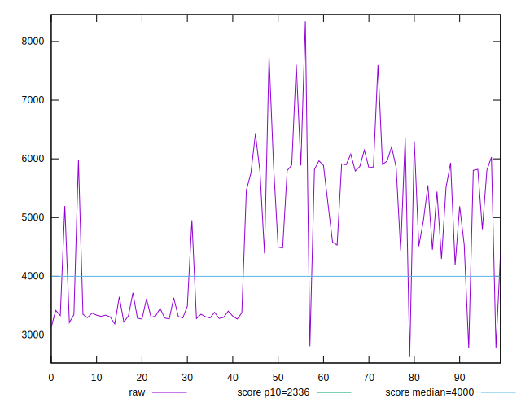
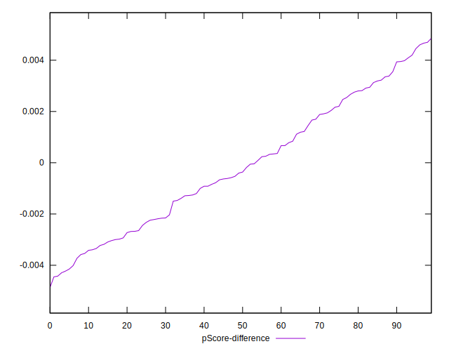

# //first-meaningful-paint/samples/pages

[→ Parent](../..)


## Raw


```yaml
p90min: 3130.751
p90max: 6359.914999999999
p90range: 3229.163999999999
p90mean: 4523.382087912086
p90median: 4451.561
p90stdev: 1147.4155612574218
p90skewness: 0.16139613896554225
p90eccentricity: 0.9999999999999997
p90discretization: 1
outlandishness: 1.0356883972502315
confidence: 524.835425106161
p90confidence: 471.4961230285826

```


## Score


```yaml
p90min: 0.13
p90max: 0.72
p90range: 0.59
p90mean: 0.42945054945054933
p90median: 0.4
p90stdev: 0.22048579051353726
p90skewness: 0.0036878294690446877
p90eccentricity: 1
p90discretization: 2.935483870967742
outlandishness: 0.988157074333258
confidence: 0.09333659646852221
p90confidence: 0.09060204421151485

```


## Raw Estimate


## Score Estimate


## P Score


```yaml
p90min: 0.13459880173793454
p90max: 0.720327784322991
p90range: 0.5857289825850565
p90mean: 0.42936943855825266
p90median: 0.39941725315698295
p90stdev: 0.22073330500176433
p90skewness: 0.0033088225187897268
p90eccentricity: 0.9999999999999997
p90discretization: 1
outlandishness: 0.9881112996976235
confidence: 0.09336691537113906
p90confidence: 0.09070375289103161

```


## Score Difference


```yaml
p90min: 0
p90max: 0
p90range: 0
p90mean: 0
p90median: 0
p90stdev: 0
p90skewness: .nan
p90eccentricity: .nan
p90discretization: 91
outlandishness: .inf
confidence: 7.953559784811416e-18
p90confidence: 0

```


## P Score Difference


```yaml
p90min: -0.00429222163703441
p90max: 0.0040935596471814995
p90range: 0.00838578128421591
p90mean: -0.00025031199336247704
p90median: -0.0005316223335048997
p90stdev: 0.0023888045856391075
p90skewness: 0.12923440804671382
p90eccentricity: 0.9999999999999991
p90discretization: 1
outlandishness: 0.13076118228098976
confidence: 0.0010468938469097556
p90confidence: 0.0009816078314010693

```

