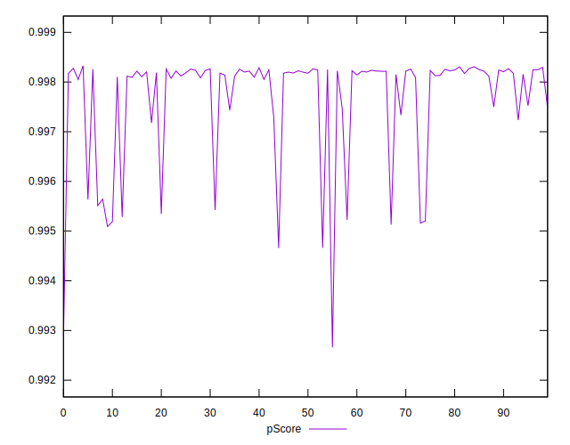

# //interactive/samples/pages+cached+noadtech+nomedia+nocss

[→ Parent](../..)


## Raw


```yaml
p90min: 1622.5395000000003
p90max: 1933.8249999999998
p90range: 311.2854999999995
p90mean: 1672.9525747252756
p90median: 1641.8378
p90stdev: 77.8254348506253
p90skewness: 2.442526781549489
p90eccentricity: 1
p90discretization: 1
outlandishness: 1.0331612256658205
confidence: 45.492081721587056
p90confidence: 31.980035868496543

```


## Score


```yaml
p90min: 1
p90max: 1
p90range: 0
p90mean: 1
p90median: 1
p90stdev: 0
p90skewness: .nan
p90eccentricity: .nan
p90discretization: 91
outlandishness: 0.9992001600000001
confidence: 0.0007681458682169406
p90confidence: 0

```


## Raw Estimate


## Score Estimate


## P Score


```yaml
p90min: 0.9952264652381597
p90max: 0.9983281842215922
p90range: 0.0031017189834324776
p90mean: 0.9979080627414925
p90median: 0.9981996311140353
p90stdev: 0.0007575788419330047
p90skewness: -2.678731305885057
p90eccentricity: 0.9999999999999996
p90discretization: 1
outlandishness: 0.999388248394999
confidence: 0.0004874818835214345
p90confidence: 0.0003113043773508295

```


## Score Difference


```yaml
p90min: 0
p90max: 0
p90range: 0
p90mean: 0
p90median: 0
p90stdev: 0
p90skewness: .nan
p90eccentricity: .nan
p90discretization: 91
outlandishness: .nan
confidence: 0
p90confidence: 0

```


## P Score Difference


```yaml
p90min: -0.004773534761840281
p90max: -0.0016718157784078036
p90range: 0.0031017189834324776
p90mean: -0.0020919372585076882
p90median: -0.0018003688859646871
p90stdev: 0.0007575788419330047
p90skewness: -2.6787313058848947
p90eccentricity: 0.9999999999999997
p90discretization: 1
outlandishness: 0.9114953396746253
confidence: 0.0005916161745949952
p90confidence: 0.00031130437735083036

```

