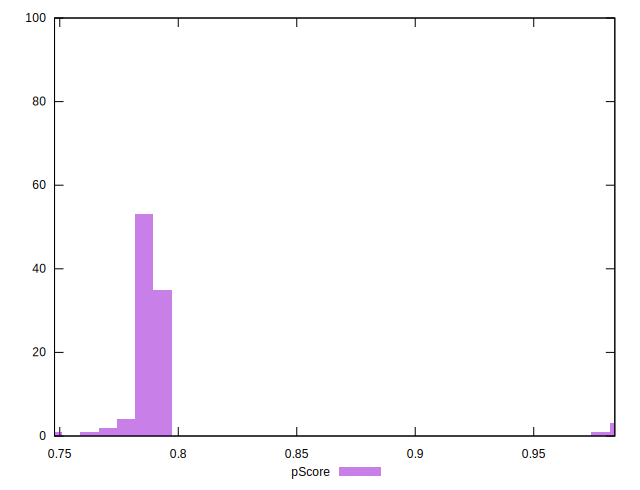

# //interactive/samples/pages+cached+noadtech+nomedia

[→ Parent](../..)


## Raw


```yaml
p90min: 4780.370500000001
p90max: 4950.442499999999
p90range: 170.0719999999983
p90mean: 4838.424636263738
p90median: 4837.8115
p90stdev: 26.744285755697803
p90skewness: 0.9745988821406506
p90eccentricity: 1.0000000000000002
p90discretization: 1
outlandishness: 0.9650057889411284
confidence: 185.56692602457588
p90confidence: 10.989764713633122

```


## Score


```yaml
p90min: 0.78
p90max: 0.8
p90range: 0.020000000000000018
p90mean: 0.7892307692307692
p90median: 0.79
p90stdev: 0.003049326796815747
p90skewness: -1.9401278742120511
p90eccentricity: 0.9999999999999958
p90discretization: 30.333333333333332
outlandishness: 1.0164609510428666
confidence: 0.014949836479758227
p90confidence: 0.0012530296878405789

```


## Raw Estimate


## Score Estimate


## P Score


```yaml
p90min: 0.7757177434775561
p90max: 0.7956034540238369
p90range: 0.019885710546280855
p90mean: 0.7888538056139545
p90median: 0.7889301010748824
p90stdev: 0.0031224926045147006
p90skewness: -0.9911403395977604
p90eccentricity: 0.9999999999999999
p90discretization: 1
outlandishness: 1.016764891053491
confidence: 0.015247997342412667
p90confidence: 0.0012830949892301824

```


## Score Difference


```yaml
p90min: 0
p90max: 0
p90range: 0
p90mean: 0
p90median: 0
p90stdev: 0
p90skewness: .nan
p90eccentricity: .nan
p90discretization: 91
outlandishness: .nan
confidence: 0
p90confidence: 0

```


## P Score Difference


```yaml
p90min: -0.004396545976163124
p90max: 0.0036942003127491407
p90range: 0.008090746288912265
p90mean: -0.0005099521277212759
p90median: -0.0008176622817465118
p90stdev: 0.002168755786464465
p90skewness: 0.12295619258778677
p90eccentricity: 0.9999999999999999
p90discretization: 1
outlandishness: 0.26226347958809837
confidence: 0.0009757386561972004
p90confidence: 0.0008911853557164622

```

