# //interactive/samples/pages+cached+noadtech

[→ Parent](../..)


## Raw


```yaml
p90min: 4814.2955
p90max: 4938.0615
p90range: 123.76599999999962
p90mean: 4876.530791758241
p90median: 4874.885999999998
p90stdev: 27.336049028726755
p90skewness: 0.057480830499434775
p90eccentricity: 0.9999999999999997
p90discretization: 1
outlandishness: 0.9729311887844331
confidence: 168.3775956240479
p90confidence: 11.23293213998113

```

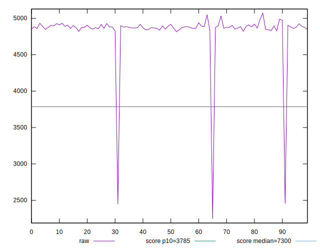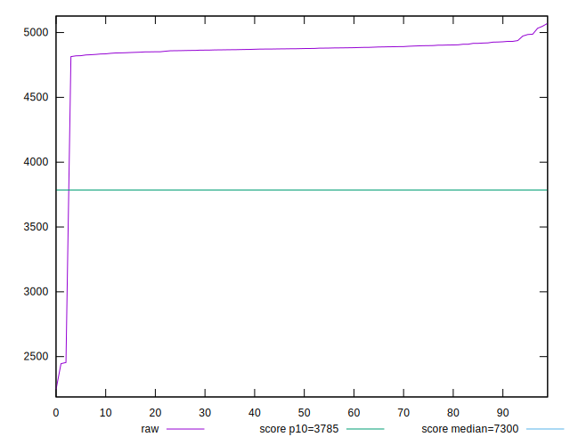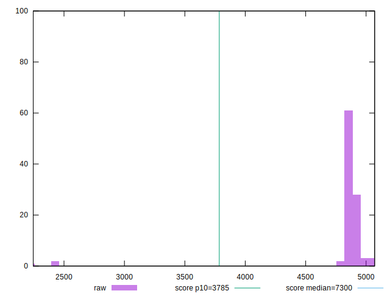
## Score


```yaml
p90min: 0.78
p90max: 0.79
p90range: 0.010000000000000009
p90mean: 0.7841758241758244
p90median: 0.78
p90stdev: 0.004931605642267448
p90skewness: 0.33424238836591824
p90eccentricity: 1.0000000000000004
p90discretization: 45.5
outlandishness: 1.0125982877214041
confidence: 0.013625288448432027
p90confidence: 0.002026495908846515

```

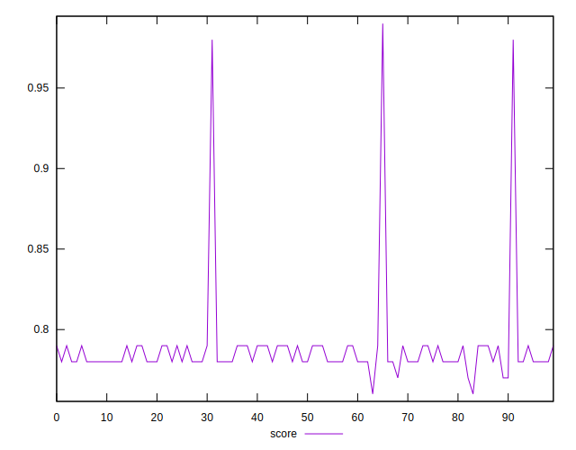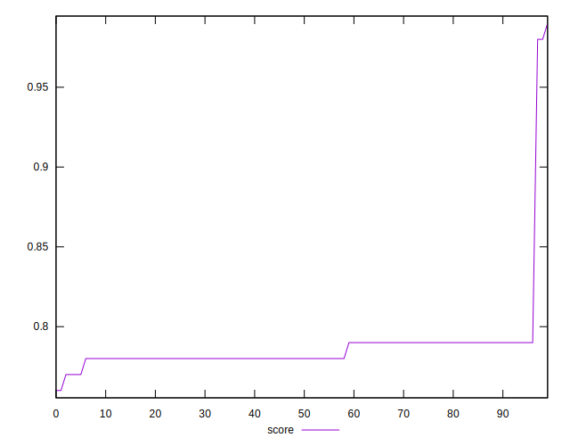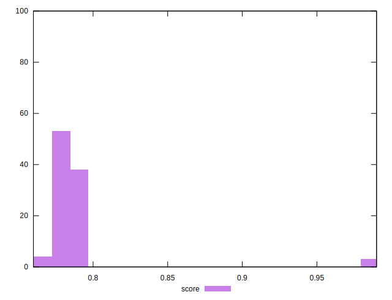
## Raw Estimate

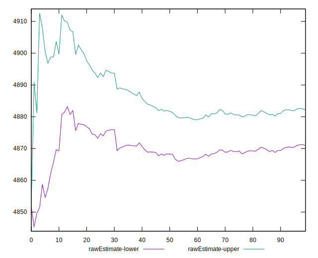
## Score Estimate

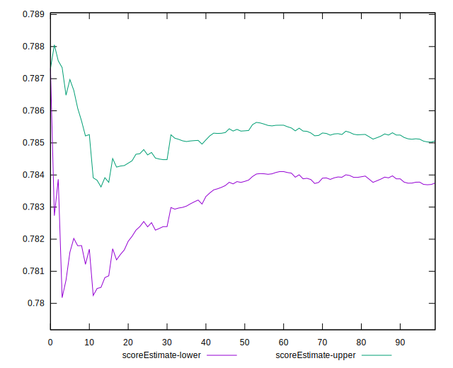
## P Score


```yaml
p90min: 0.777177704945663
p90max: 0.7916677924602313
p90range: 0.014490087514568373
p90mean: 0.784401348415783
p90median: 0.784598729777586
p90stdev: 0.003200979526098097
p90skewness: -0.06513452551290107
p90eccentricity: 1.0000000000000002
p90discretization: 1
outlandishness: 1.0128917060261418
confidence: 0.013654267896135996
p90confidence: 0.0013153468432964832

```

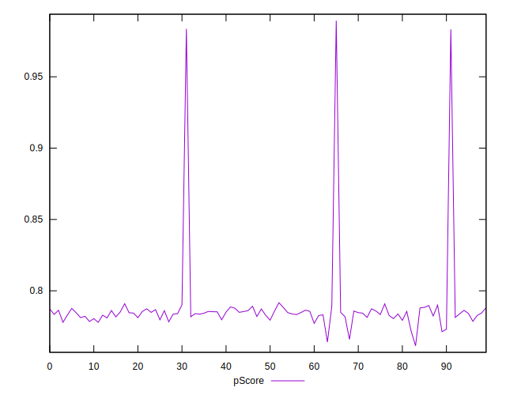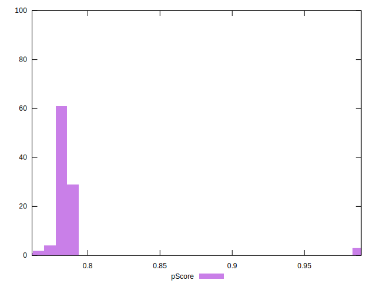
## Score Difference


```yaml
p90min: 0
p90max: 0
p90range: 0
p90mean: 0
p90median: 0
p90stdev: 0
p90skewness: .nan
p90eccentricity: .nan
p90discretization: 91
outlandishness: .nan
confidence: 0
p90confidence: 0

```


## P Score Difference


```yaml
p90min: -0.004206401329794662
p90max: 0.004912964541741505
p90range: 0.009119365871536167
p90mean: 0.0008302178330477425
p90median: 0.0013420758954868495
p90stdev: 0.002851860398597947
p90skewness: -0.24580375504555063
p90eccentricity: 0.9999999999999999
p90discretization: 1
outlandishness: 0.168993609424475
confidence: 0.0012284624856731476
p90confidence: 0.0011718867747306163

```

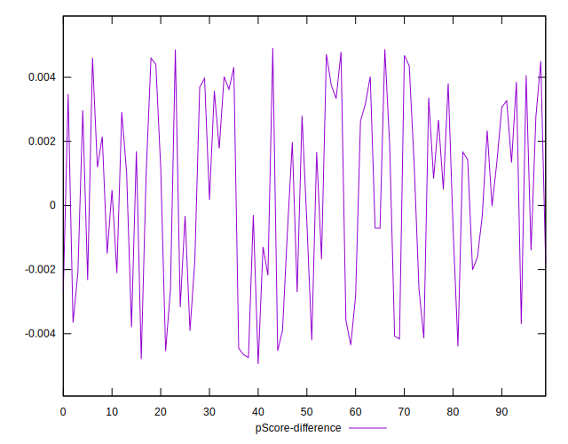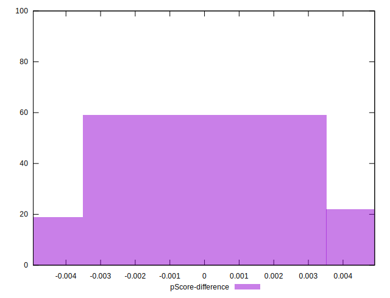