# //interactive/samples/pages+cached

[→ Parent](../..)


## Raw


```yaml
p90min: 11421.559000000001
p90max: 12011.221999999998
p90range: 589.6629999999968
p90mean: 11682.50608241758
p90median: 11672.647500000001
p90stdev: 128.11540958183045
p90skewness: 0.30532663895577783
p90eccentricity: 1.0000000000000002
p90discretization: 1
outlandishness: 1.005385471679831
confidence: 115.8718796440262
p90confidence: 52.645197570665914

```

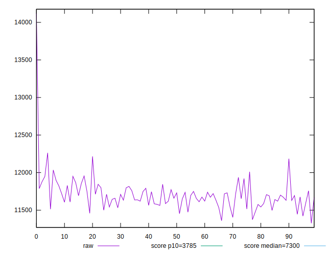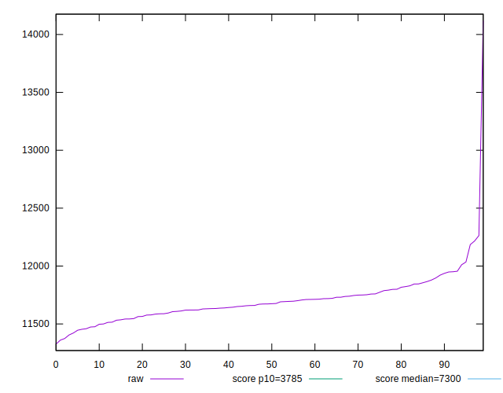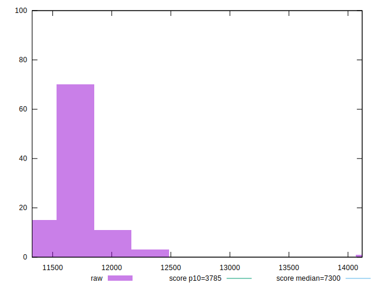
## Score


```yaml
p90min: 0.17
p90max: 0.19
p90range: 0.01999999999999999
p90mean: 0.17956043956043935
p90median: 0.18
p90stdev: 0.006096673189749531
p90skewness: 0.022697647401077183
p90eccentricity: 1.0000000000000013
p90discretization: 30.333333333333332
outlandishness: 0.9882233724076356
confidence: 0.004271642470794701
p90confidence: 0.002505245587909821

```

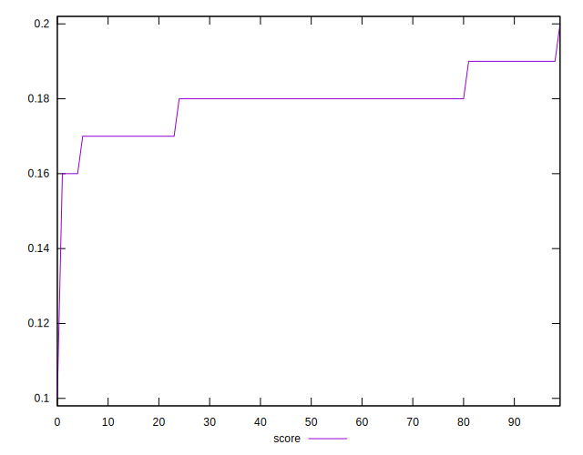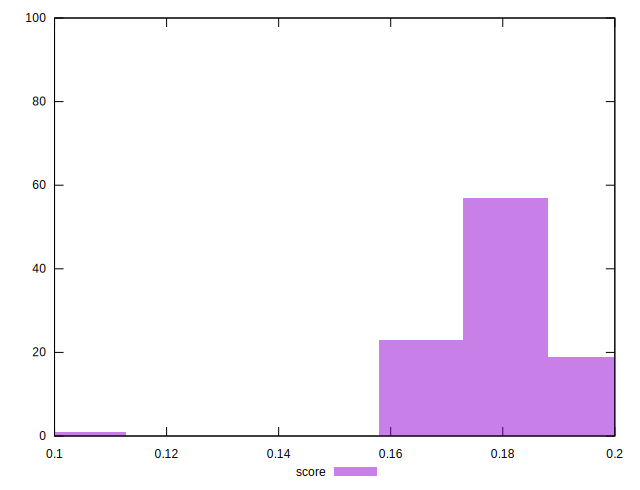
## Raw Estimate

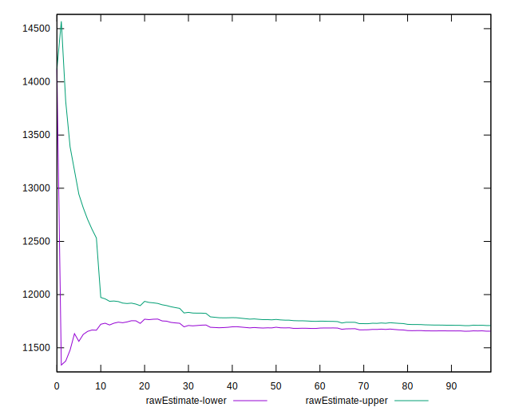
## Score Estimate

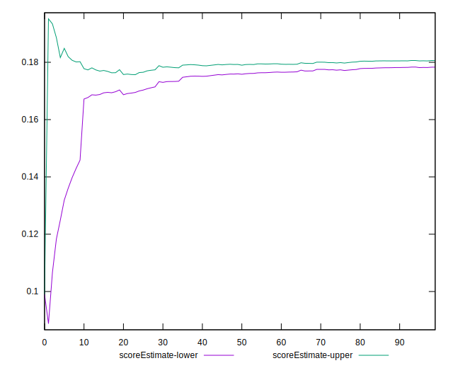
## P Score


```yaml
p90min: 0.16562634499449863
p90max: 0.19122879076838462
p90range: 0.025602445773885985
p90mean: 0.17953830154571052
p90median: 0.17988452163491997
p90stdev: 0.005580807873672938
p90skewness: -0.2285941847836973
p90eccentricity: 1
p90discretization: 1
outlandishness: 0.988357380391823
confidence: 0.004246471371994798
p90confidence: 0.0022932661580086777

```

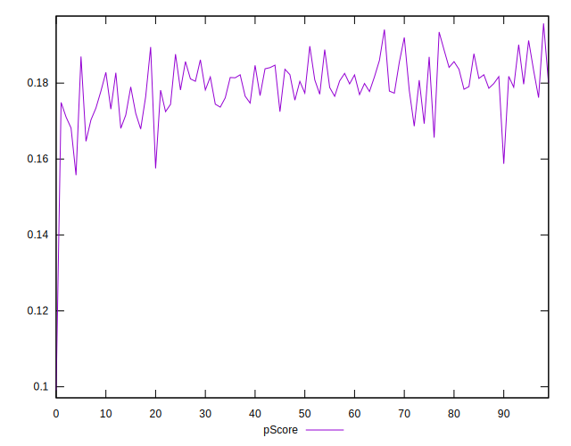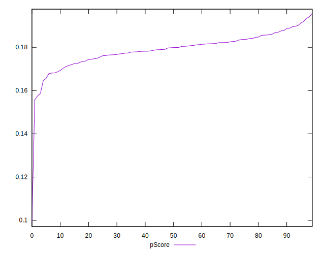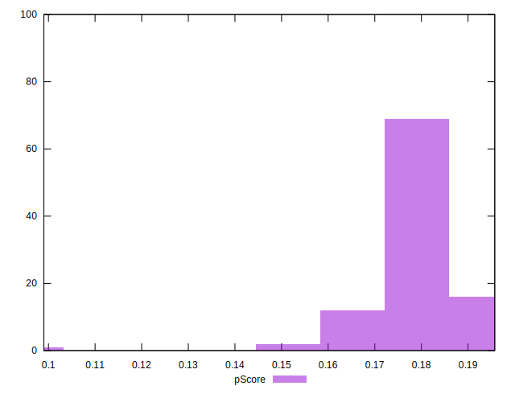
## Score Difference


```yaml
p90min: 0
p90max: 0
p90range: 0
p90mean: 0
p90median: 0
p90stdev: 0
p90skewness: .nan
p90eccentricity: .nan
p90discretization: 91
outlandishness: .nan
confidence: 0
p90confidence: 0

```


## P Score Difference


```yaml
p90min: -0.004373655005501381
p90max: 0.00413902609914546
p90range: 0.008512681104646841
p90mean: -0.00027015505161839386
p90median: -0.0002932863095622129
p90stdev: 0.002469369593743964
p90skewness: 0.08052227096626485
p90eccentricity: 1
p90discretization: 1
outlandishness: 0.001344647537733504
confidence: 0.0010759952299284645
p90confidence: 0.0010147136129991315

```

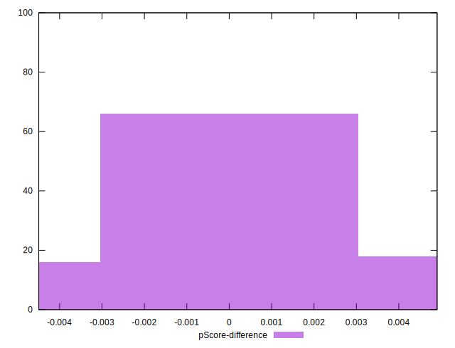