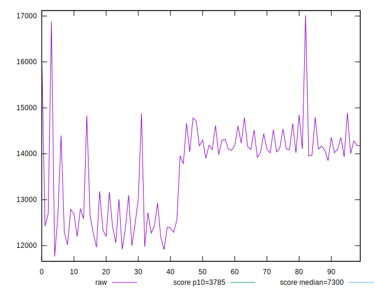

# //interactive/samples/pages

[→ Parent](../..)


## Raw


```yaml
p90min: 12016.681
p90max: 14889.639000000001
p90range: 2872.9580000000005
p90mean: 13659.255686813185
p90median: 14033.194
p90stdev: 872.5015514942554
p90skewness: -0.5075002089959799
p90eccentricity: 0.9999999999999999
p90discretization: 1
outlandishness: 0.9980815065232398
confidence: 421.15541031919565
p90confidence: 358.5284292424476

```


## Score


```yaml
p90min: 0.06
p90max: 0.16
p90range: 0.1
p90mean: 0.11175824175824162
p90median: 0.1
p90stdev: 0.025445196726868236
p90skewness: 0.5914668037265604
p90eccentricity: 1.0000000000000002
p90discretization: 9.1
outlandishness: 1.0533379093270843
confidence: 0.011804842089711692
p90confidence: 0.01045594291336821

```


## Raw Estimate


## Score Estimate


## P Score


```yaml
p90min: 0.08215193640339402
p90max: 0.16540582506231283
p90range: 0.0832538886589188
p90mean: 0.11341639417958653
p90median: 0.1011268748407042
p90stdev: 0.025244329181989038
p90skewness: 0.66603438268949
p90eccentricity: 0.9999999999999997
p90discretization: 1
outlandishness: 1.0275708415308165
confidence: 0.011587675509465767
p90confidence: 0.010373402400714687

```


## Score Difference


```yaml
p90min: 0
p90max: 0
p90range: 0
p90mean: 0
p90median: 0
p90stdev: 0
p90skewness: .nan
p90eccentricity: .nan
p90discretization: 91
outlandishness: .nan
confidence: 0
p90confidence: 0

```


## P Score Difference


```yaml
p90min: -0.004006261710878312
p90max: 0.004740746244362576
p90range: 0.008747007955240887
p90mean: 0.00043200581142188596
p90median: 0.00005396800706231053
p90stdev: 0.0024158357260721467
p90skewness: 0.12068659445321671
p90eccentricity: 0.9999999999999993
p90discretization: 1
outlandishness: 0.38846543604945644
confidence: 0.0010636051281183482
p90confidence: 0.0009927154704688647

```

