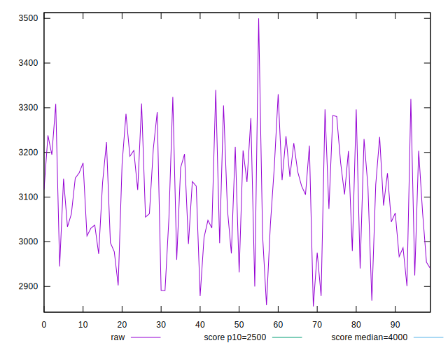
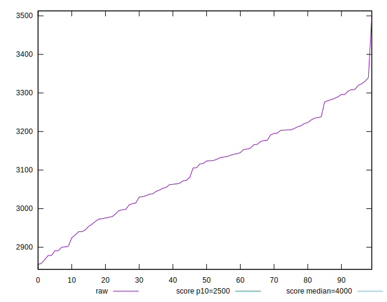
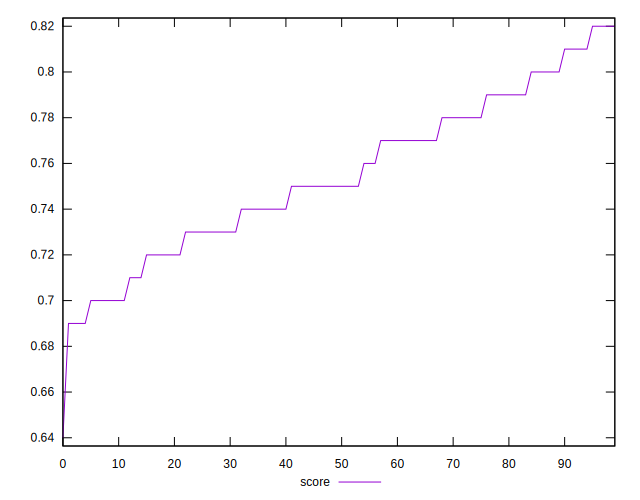

# //largest-contentful-paint/samples/pages+cached+noadtech+nomedia+nocss

[→ Parent](../..)


## Raw


```yaml
p90min: 2890.769500000001
p90max: 3319.788200000001
p90range: 429.0187000000001
p90mean: 3106.6237197802184
p90median: 3123.629
p90stdev: 117.66667974377195
p90skewness: -0.03222501261014515
p90eccentricity: 1.0000000000000002
p90discretization: 1
outlandishness: 0.9991869385685651
confidence: 53.341464519478905
p90confidence: 48.35160440741765

```


## Score


```yaml
p90min: 0.69
p90max: 0.81
p90range: 0.1200000000000001
p90mean: 0.754175824175824
p90median: 0.75
p90stdev: 0.03200501107968635
p90skewness: -0.02894519694454771
p90eccentricity: 1.0000000000000002
p90discretization: 7
outlandishness: 1.0005945805598206
confidence: 0.014680849839513233
p90confidence: 0.013151502516683733

```


## Raw Estimate


## Score Estimate


## P Score


```yaml
p90min: 0.6943560506978654
p90max: 0.8120699325477401
p90range: 0.11771388184987464
p90mean: 0.7541052033466611
p90median: 0.7499416834114778
p90stdev: 0.03236217866646963
p90skewness: -0.01747433396911072
p90eccentricity: 0.9999999999999997
p90discretization: 1
outlandishness: 1.0004647342457036
confidence: 0.014674728778908408
p90confidence: 0.013298269858983858

```


## Score Difference


```yaml
p90min: 0
p90max: 1.1102230246251565e-16
p90range: 1.1102230246251565e-16
p90mean: 8.540177112501205e-18
p90median: 0
p90stdev: 2.958404132897794e-17
p90skewness: 3.175426480542932
p90eccentricity: 0.999999999999997
p90discretization: 45.5
outlandishness: 4.3264000000000005
confidence: 1.595467459221934e-17
p90confidence: 1.2156677372271632e-17

```


## P Score Difference


```yaml
p90min: -0.004856484770341507
p90max: 0.004599239505610919
p90range: 0.009455724275952426
p90mean: -0.00018209512436348588
p90median: -0.0003138599304060019
p90stdev: 0.0026304038182789428
p90skewness: 0.06296590778837365
p90eccentricity: 1.0000000000000002
p90discretization: 1
outlandishness: 0.4312973217789128
confidence: 0.0011403091926240963
p90confidence: 0.001080885813470206

```

