# //largest-contentful-paint/samples/pages+cached+noadtech+nomedia

[→ Parent](../..)


## Raw


```yaml
p90min: 5299.991999999998
p90max: 5795.065499999997
p90range: 495.0734999999986
p90mean: 5546.246644505492
p90median: 5556.089999999999
p90stdev: 105.11424567710124
p90skewness: -0.3349099718994389
p90eccentricity: 0.9999999999999996
p90discretization: 1
outlandishness: 1.0019666782594814
confidence: 51.708795915687006
p90confidence: 43.19355688144424

```

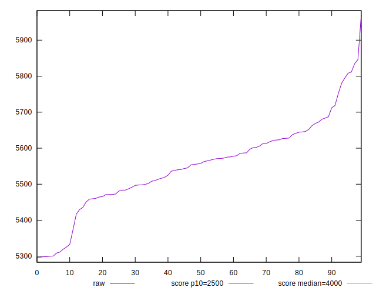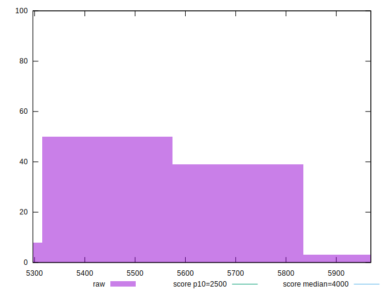
## Score


```yaml
p90min: 0.16
p90max: 0.22
p90range: 0.06
p90mean: 0.18681318681318673
p90median: 0.19
p90stdev: 0.014364112857948105
p90skewness: 0.5689707570665349
p90eccentricity: 0.9999999999999999
p90discretization: 13
outlandishness: 0.9934460679584779
confidence: 0.0068745300199873904
p90confidence: 0.00590250276529769

```

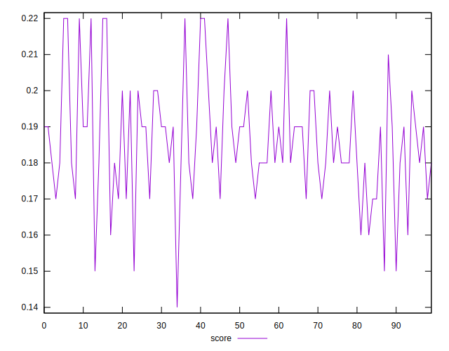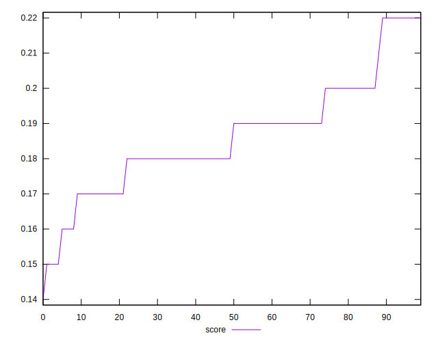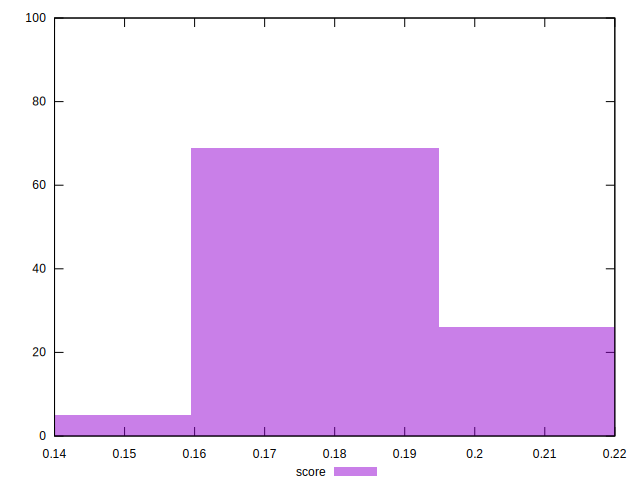
## Raw Estimate

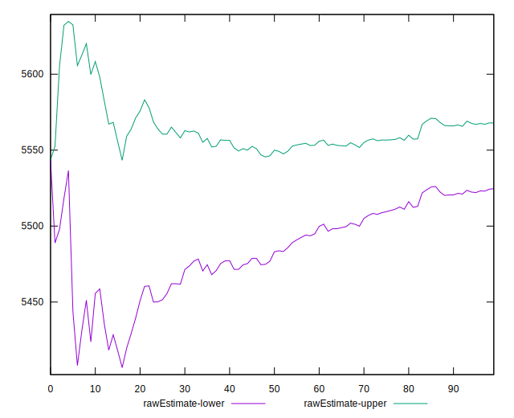
## Score Estimate

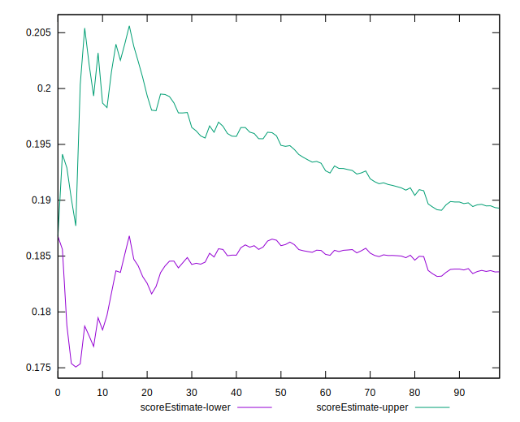
## P Score


```yaml
p90min: 0.15419223378437352
p90max: 0.22007734751686664
p90range: 0.06588511373249312
p90mean: 0.18540263584313313
p90median: 0.18426408586226062
p90stdev: 0.013861924377379556
p90skewness: 0.2551809140689717
p90eccentricity: 0.9999999999999999
p90discretization: 1
outlandishness: 1.0109058958690633
confidence: 0.006780441661795644
p90confidence: 0.005696143422081024

```

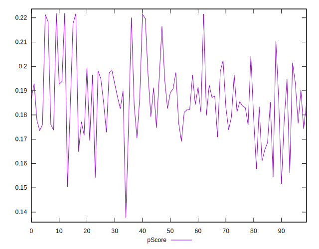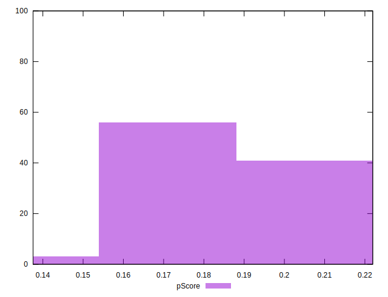
## Score Difference


```yaml
p90min: 0
p90max: 0
p90range: 0
p90mean: 0
p90median: 0
p90stdev: 0
p90skewness: .nan
p90eccentricity: .nan
p90discretization: 91
outlandishness: .nan
confidence: 0
p90confidence: 0

```


## P Score Difference


```yaml
p90min: -0.004109158182204975
p90max: 0.0047081767063619495
p90range: 0.008817334888566924
p90mean: 0.00027416032976356787
p90median: 0.0004732040626157785
p90stdev: 0.002655673659856145
p90skewness: -0.07275765619312742
p90eccentricity: 1.0000000000000009
p90discretization: 1
outlandishness: 0.591674959935815
confidence: 0.0011415951227205783
p90confidence: 0.0010912696994270432

```

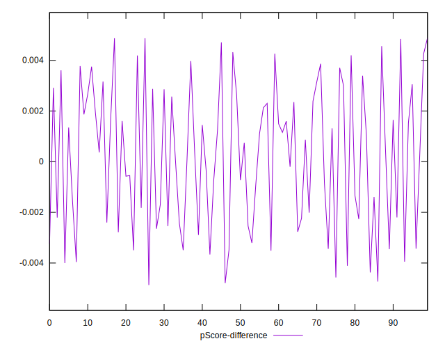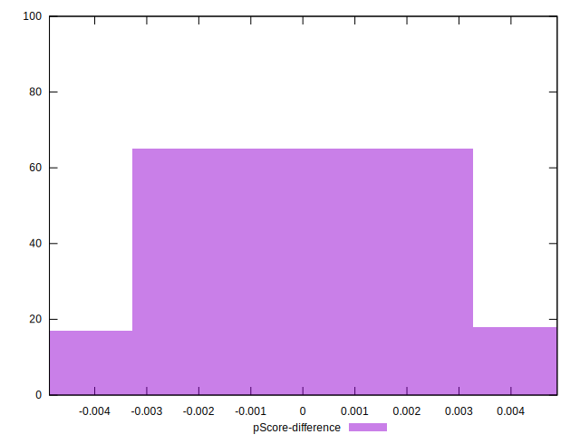