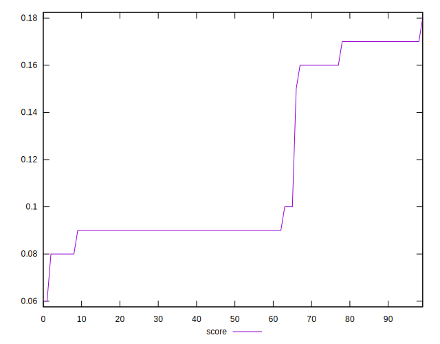

# //largest-contentful-paint/samples/pages+cached+noadtech

[→ Parent](../..)


## Raw


```yaml
p90min: 5685.143999999998
p90max: 6779.849999999998
p90range: 1094.7059999999992
p90mean: 6303.392431868133
p90median: 6521.544000000002
p90stdev: 382.22202049937204
p90skewness: -0.8406596072222571
p90eccentricity: 1
p90discretization: 1
outlandishness: 0.9912658797430153
confidence: 164.4281202710754
p90confidence: 157.06271283623755

```


## Score


```yaml
p90min: 0.06
p90max: 0.17
p90range: 0.11000000000000001
p90mean: 0.1094505494505494
p90median: 0.09
p90stdev: 0.034620791484233956
p90skewness: 0.9408469885235358
p90eccentricity: 1.0000000000000007
p90discretization: 13
outlandishness: 1.1039763975581038
confidence: 0.014682733703822143
p90confidence: 0.014226379275446399

```


## Raw Estimate


## Score Estimate


## P Score


```yaml
p90min: 0.07510874935765116
p90max: 0.1688804213584748
p90range: 0.09377167200082365
p90mean: 0.11180178120780145
p90median: 0.09129072377361847
p90stdev: 0.034575384677284354
p90skewness: 0.8718317980112325
p90eccentricity: 0.9999999999999993
p90discretization: 1
outlandishness: 1.0557280337455428
confidence: 0.01462743220715984
p90confidence: 0.014207720705562282

```


## Score Difference


```yaml
p90min: 0
p90max: 0
p90range: 0
p90mean: 0
p90median: 0
p90stdev: 0
p90skewness: .nan
p90eccentricity: .nan
p90discretization: 91
outlandishness: .nan
confidence: 0
p90confidence: 0

```


## P Score Difference


```yaml
p90min: -0.004385011608046108
p90max: 0.004012445285371452
p90range: 0.00839745689341756
p90mean: -0.0001759059144975514
p90median: -0.00012759517358609807
p90stdev: 0.0023369241864259907
p90skewness: 0.09447125058702971
p90eccentricity: 0.9999999999999996
p90discretization: 1
outlandishness: 0.5066194868952006
confidence: 0.0010281194664413422
p90confidence: 0.0009602891323036358

```

