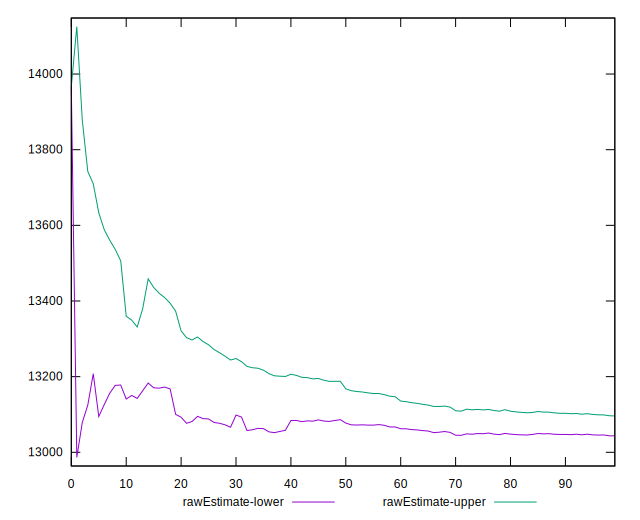

# //largest-contentful-paint/samples/pages+cached

[→ Parent](../..)


## Raw


```yaml
p90min: 12839.275
p90max: 13378.150000000003
p90range: 538.8750000000036
p90mean: 13069.768939560441
p90median: 13050.100000000006
p90stdev: 127.8373521139448
p90skewness: 0.41959839523827025
p90eccentricity: 1.0000000000000004
p90discretization: 1
outlandishness: 1.0006445690051868
confidence: 96.04087218767745
p90confidence: 52.53093816673572

```


## Score


```yaml
p90min: 0
p90max: 0
p90range: 0
p90mean: 0
p90median: 0
p90stdev: 0
p90skewness: .nan
p90eccentricity: .nan
p90discretization: 91
outlandishness: .nan
confidence: 0
p90confidence: 0

```


## Raw Estimate


## Score Estimate


## P Score


```yaml
p90min: 0.0004974406750265503
p90max: 0.000736697572366718
p90range: 0.00023925689734016764
p90mean: 0.000625204259605613
p90median: 0.0006314499409825758
p90stdev: 0.000057192407821864485
p90skewness: -0.21689311641656323
p90eccentricity: 1
p90discretization: 1
outlandishness: 1.0209523096394666
confidence: 0.00005233688993726412
p90confidence: 0.00002350151023324757

```


## Score Difference


```yaml
p90min: 0
p90max: 0
p90range: 0
p90mean: 0
p90median: 0
p90stdev: 0
p90skewness: .nan
p90eccentricity: .nan
p90discretization: 91
outlandishness: .nan
confidence: 0
p90confidence: 0

```


## P Score Difference


```yaml
p90min: 0.0004974406750265503
p90max: 0.000736697572366718
p90range: 0.00023925689734016764
p90mean: 0.000625204259605613
p90median: 0.0006314499409825758
p90stdev: 0.000057192407821864485
p90skewness: -0.21689311641656323
p90eccentricity: 1
p90discretization: 1
outlandishness: 1.0209523096394666
confidence: 0.00005233688993726412
p90confidence: 0.00002350151023324757

```

