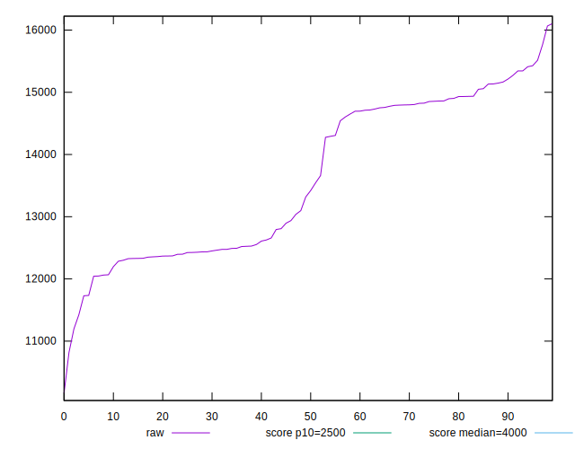

# //largest-contentful-paint/samples/pages

[→ Parent](../..)


## Raw


```yaml
p90min: 11734.771999999999
p90max: 15426.845999999996
p90range: 3692.073999999997
p90mean: 13640.889582417583
p90median: 13420.966
p90stdev: 1218.098107475036
p90skewness: 0.04613603838445672
p90eccentricity: 1.0000000000000009
p90discretization: 1
outlandishness: 0.9941648066258434
confidence: 539.4915244676267
p90confidence: 500.54100234926227

```


## Score


```yaml
p90min: 0
p90max: 0
p90range: 0
p90mean: 0
p90median: 0
p90stdev: 0
p90skewness: .nan
p90eccentricity: .nan
p90discretization: 91
outlandishness: .inf
confidence: 0.00039002790835975713
p90confidence: 0

```


## Raw Estimate


## Score Estimate


## P Score


```yaml
p90min: 0.0000730292725598658
p90max: 0.0013031577965812446
p90range: 0.0012301285240213788
p90mean: 0.0005293212647353699
p90median: 0.0002582015550904315
p90stdev: 0.00040050035747678296
p90skewness: 0.3235745676581339
p90eccentricity: 0.9999999999999993
p90discretization: 1
outlandishness: 1.694924103968774
confidence: 0.00029190237794594074
p90confidence: 0.00016457364898810165

```


## Score Difference


```yaml
p90min: 0
p90max: 0
p90range: 0
p90mean: 0
p90median: 0
p90stdev: 0
p90skewness: .nan
p90eccentricity: .nan
p90discretization: 91
outlandishness: .nan
confidence: 0
p90confidence: 0

```


## P Score Difference


```yaml
p90min: 0.0000730292725598658
p90max: 0.0013031577965812446
p90range: 0.0012301285240213788
p90mean: 0.0005293212647353699
p90median: 0.0002582015550904315
p90stdev: 0.00040050035747678296
p90skewness: 0.3235745676581339
p90eccentricity: 0.9999999999999993
p90discretization: 1
outlandishness: 1.2387051696099887
confidence: 0.00029928483635361855
p90confidence: 0.00016457364898810165

```

