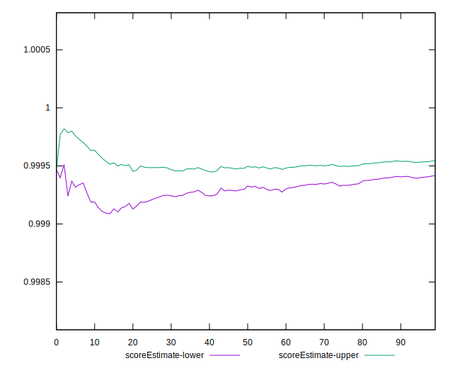

# //mainthread-work-breakdown/samples/pages+cached+noadtech+nomedia+nocss

[→ Parent](../..)


## Raw


```yaml
p90min: 587.0240000000002
p90max: 841.372
p90range: 254.34799999999973
p90mean: 692.8596043956042
p90median: 687.6000000000004
p90stdev: 63.2448883349701
p90skewness: 0.5209913866643269
p90eccentricity: 1.0000000000000002
p90discretization: 1
outlandishness: 1.0600528335935955
confidence: 44.81488565127711
p90confidence: 25.98859616182608

```


## Score


```yaml
p90min: 1
p90max: 1
p90range: 0
p90mean: 1
p90median: 1
p90stdev: 0
p90skewness: .nan
p90eccentricity: .nan
p90discretization: 91
outlandishness: 0.9990002499999997
confidence: 0.001285234333846752
p90confidence: 0

```


## Raw Estimate


## Score Estimate


## P Score


```yaml
p90min: 0.9982389542663477
p90max: 0.9998357909191202
p90range: 0.0015968366527725486
p90mean: 0.9994058830509142
p90median: 0.9995093129577016
p90stdev: 0.00038091284593657146
p90skewness: -1.3203325224703295
p90eccentricity: 0.9999999999999996
p90discretization: 1
outlandishness: 0.999117579123259
confidence: 0.0010715759868356045
p90confidence: 0.0001565247466872588

```


## Score Difference


```yaml
p90min: 0
p90max: 0
p90range: 0
p90mean: 0
p90median: 0
p90stdev: 0
p90skewness: .nan
p90eccentricity: .nan
p90discretization: 91
outlandishness: .nan
confidence: 0
p90confidence: 0

```


## P Score Difference


```yaml
p90min: -0.0016947536295606191
p90max: -0.0001391852705816543
p90range: 0.0015555683589789648
p90mean: -0.0005592360445043058
p90median: -0.0004680565211181431
p90stdev: 0.0003465514751524281
p90skewness: -1.2350303969128231
p90eccentricity: 1.0000000000000002
p90discretization: 1
outlandishness: 0.9157589237448354
confidence: 0.0004102400575931198
p90confidence: 0.00014240496859319464

```

