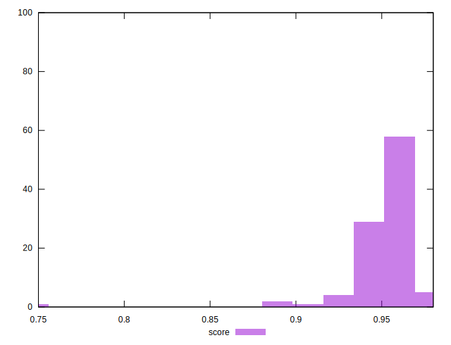
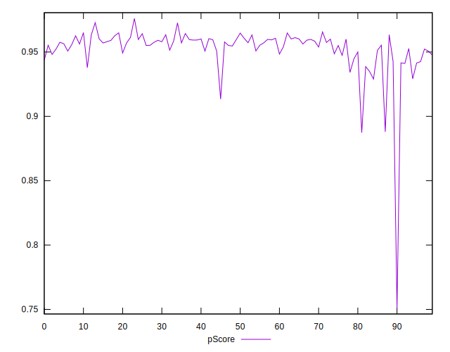

# //mainthread-work-breakdown/samples/pages+cached+noadtech+nomedia

[→ Parent](../..)


## Raw


```yaml
p90min: 1512.8920000000005
p90max: 1787.6520000000012
p90range: 274.7600000000007
p90mean: 1611.8257142857144
p90median: 1597.3720000000005
p90stdev: 63.50688279913782
p90skewness: 0.8284559569429134
p90eccentricity: 1.0000000000000004
p90discretization: 1
outlandishness: 1.028704836101996
confidence: 61.452044164599556
p90confidence: 26.096254954577944

```


## Score


```yaml
p90min: 0.94
p90max: 0.97
p90range: 0.030000000000000027
p90mean: 0.9562637362637364
p90median: 0.96
p90stdev: 0.00720932723817879
p90skewness: -0.8868571671055591
p90eccentricity: 0.9999999999999997
p90discretization: 22.75
outlandishness: 0.9902697059948813
confidence: 0.009549189122753265
p90confidence: 0.0029624575064335357

```


## Raw Estimate


## Score Estimate


## P Score


```yaml
p90min: 0.9341569701190724
p90max: 0.9656086048528042
p90range: 0.031451634733731804
p90mean: 0.955258851037528
p90median: 0.9571143699085178
p90stdev: 0.0071702432169761625
p90skewness: -1.0106611041113753
p90eccentricity: 0.9999999999999997
p90discretization: 1
outlandishness: 0.992101106361398
confidence: 0.009465047613211874
p90confidence: 0.002946397096333042

```


## Score Difference


```yaml
p90min: 0
p90max: 1.1102230246251565e-16
p90range: 1.1102230246251565e-16
p90mean: 2.4400506035717726e-17
p90median: 0
p90stdev: 4.597407602700464e-17
p90skewness: 1.3533994757073944
p90eccentricity: 0.9999999999999959
p90discretization: 45.5
outlandishness: 1.7410802499999998
confidence: 1.9747698583634167e-17
p90confidence: 1.889167215302465e-17

```


## P Score Difference


```yaml
p90min: -0.004897572733617683
p90max: 0.0043547756930542025
p90range: 0.009252348426671886
p90mean: -0.00028593651035817156
p90median: -0.00028578911090693104
p90stdev: 0.002472217283534102
p90skewness: 0.014162924860338464
p90eccentricity: 1
p90discretization: 1
outlandishness: 0.18017839909826358
confidence: 0.0010885697370341695
p90confidence: 0.0010158837859869955

```

